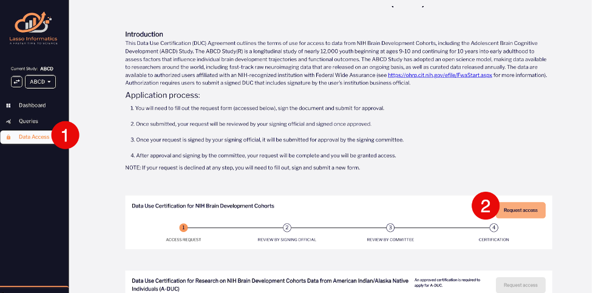
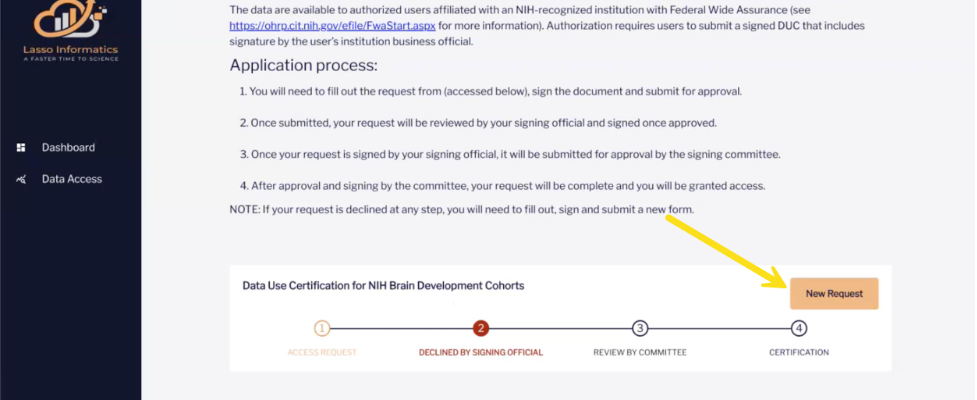

# How To Access HBCD Data

  
    &#x1f4a1;
    NOTIFICATION: Potential Data Access Issues
  
  ▸

 

Users may encounter issues with their DUC applications or renewals due to the Biden administration's expansion of Executive Order 13873 of May 15, 2019 (Securing the Information and Communications Technology and Services Supply Chain) and Executive Order 14034 of June 9, 2021 (Protecting Americans’ Sensitive Data from Foreign Adversaries) that, among other things, prohibits the sharing of Americans’ bulk personal data, including genomic data, in certain cases. The ABCD Study has reported issues for users from countries identified in the Executive Order (see <a href="https://wiki.abcdstudy.org/">ABCD Wiki 11.6.2024: Data Access Issues</a>) and it will likely impact HBCD as well.
 

See <a href="https://www.whitehouse.gov/briefing-room/presidential-actions/2024/02/28/executive-order-on-preventing-access-to-americans-bulk-sensitive-personal-data-and-united-states-government-related-data-by-countries-of-concern/#:~:text=(c)%20The%20term%20%E2%80%9Ccountry,States%20or%20the%20security%20and">Executive Order on Preventing Access to Americans’ Bulk Sensitive Personal Data and United States Government-Related Data by Countries of Concern</a> for details.

## Overview
HBCD data is publicly shared with all researchers associated with an NIH-recognized research institution via the individual or investigator-led group NBDC Data Use Agreement/Certification (DUC) process, which governs data use for both the ABCD and HBCD studies. The DUC outlines rules that must be followed for data use and is signed electronically by both the submitter and the Institutional Signing Officer at their institution. Public access to release data is conducted through the [NIH Brain Development Cohort (NBCD) portal supported by Lasso](https://nbdc-hbcd-beta.lassoinformatics.com), enabling seamless data queries, downloads, and sharing. 

**NOTE:** Recipients who intend to disseminate findings from analyses of American Indian/Alaska Native (AI/AN) data separated out from other groups in
presentations, pre-prints, publications, website posts, etc. must submit a second DUC governing use of AI/AN data (A-DUC) after obtaining approval on the general DUC. 

The steps involved for DUC submission are outlined below.

## DUC Submission: Before You Begin
Before you begin the DUC process, please do the following:

**Make sure that you meet the following access eligibility requirements:**

1. You must have a research-related need to access the data. 
2. You must be associated with an NIH-recognized research institution and have the approval of an authorized signatory official of that institution. Visit eRA Commons to learn about institutional signing officials: [https://www.era.nih.gov/erahelp/commons/commons/roles/SO.htm](https://www.era.nih.gov/erahelp/commons/commons/roles/SO.htm)  
3. Your institution must have an active Federalwide Assurance (FWA) 

**Identify an authorized signatory official at your institution**. If you are unsure of who at your institution is an authorized signing official, do not know whether your institution has an FWA, or have any other questions, please email nbdc@mail.nih.gov.

**Decide whether to submit an individual or group-level DUC**. Users may submit either an **individual** or **group-level** DUC. You may submit a DUC either as an individual recipient or submit a group-level DUC as a lead PI with others from your institution listed on the same DUC (recommended). For group-level DUCs, the lead PI must ensure that all listed recipients on the DUC comply with its terms and conditions. *Note: Recipients may only be listed on one DUC.*

## DUC Submission Instructions & Workflow
### Fill Out DUC Forms
Once you have an account and have logged into the Lasso Informatics platform, please follow these steps to request access to the data.

Select **Data Access** from the left-hand menu followed by **Request access** in the lower right-hand corner of the page that appears:

 
This will bring you to the the first of three forms of the **Data Use Certification (DUC)** to fill out before review and submission. Fill out the information as follows:

<u>Form 1: Lead Recipient</u>

Provide information for all required fields, marked with an asterisk ( * ), including Name, Degree, Institution, and Address. Once complete, select **Continue** (lower right-hand corner of the page).

<u>Form 2: Research Data Use Statement</u>

This form asks you to describe (within a limit of 250 words) why you need access to the dataset. Once complete, select **Continue** (lower right-hand corner of the page).

<u>Form 3: Authorized Institutional Business Official</u>

Provide the (1) name and (2) email address of the Institutional Signing Official for your institution who will be authorizing your access and has signing authority (both fields are mandatory). Once complete, select **Submit** in the lower right-hand corner of the page and the following screen will appear:

Select **Continue Signing** and folllow the steps below to apply your electronic signature.

### Sign DUC Electronically
This section of the DUC process asks you to agree to electronically signing the DUC. If you wish to proceed with signing, follow these steps.

<ol>
    

    <li>First select the Electronic records and signature agreement checkbox, which will enable the <b>CONTINUE</b> button - click this </li>
    

    

    <li>You will now see the form that requires your signature. Read through the contract and select <b>START</b> once you are ready to apply your electronic signature: </li>
    

    

    <li>Input your full name and initials in the fields of the following <i>Adopt Your Signature</i> dialogue box that appears: </li>
    

    

    <li>Select <b>ADOPT AND SIGN</b> to apply the signature to the document signature page.</li>
    

    

    <li>Select <b>FINISH</b> in the upper right-hand corner of the page to submit the signed document.</li>
    

    

    <li>Wait for the Signing Official to review and sign the DocuSign document.</li>
    

</ol>

### Instructions for Signing Officials
The Signing Official will receive an email from DocuSign asking that they review and sign the DocuSign document. The Signing Official must sign the document for the DUC process to continue as follows: 

<ol>
    <li>Open the email received from Lasso Informatics via DocuSign.</li>
    <li>Select <b>REVIEW DOCUMENT</b></li>
    <li>Select the Electronic Record and Signature Disclosure checkbox. <b>REMINDER: The checkbox must be selected in order to enable the CONTINUE button.</b></li>
    <li>Select <b>CONTINUE</b>.</li>
    <li>Select <b>START</b>.</li>
    <li>Review the document.</li>    
    <li>Sign the document to approve or, if you choose to decline to sign, select <b>Decline to Sign</b> from <b>OTHER ACTIONS</b> drop-down list in the upper right-hand corner of page.</li> 
    <li>Select <b>FINISH</b>.</li>     
    <li>Wait for the DUC committee (NIDA) to approve the request.</li> 
</ol>

### Review
This is the step where the NBDC Data Access Committee (DAC) reviews your request. The DAC consists of federal staff from NIH with expertise in science, policy, or bioinformatics resources. DUCs are approved based on satisfaction of basic pre-requisites and whether the data access request is reasonable and aligns with the terms of the DUC. The quality of the science for which the data is intended to be used is not reviewed.

When your request is approved, you will receive an email notifying you of the approval. After signing in to the platform, you will have access to the requested data. If your DUC request is denied, your access to the platform will be limited, but you will be allowed to submit a new DUC request. Access is valid for one year. To maintain access, recipients must submit a renewal request before the DUC expires.

Please note: For beta testing, users do not have to undergo any additional training. But for the public release, each user needs to go through a mandatory training on responsible data use before accessing the data.  