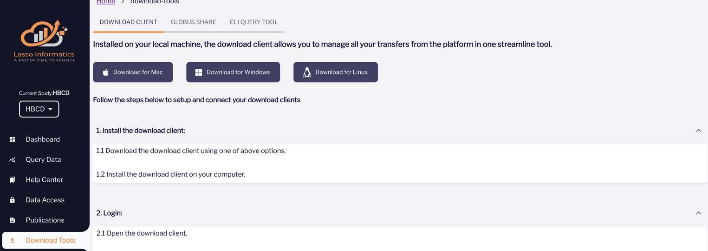

# How To Download Data

## Dictionary Query Tool

  <i class="fas fa-exclamation-triangle"></i>
  Instruction metadata - Caution, please read carefully:
  ▸

The text added to the 'instruction' column in the Data Dictionary metadata are extracted programmatically from the latest instruction field provided in the Data Dictionary of the form based on the order of the fields, and added to all fields up to the next set of instructions. Because of this, in some cases the instruction text may be broken into several instruction fields, of which only the last portion will currently be extracted, leading to partial instruction text. Likewise, since the instruction is provided for all fields up to the next set of instructions, in some cases the instruction provided may correspond to a previous section in the form. Instruction metadata will be fine-tuned manually for future releases. To ensure instructions are accurately interpreted, please refer to the original form.
 

  <a class="button-link" href="https://nbdc-splash-beta.lassoinformatics.com/hbcd-study">HBCD Study on NBDC Data Hub &nbsp; ↗️</a>

*Below we describe how to use the Dictionary Query Tool on the [NBDC portal supported by Lasso](https://nbdc-hbcd-beta.lassoinformatics.com) to download data.*

#### Step 1: Get Started with Approved Access  
Once your **Data Use Certification** has been approved and you’ve completed the required training, you’ll gain access to the **Query Data** tab in Lasso. This tab is conveniently located in the **left-hand side menu**.

#### Step 2: Choose Your Query Method
On the Query Data page, you can toggle between the **Query Wizard** and the **Dictionary Query Tool**. Both tools offer flexible ways to build your queries, letting you choose the approach that best suits your needs. 

#### Step 3: Navigate the Dictionary Query Tool
When using the Dictionary Query Tool, you can filter data based on specific instruments or variables. Use the **column filters** or the **global search** to find exactly what you need quickly and efficiently. 

  <i class="fa-regular fa-lightbulb"></i>
  See the <a href="#nbdc-data-dictionary">NBDC Data Dictionary</a> section for Query Tool column name definitions
  

#### Step 4: Export the Data Dictionary
After selecting the desired fields, click on **Download** and choose your preferred export format for the data dictionary.

#### Step 5: Query the Associated Data
If you need both the data dictionary and the associated data:

* Drag and drop the selected fields into the **Selected Tabular Data** area.  
* Click on **Run Tabular Query**, and the system will generate and download the output file directly to your device in seconds.

#### Step 6: Save and Reuse Your Queries
To save time on future queries, click the **Save Query** button. Your saved queries can be accessed later via the **Load Query** button. Select your saved query, click **Run**, and instantly download the most up-to-date data.

#### NBDC Data Dictionary

  Column Definitions
  ▸

<table style="width: 100%; border-collapse: collapse; table-layout: fixed; font-size: 13px;">
	<thead>
	  <tr>
		<th style="width: 10%; border: 1px solid #ddd; padding: 5px; text-align: center;">Column Name (DEAP)</th>
		<th style="width: 10%; border: 1px solid #ddd; padding: 5px; text-align: center;">Column Name (Query Tool)</th>
		<th style="width: 30%; border: 1px solid #ddd; padding: 5px; text-align: center;">Description</th>
		<th style="width: 30%; border: 1px solid #ddd; padding: 5px; text-align: center;"><b>{</b>Possible Values<b>}</b> / Example(s)</th>
		<th style="width: 5%; border: 1px solid #ddd; padding: 5px; word-wrap: break-word; white-space: normal; text-align: center;">
			Mutable
				Values may vary between releases
			</th>
	  </tr>
	</thead>
	<tbody>
	<tr>
		<td style="border: 1px solid #ddd; padding: 4px; word-wrap: break-word; white-space: normal;">Study</td>
		<td style="border: 1px solid #ddd; padding: 4px; word-wrap: break-word; white-space: normal;">study</td>
		<td style="border: 1px solid #ddd; padding: 4px; word-wrap: break-word; white-space: normal;">Indicates if table/measure is part of core or sub/auxiliary study</td>
		<td style="border: 1px solid #ddd; padding: 4px; word-wrap: break-word; white-space: normal;"><b>{</b>Core; Substudy<b>}</b></td>
		<td style="border: 1px solid #ddd; padding: 4px; word-wrap: break-word; white-space: normal;">NO</td>
	</tr>
	<tr>
		<td style="border: 1px solid #ddd; padding: 4px; word-wrap: break-word; white-space: normal;">Domain</td>
		<td style="border: 1px solid #ddd; padding: 4px; word-wrap: break-word; white-space: normal;">domain</td>
		<td style="border: 1px solid #ddd; padding: 4px; word-wrap: break-word; white-space: normal;">Domain/Workgroup</td>
		<td style="border: 1px solid #ddd; padding: 4px; word-wrap: break-word; white-space: normal;">
		Demographics; EEG
		See full list under <a href="../../measures/#tabulated-data">Tabulated Data</a>
	  </td>
		<td style="border: 1px solid #ddd; padding: 4px; word-wrap: break-word; white-space: normal;">NO</td>
	</tr>
	<tr>
		<td style="border: 1px solid #ddd; padding: 4px; word-wrap: break-word; white-space: normal;">Table name</td>
		<td style="border: 1px solid #ddd; padding: 4px; word-wrap: break-word; white-space: normal;">table_name</td>
		<td style="border: 1px solid #ddd; padding: 4px; word-wrap: break-word; white-space: normal;">Name of table/measure</td>
		<td style="border: 1px solid #ddd; padding: 4px; word-wrap: break-word; white-space: normal;"><code>mh_p_cbcl</code></td>
		<td style="border: 1px solid #ddd; padding: 4px; word-wrap: break-word; white-space: normal;">NO</td>
	</tr>
	<tr>
		<td style="border: 1px solid #ddd; padding: 4px; word-wrap: break-word; white-space: normal;">
		Table label
		Corresponds to MeasurementToolMetadata > Description in BIDS JSON
	  
	  </td>
		<td style="border: 1px solid #ddd; padding: 4px; word-wrap: break-word; white-space: normal;">table_label</td>
		<td style="border: 1px solid #ddd; padding: 4px; word-wrap: break-word; white-space: normal;">Label for table/measure</td>
		<td style="border: 1px solid #ddd; padding: 4px; word-wrap: break-word; white-space: normal;">Child Behavior Checklist [Parent]</td>
		<td style="border: 1px solid #ddd; padding: 4px; word-wrap: break-word; white-space: normal;">YES</td>
	</tr>
	<tr>
		<td style="border: 1px solid #ddd; padding: 4px; word-wrap: break-word; white-space: normal;">Variable Name</td>
		<td style="border: 1px solid #ddd; padding: 4px; word-wrap: break-word; white-space: normal;">name</td>
		<td style="border: 1px solid #ddd; padding: 4px; word-wrap: break-word; white-space: normal;">Name of column/variable/question</td>
		<td style="border: 1px solid #ddd; padding: 4px; word-wrap: break-word; white-space: normal;"><code>mh_p_cbcl__aggr_001</code></td>
		<td style="border: 1px solid #ddd; padding: 4px; word-wrap: break-word; white-space: normal;">NO</td>
	</tr>
	<tr>
		<td style="border: 1px solid #ddd; padding: 4px; word-wrap: break-word; white-space: normal;">
		Variable Label
		Corresponds to Description in BIDS JSON
	  
	  </td>
		<td style="border: 1px solid #ddd; padding: 4px; word-wrap: break-word; white-space: normal;">label</td>
		<td style="border: 1px solid #ddd; padding: 4px; word-wrap: break-word; white-space: normal;">Label for column/variable/question</td>
		<td style="border: 1px solid #ddd; padding: 4px; word-wrap: break-word; white-space: normal;">"Demands a lot of attention"</td>
		<td style="border: 1px solid #ddd; padding: 4px; word-wrap: break-word; white-space: normal;">YES</td>
	</tr>
	<tr>
		<td style="border: 1px solid #ddd; padding: 4px; word-wrap: break-word; white-space: normal;">Instruction</td>
		<td style="border: 1px solid #ddd; padding: 4px; word-wrap: break-word; white-space: normal;">instruction</td>
		<td style="border: 1px solid #ddd; padding: 4px; word-wrap: break-word; white-space: normal;">Instructions preceding table/measure questions</td>
		<td style="border: 1px solid #ddd; padding: 4px; word-wrap: break-word; white-space: normal;">"The next set of question is about your child's behavior in different situations and contexts. Please fill in a response to all questions."</td>
		<td style="border: 1px solid #ddd; padding: 4px; word-wrap: break-word; white-space: normal;">YES</td>
	</tr>
	<tr>
		<td style="border: 1px solid #ddd; padding: 4px; word-wrap: break-word; white-space: normal;">Header</td>
		<td style="border: 1px solid #ddd; padding: 4px; word-wrap: break-word; white-space: normal;">header</td>
		<td style="border: 1px solid #ddd; padding: 4px; word-wrap: break-word; white-space: normal;">Header/instructions for a set of questions</td>
		<td style="border: 1px solid #ddd; padding: 4px; word-wrap: break-word; white-space: normal;">"Below is a list of items that describe children and youths. For each item that describes your child <strong>...</strong>
		... now or within the past 6 months, please choose whether the item is very true or often true of your child, somewhat or sometimes true of your child, or not true of your child. Please answer all items as well as you can, even if some do not seem to apply to your child."
	  
	 </td>
		<td style="border: 1px solid #ddd; padding: 4px; word-wrap: break-word; white-space: normal;">YES</td>
	</tr>
	<tr>
		<td style="border: 1px solid #ddd; padding: 4px; word-wrap: break-word; white-space: normal;">Note</td>
		<td style="border: 1px solid #ddd; padding: 4px; word-wrap: break-word; white-space: normal;">note</td>
		<td style="border: 1px solid #ddd; padding: 4px; word-wrap: break-word; white-space: normal;">Note displayed to participants</td>
		<td style="border: 1px solid #ddd; padding: 4px; word-wrap: break-word; white-space: normal;">"Enter weight in pounds."</td>
		<td style="border: 1px solid #ddd; padding: 4px; word-wrap: break-word; white-space: normal;">YES</td>
	</tr>
	<tr>
		<td style="border: 1px solid #ddd; padding: 4px; word-wrap: break-word; white-space: normal;">
		Unit
		Corresponds to Units in BIDS JSON
	  
	  </td>
		<td style="border: 1px solid #ddd; padding: 4px; word-wrap: break-word; white-space: normal;">unit</td>
		<td style="border: 1px solid #ddd; padding: 4px; word-wrap: break-word; white-space: normal;">Unit of measurement</td>
		<td style="border: 1px solid #ddd; padding: 4px; word-wrap: break-word; white-space: normal;">m, cm2, lbs</td>
		<td style="border: 1px solid #ddd; padding: 4px; word-wrap: break-word; white-space: normal;">YES</td>
	</tr>
	<tr>
		<td style="border: 1px solid #ddd; padding: 4px; word-wrap: break-word; white-space: normal;">Variable type</td>
		<td style="border: 1px solid #ddd; padding: 4px; word-wrap: break-word; white-space: normal;">type_var</td>
		<td style="border: 1px solid #ddd; padding: 4px; word-wrap: break-word; white-space: normal;">Type of column/variable/question</td>
		<td style="border: 1px solid #ddd; padding: 4px; word-wrap: break-word; white-space: normal;"><b>{</b>administrative; item; derived item; summary score<b>}</b></td>
		<td style="border: 1px solid #ddd; padding: 4px; word-wrap: break-word; white-space: normal;">YES</td>
	</tr>
	<tr>
		<td style="border: 1px solid #ddd; padding: 4px; word-wrap: break-word; white-space: normal;">Data type</td>
		<td style="border: 1px solid #ddd; padding: 4px; word-wrap: break-word; white-space: normal;">type_data</td>
		<td style="border: 1px solid #ddd; padding: 4px; word-wrap: break-word; white-space: normal;">Data type (in database)</td>
		<td style="border: 1px solid #ddd; padding: 4px; word-wrap: break-word; white-space: normal;"><b>{</b>date; timestamp; time;
	  character
		Character only used for categorical columns
	  ;
	  text; integer; double<b>}</b></td>
	</td>
		<td style="border: 1px solid #ddd; padding: 4px; word-wrap: break-word; white-space: normal;">NO</td>
	</tr>
	<tr>
		<td style="border: 1px solid #ddd; padding: 4px; word-wrap: break-word; white-space: normal;">Level of measurement</td>
		<td style="border: 1px solid #ddd; padding: 4px; word-wrap: break-word; white-space: normal;">type_level</td>
		<td style="border: 1px solid #ddd; padding: 4px; word-wrap: break-word; white-space: normal;">Measurement level/scale type</td>
		<td style="border: 1px solid #ddd; padding: 4px; word-wrap: break-word; white-space: normal;"><b>{</b>nominal; ordinal; interval; ratio<b>}</b></td>
		<td style="border: 1px solid #ddd; padding: 4px; word-wrap: break-word; white-space: normal;">YES</td>
	</tr>
	<tr>
		<td style="border: 1px solid #ddd; padding: 4px; word-wrap: break-word; white-space: normal;">Field type</td>
		<td style="border: 1px solid #ddd; padding: 4px; word-wrap: break-word; white-space: normal;">type_field</td>
		<td style="border: 1px solid #ddd; padding: 4px; word-wrap: break-word; white-space: normal;">Field type in data capture system as presented to participant</td>
		<td style="border: 1px solid #ddd; padding: 4px; word-wrap: break-word; white-space: normal;">dropdown; radio; checkbox</td>
		<td style="border: 1px solid #ddd; padding: 4px; word-wrap: break-word; white-space: normal;">YES</td>
	</tr>
	<tr>
		<td style="border: 1px solid #ddd; padding: 4px; word-wrap: break-word; white-space: normal;">Display order</td>
		<td style="border: 1px solid #ddd; padding: 4px; word-wrap: break-word; white-space: normal;">order_display</td>
		<td style="border: 1px solid #ddd; padding: 4px; word-wrap: break-word; white-space: normal;">Display order of item within measure</td>
		<td style="border: 1px solid #ddd; padding: 4px; word-wrap: break-word; white-space: normal;">&nbsp;</td>
		<td style="border: 1px solid #ddd; padding: 4px; word-wrap: break-word; white-space: normal;">YES</td>
	</tr>
	<tr>
		<td style="border: 1px solid #ddd; padding: 4px; word-wrap: break-word; white-space: normal;">Branching logic</td>
		<td style="border: 1px solid #ddd; padding: 4px; word-wrap: break-word; white-space: normal;">branching_logic</td>
		<td style="border: 1px solid #ddd; padding: 4px; word-wrap: break-word; white-space: normal;">Branching logic applied to column/variable/question</td>
		<td style="border: 1px solid #ddd; padding: 4px; word-wrap: break-word; white-space: normal;">&nbsp;</td>
		<td style="border: 1px solid #ddd; padding: 4px; word-wrap: break-word; white-space: normal;">YES</td>
	</tr>
	<tr>
		<td style="border: 1px solid #ddd; padding: 4px; word-wrap: break-word; white-space: normal;">Label (Spanish)</td>
		<td style="border: 1px solid #ddd; padding: 4px; word-wrap: break-word; white-space: normal;">label_es</td>
		<td style="border: 1px solid #ddd; padding: 4px; word-wrap: break-word; white-space: normal;">Label (Spanish)</td>
		<td style="border: 1px solid #ddd; padding: 4px; word-wrap: break-word; white-space: normal;">&nbsp;</td>
		<td style="border: 1px solid #ddd; padding: 4px; word-wrap: break-word; white-space: normal;">YES</td>
	</tr>
	<tr>
		<td style="border: 1px solid #ddd; padding: 4px; word-wrap: break-word; white-space: normal;">Instruction (Spanish)</td>
		<td style="border: 1px solid #ddd; padding: 4px; word-wrap: break-word; white-space: normal;">instruction_es</td>
		<td style="border: 1px solid #ddd; padding: 4px; word-wrap: break-word; white-space: normal;">Instruction (Spanish)</td>
		<td style="border: 1px solid #ddd; padding: 4px; word-wrap: break-word; white-space: normal;">&nbsp;</td>
		<td style="border: 1px solid #ddd; padding: 4px; word-wrap: break-word; white-space: normal;">YES</td>
	</tr>
	<tr>
		<td style="border: 1px solid #ddd; padding: 4px; word-wrap: break-word; white-space: normal;">Header (Spanish)</td>
		<td style="border: 1px solid #ddd; padding: 4px; word-wrap: break-word; white-space: normal;">header_es</td>
		<td style="border: 1px solid #ddd; padding: 4px; word-wrap: break-word; white-space: normal;">Header (Spanish)</td>
		<td style="border: 1px solid #ddd; padding: 4px; word-wrap: break-word; white-space: normal;">&nbsp;</td>
		<td style="border: 1px solid #ddd; padding: 4px; word-wrap: break-word; white-space: normal;">YES</td>
	</tr>
	<tr>
		<td style="border: 1px solid #ddd; padding: 4px; word-wrap: break-word; white-space: normal;">Note (Spanish)</td>
		<td style="border: 1px solid #ddd; padding: 4px; word-wrap: break-word; white-space: normal;">note_es</td>
		<td style="border: 1px solid #ddd; padding: 4px; word-wrap: break-word; white-space: normal;">Note (Spanish)</td>
		<td style="border: 1px solid #ddd; padding: 4px; word-wrap: break-word; white-space: normal;">&nbsp;</td>
		<td style="border: 1px solid #ddd; padding: 4px; word-wrap: break-word; white-space: normal;">YES</td>
	</tr>
  <tr>
		<td style="border: 1px solid #ddd; padding: 4px; word-wrap: break-word; white-space: normal;">Required field (LORIS)</td>
		<td style="border: 1px solid #ddd; padding: 4px; word-wrap: break-word; white-space: normal;">loris_required</td>
		<td style="border: 1px solid #ddd; padding: 4px; word-wrap: break-word; white-space: normal;">Specifies if a field is required in LORIS</td>
		<td style="border: 1px solid #ddd; padding: 4px; word-wrap: break-word; white-space: normal;">&nbsp;</td>
		<td style="border: 1px solid #ddd; padding: 4px; word-wrap: break-word; white-space: normal;">YES</td>
	</tr>
	<tr>
		<td style="border: 1px solid #ddd; padding: 4px; word-wrap: break-word; white-space: normal;">Collection Platform</td>
		<td style="border: 1px solid #ddd; padding: 4px; word-wrap: break-word; white-space: normal;">collection_platform</td>
		<td style="border: 1px solid #ddd; padding: 4px; word-wrap: break-word; white-space: normal;">Platform the data was collected with</td>
		<td style="border: 1px solid #ddd; padding: 4px; word-wrap: break-word; white-space: normal;">&nbsp;</td>
		<td style="border: 1px solid #ddd; padding: 4px; word-wrap: break-word; white-space: normal;">YES</td>
	</tr>
	<tr>
		<td style="border: 1px solid #ddd; padding: 4px; word-wrap: break-word; white-space: normal;">Identifier column(s)</td>
		<td style="border: 1px solid #ddd; padding: 4px; word-wrap: break-word; white-space: normal;">unique_identifiers</td>
		<td style="border: 1px solid #ddd; padding: 4px; word-wrap: break-word; white-space: normal;">Unique identifier column names (variable/table)</td>
		<td style="border: 1px solid #ddd; padding: 4px; word-wrap: break-word; white-space: normal;">&nbsp;</td>
		<td style="border: 1px solid #ddd; padding: 4px; word-wrap: break-word; white-space: normal;">NO</td>
	</tr>
	<tr>
		<td style="border: 1px solid #ddd; padding: 4px; word-wrap: break-word; white-space: normal;">Documentation for table</td>
		<td style="border: 1px solid #ddd; padding: 4px; word-wrap: break-word; white-space: normal;">url_table</td>
		<td style="border: 1px solid #ddd; padding: 4px; word-wrap: break-word; white-space: normal;">Link to description in <a href="../../measures#data-measure-release-notes" target="_blank">Release Notes</a></td>
		<td style="border: 1px solid #ddd; padding: 4px; word-wrap: break-word; white-space: normal;">&nbsp;</td>
		<td style="border: 1px solid #ddd; padding: 4px; word-wrap: break-word; white-space: normal;">YES</td>
	</tr>
	<tr>
		<td style="border: 1px solid #ddd; padding: 4px; word-wrap: break-word; white-space: normal;">Responsible data use warning (table)</td>
		<td style="border: 1px solid #ddd; padding: 4px; word-wrap: break-word; white-space: normal;">url_table_warn_use</td>
		<td style="border: 1px solid #ddd; padding: 4px; word-wrap: break-word; white-space: normal;">Link to <a href="../resp_data_use/#warnings" target="_blank">responsible use warning</a> (table)</td>
		<td style="border: 1px solid #ddd; padding: 4px; word-wrap: break-word; white-space: normal;">&nbsp;</td>
		<td style="border: 1px solid #ddd; padding: 4px; word-wrap: break-word; white-space: normal;">YES</td>
	</tr>
	<tr>
		<td style="border: 1px solid #ddd; padding: 4px; word-wrap: break-word; white-space: normal;">Data quality warning (table)</td>
		<td style="border: 1px solid #ddd; padding: 4px; word-wrap: break-word; white-space: normal;">url_table_warn_data</td>
		<td style="border: 1px solid #ddd; padding: 4px; word-wrap: break-word; white-space: normal;">Link to <a href="../resp_data_use/#warnings" target="_blank">data warning</a> (table)</td>
		<td style="border: 1px solid #ddd; padding: 4px; word-wrap: break-word; white-space: normal;">&nbsp;</td>
		<td style="border: 1px solid #ddd; padding: 4px; word-wrap: break-word; white-space: normal;">YES</td>
	</tr>
	<tr>
		<td style="border: 1px solid #ddd; padding: 4px; word-wrap: break-word; white-space: normal;">Responsible data use warning (variable)</td>
		<td style="border: 1px solid #ddd; padding: 4px; word-wrap: break-word; white-space: normal;">url_warn_use</td>
		<td style="border: 1px solid #ddd; padding: 4px; word-wrap: break-word; white-space: normal;">Link to <a href="../resp_data_use/#warnings" target="_blank">responsible use warning</a> (variable)</td>
		<td style="border: 1px solid #ddd; padding: 4px; word-wrap: break-word; white-space: normal;">&nbsp;</td>
		<td style="border: 1px solid #ddd; padding: 4px; word-wrap: break-word; white-space: normal;">YES</td>
	</tr>
	<tr>
		<td style="border: 1px solid #ddd; padding: 4px; word-wrap: break-word; white-space: normal;">Data quality warning (variable)</td>
		<td style="border: 1px solid #ddd; padding: 4px; word-wrap: break-word; white-space: normal;">url_warn_data</td>
		<td style="border: 1px solid #ddd; padding: 4px; word-wrap: break-word; white-space: normal;">Link to <a href="../resp_data_use/#warnings" target="_blank">data warning</a> (variable)</td>
		<td style="border: 1px solid #ddd; padding: 4px; word-wrap: break-word; white-space: normal;">&nbsp;</td>
		<td style="border: 1px solid #ddd; padding: 4px; word-wrap: break-word; white-space: normal;">YES</td>
	</tr>
	<tr>
		<td style="border: 1px solid #ddd; padding: 4px; word-wrap: break-word; white-space: normal;">Sort order</td>
		<td style="border: 1px solid #ddd; padding: 4px; word-wrap: break-word; white-space: normal;">order_sort</td>
		<td style="border: 1px solid #ddd; padding: 4px; word-wrap: break-word; white-space: normal;">Standard sort order in table/measure (and ⇒ column order in data/database)</td>
		<td style="border: 1px solid #ddd; padding: 4px; word-wrap: break-word; white-space: normal;">&nbsp;</td>
		<td style="border: 1px solid #ddd; padding: 4px; word-wrap: break-word; white-space: normal;">YES</td>
	</tr>
</tbody>
</table>

## Globus Share Download

1 - [Login](https://nbdc-beta.lassoinformatics.com/) with your Globus ID after clicking the Globus button on the login screen. 

2 - Login to your Globus Account by looking up your institution from the drop-down menu. If your organization is missing from the list, please create a Globus ID to sign in. 

If you are already logged in, allow Lasso to use your globus id.

3 - Replace the autogenerated id with a username and fill in the information. 

4 - Request for DUC Form Approval from the Data Access page and complete the training module when you receive a system generated email.

5 - Go to **Download Tools** page in Lasso Portal and click **Learn More** to follow the steps about how to install and configure Globus Connect. 

6 - Give your collection container a name and hit save. Please **DO NOT** select the HA checkbox while creating your collections through Globus Connect.   

     
7 - Next, you can choose files to download. Once you have built a query, select **Trigger Transfer**.

8 - Click **Authorize Lasso for Globus Transfer**.

     
9 - You may also have to reauthorize.   

     
10 - You will be redirected to globus collections page where you can view your collections. Double click on it to choose a download destination on your device. 

11 - You can either select an existing directory on your computer or create a new one for your files to be downloaded to. 

12 - Click on **Transfer Here** to begin the data transfer process. 

13 - Once, the download is completed, your files will be downloaded to the destination specified. 

14 - You can also check the progress of your data transfers by either a) tapping on the globus icon in your systems tray and going to Web: Activity or b) visiting globus.org and clicking on activity. You will also be sent an email once your data transfer is completed. 

## Download Client User Guide (macOS Version)
### Introduction
The Download Client is a user-friendly application designed to help you securely download files from remote storage. This guide will walk you through downloading, installing, and using the client on macOS.

### System Requirements
Before installing the Download Client, ensure your macOS system meets the following requirements:

- **Operating System**: macOS 11 (Big Sur) or later
- **Internet Connection**: Required for downloading files
- **Storage Space**: At least 500MB free disk space
- **Authentication**: Lasso account credentials

### Download & Installation Steps (macOS)
1. Download the .dmg file from the download tools option on the [Pre-Release HBCD System](https://nbdc-hbcd-beta.lassoinformatics.com/download-tools) 
2. Alternatively, you can download the .dmg file from the Query Data Module: select **Choose Files For Download**, build a query, and click **Trigger Transfer**. Selecting "available here" on the Lasso Download Client (Beta) will redirect you to the Download Tools Page, where you can download the application based on your system. 

3. Open the .dmg file and drag the application into the **Applications** folder.
4. Open the application from **Launchpad**.
5. If prompted, allow the application to run in **System Preferences** > **Security & Privacy** under the **General** tab.

### Running the Application for the First Time
Please follow these steps to proceed with the download process:

#### Step 1: Open the Application
When you first try to open the application, you will see a warning that Apple cannot verify the developer. Click **OK** to close the warning.

#### Step 2: Go to System Preferences
- Open **System Settings** from the Apple menu.
- Navigate to **Privacy & Security**.
- Scroll down to find the blocked application and click **Open Anyway**.

#### Step 3: Confirm Security Exception
- You will see another prompt asking if you are sure you want to open the app.
- Click **Open Anyway**.

#### Step 4: Enter Admin Credentials (If Asked)
- Some macOS versions require an administrator password or Touch ID confirmation to proceed.
- Enter your credentials and confirm.

**You can now easily access the Lasso Download Client from your menu bar:**

### First-Time Setup
#### Step 1: Login
- When you open the application for the first time, you will be prompted to log in.
- Select **LOGIN** and enter your Lasso username and password.
- If you are already logged into the Pre-Release HBCD System on your browser (click **Globus** to proceed), you may not be asked to enter your credentials again.

- After successful login you will be redirected to a page with the message **Login Successful!**

#### Step 2: Select a Download Directory
If no download folder is detected, you will see a message prompting you to choose a folder. Click the Settings button (⚙) in the top-right corner, select a folder where you want files to be saved, and click **Confirm**.

#### Step 3: Register Your Client
Some users may need to register their client before downloading. If prompted, follow the on-screen instructions to complete registration. 

### Downloading Files
- Once logged into the Pre-Release HBCD System, go to query data and click on choose files for download.
- Select the files and tap on trigger transfer.
- Next, select Download Client (Beta) as your preferred download tool.
- The **Download Progress Section** will show the download speed, estimated time remaining, and file size.
- Once a file is downloaded, it will appear in your selected folder.

### Monitoring Downloads 
***BETA TEST PHASE: the progress will be unavailable when downloading smaller datasets***
<ul>
Active downloads will be listed in the <strong>Download Progress Section</strong>. Each file will display:
<li>Name</li>
<li>Download speed</li>
<li>Progress percentage</li>
<li>Estimated time remaining</li>
<li>Errors or retries (if any)</li>
</ul>

### Settings & Customization
<ul>
Click the <strong>Settings</strong> (⚙) button in the top-right corner to:
<li>Change the download folder.</li>
<li>View connection settings.</li>
<li>Check for application updates.</li>
</ul>

### Troubleshooting
<ul>
<strong>Problem: Login Issues</strong>
<li>Ensure you have entered the correct credentials.</li>
<li>Check your internet connection.</li>
<li>If the problem persists, contact your administrator.</li>
</ul>

<ul>
<strong>Problem: No Download Directory Found</strong>
<li>Click on the settings icon and manually select a folder.</li>
</ul>

<ul>
<strong>Problem: Downloads Stuck or Slow</strong>
<li>Check your internet connection.</li>
<li>Restart the application and try again.</li>
<li>Ensure you have enough free disk space.</li>
</ul>

### Future Updates
Thank you for beta testing the Download Client on macOS. Your feedback has been invaluable, and we truly appreciate your patience as we work to make things better. We know the experience isn’t perfect yet—there are still bugs, and performance needs improvement. But we’re on it! Here’s what’s coming in the next update:

**What's Changing in the Next Update:**

**Windows Client** – We’re actively testing it, and it’s getting closer to launch.    
**Create New Folders** – No more workarounds! You’ll be able to create a new folder when choosing a download directory.   
**Stay Logged In** – No more frustrating logouts after inactivity—you’ll stay connected and receive new transfer requests seamlessly.   
**Better Progress Tracking** – Instead of only seeing chunks (currently set to 100 files), you’ll get an overall progress indicator.    
**More Accurate Download Estimates**    
**Faster Downloads**