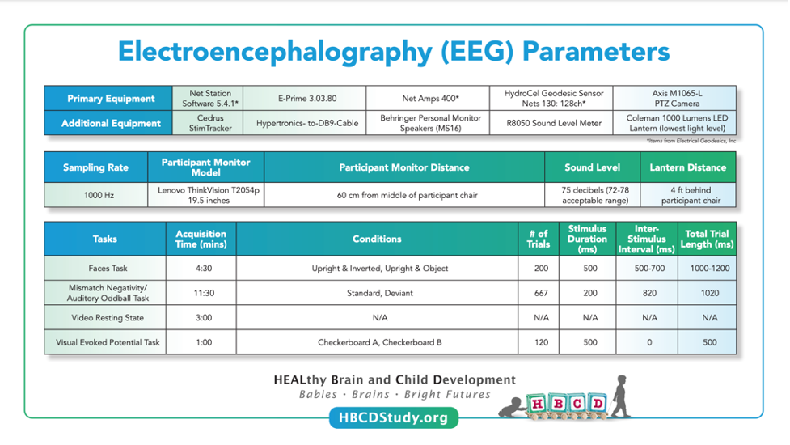

# EEG Data Curation & BIDS Conversion

## Quality Control
QC is performed by evaluating retained epochs and line noise level… [To be completed]

## BIDS Conversion
EEG data is converted from MFF to SET using a custom MATLAB script and application. This script produces flags to evaluate the acquisition quality according to the protocol guidelines. Data is collected as raw .mff files outputted from the MagStim EGI Netstation application. Next, the EEG2Bids Wizard application converts raw .mff structured files to eeg .set files, and then adds the .set files into a standardized BIDS formatted folder. This final folder is uploaded to the loris dashboard and any personally identifiable information is extracted to a secure computing environment in the UMN server. Quality control flags and acquisition notes can be found in the BIDS formatted folder in the `eeg/sourcedata/sub-<label>_ses-<label>_acq-eeg_flags.json` file.

### INPUT   
Login information for LORIS is required to use the EEG2Bids Wizard Application.  

Participant details

<ul>
 
<ul>
  <li>PSCID - required</li>
  <li>DCCID - required</li>
  <li>Biological Sex - optional, defaulted to n/a (other options include Female, Male, Other)</li>
  <li>Handedness - optional, defaulted to n/a (other options include Right, Left, Ambidextrous)</li>
</ul>

Recording details

<ul>
 
<ul>
  <li>Site - required, automatically generated from LORIS</li>
  <li>Project - required, automatically generated from LORIS</li>
  <li>Session - required, dropdown options automatically generated from LORIS</li>
</ul>

Recording Data

<ul>
 
<ul>
  <li>Resting state/baseline - required, either choose task from file folder, exclude task with reason why, or add additional runs of task</li>
  <li>MMN - required, either choose task from file folder, exclude task with reason why, or add additional runs of task</li>
  <li>Face processing - required, either choose task from file folder, exclude task with reason why, or add additional runs of task</li>
  <li>Visual Evoked Potential - required, either choose task from file folder, exclude task with reason why, or add additional runs of task</li>
  <li>Placement Photos - required, choose zipped folder from file folder</li>
  <li>Stimuli files - required, choose both .edat and .txt files for each task (outputted from the EPrime application for each task run)</li>
</ul>

 

Then, press convert to SET button

### FLAGS
During conversion to SET, a custom script is run to check the quality of data in the .mff files, and several flags are either checked as passing or failing. If failed, the flag will output an error message and potentially require a reason why this error occurred. Variables are error flags are listed below:

(ADD FLAGS ONCE COMPLETE)

Once all flags have been checked, the user must validate their name through the “Prepared by” text box, then click the convert to BIDS button.

### OUTPUT
EEG data is converted to BIDS using the MNE BIDS library.  

## Acquisition Protocol

## Tasks
### RS (Baseline/Resting-state)
3 minute silent video. The video for visit 3 is a compilation of different clips taken from Baby Einstein Baby Mozart videos. They display colorful toys and abstract images. The video for Visits 4 and 6 contains alternating 30 second clips of construction videos and marble runs. The transitions between clips cross-dissolve to avoid a harsh transition between scenes.

### MMN (Mismatched Negativity)
This task consists of 667 trials wherein the participant hears either a ‘ba’ or ‘da’ sound. One sound is a “standard” which is played in 567 trials and the other sound is a “deviant” which is randomly played in 100 trials. Whether the ‘ba’ or  ‘da’ phoneme is the standard sound is randomized across participants. Each sound plays for 200 ms and the interstimulus interval is 600ms in V04/6 or 800ms for V03.

### VEP (Visual Evoked Potential)
In this task the participant watches the screen where an alternating  black and white checkerboard is presented. The checkerboard pattern is then quickly reversed, the white tiles turn black and vice versa. For this task, the participants viewed 120 checkerboards in total with each checkerboard lasting 500ms.

### FACE (Face processing)
This task consists of two blocks, one in which the participant views 50 upright faces and 50 inverted faces and in the second block there are 50 upright faces and 50 abstract objects. The stimuli are presented for 500 ms with a jittered 600-700ms interstimulus interval, but are progressed by the experimenter based on the infant’s attention to the computer screen. Attention getters are triggered by the experimenter as necessary to keep the participant's attention oriented to the screen.
