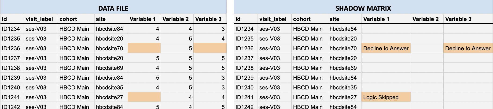

# Tabulated Data

## Overview

Tabulated data, located under `rawdata/phenotype/`, refers to data from measures and instruments listed under the documentation on [study instruments](../instruments/index.md). This includes behavior, demographics, visit data, toxicology results, and tabulated data associated with brain imaging and other file-based data:

<pre class="folder-tree">
hbcd/
|__ rawdata/ 
    |__ phenotype/ 
        |__ sed_basic_demographics.*        <span class="hashtag"># Basic Demographics</span>
        |__ par_visit_data.*                <span class="hashtag"># Visit Information</span>
        |__ bio_biosample_<span class="placeholder">&lt;nails|urine&gt;</span>.*   <span class="hashtag"># Toxicology</span>
        |__ <span class="placeholder">&lt;instrument_name&gt;</span>.*             <span class="hashtag"># Instrument Data</span>
</pre>

Tabulated data lists information for all participants in both plain text (`.tsv`) and Parquet (`.parquet`) formats (see example below). TSV files are tab-separated values files that can be easily opened in spreadsheet software or text editors, with metadata (including the names and types of each column) provided in a separate `.json` file. The Parquet files are a columnar storage format optimized for performance and efficiency, with metadata stored directly in the file. Each data file is additionally accompanied by a corresponding shadow matrix file (in `.tsv` and `.parquet` format) that mirrors the structure of the data file with the values replaced by reason for data missingness. 

<p>
<div id="instrument-age" class="notification-banner" onclick="toggleCollapse(this)">
  <span class="emoji"><i class="fa-regular fa-lightbulb"></i></span>
    <span class="text-with-link">
    <span class="text">Instrument-Specific Fields Reporting Age</span>
    <a class="anchor-link" href="#instrument-age" title="Copy link">
    <i class="fa-solid fa-link"></i>
    </a>
    </span>
  <span class="arrow">▸</span>
</div>
<div class="notification-open-collapsible-content">
<p><i>See the <a href="../../instruments/agevariables">Age Variable Definitions</a> section for a summary of all age-related variables across the release, as well as the information summarized in table format <a href="../../instruments/agevariables/#tabulated-instrument-data">here</a>.</i></p>
<b>Gestational Age at Administration</b> (<code>&lt;instrument_name&gt;_gestational_age</code>): 'GAA' is the time from the first day of the birth parent’s last menstrual period (LMP), estimated as EDD minus 280 days, to the instrument administration date. GAA is given in whole weeks, rounded down, for only the V01 visit. For a given participant, GAA typically varies by no more than 4 weeks across protocol elements except in cases where protocol exceptions were granted.
<br>
<br>
<b>Chronological Age at Administration</b> (<code>&lt;instrument_name&gt;_candidate_age</code>): Reported in years (to three decimal places), chronological age is the time from birth (with the birthdate jittered up to 7 days to mitigate identification risks) to the date of instrument administration (for V02 onward). It is calculated by dividing the total days elapsed (rounded down) by 365.25. Reporting in years, rather than months, ensures consistency across developmental stages (e.g., toddlerhood, childhood), while three-decimal precision compensates for birthdate adjustments, yielding values closer to actual age.
<br>
<br>
<b>Adjusted Chronological Age at Administration</b> (<code>&lt;instrument_name&gt;_adjusted_age</code>): 'ACAA' is the time elapsed between the estimated date of delivery (EDD) and date of instrument administration (for V02 onward), reported in whole weeks rounded down to the nearest week.
<br>
<br>
</div>
</p>

## File Types
Tabulated data is available in both tab-separated values (TSV) and [Apache Parquet](https://parquet.apache.org/) formats. Both formats are provided to support a range of tools and user preferences. However, **we recommend using Parquet for NBDC tabulated data to ensure correctly specified data types, faster loading speeds, and lower memory usage.**

### Plain Text vs. Parquet Files
#### Plain Text (TSV/CSV)
Plain text formats (TSV/CSV) are widely compatible and easy to inspect, but less efficient for large datasets. They don't support selective column loading or preserve metadata, such as data type specification; the metadata is instead available via the sidecar JSON files for plan text files. As a result, tools like Python or R must guess data types during import, often incorrectly. For example, categorical values like "0"/"1" for "Yes"/"No" (commonly used in NBDC datasets) may be interpreted as numeric, and columns with mostly missing values may be treated as empty if the first few rows lack data.

To avoid such issues, it's recommended to manually define column types using the accompanying data dictionaries included in the sidecar JSON metadata files during the import. The `NBDCtools` R package offers a helper function, `read_dsv_formatted()`, to automate this process (see [Recommended Tools](../dataformats/recprograms.md#tabulated-data) for details).

#### Parquet
<div id="parquetbids" class="notification-banner" onclick="toggleCollapse(this)">
  <span class="emoji"><i class="fa-regular fa-lightbulb"></i></span>
  <span class="text">Note: Parquet Not Currently Supported by BIDS</span>
  <span class="arrow">▸</span>
</div>
<div class="notification-open-collapsible-content">
<p>Please note that Parquet files are currently not officially supported by the <a href="https://bids-specification.readthedocs.io/en/stable/">BIDS specification</a>. For NBDC datasets, we decided to add Parquet as an alternative file format to the BIDS standard TSV to allow users to take advantage of the features of this modern and efficient open source format that is commonly used in the data science community.</p>
</div>

[Apache Parquet](https://parquet.apache.org/) is a modern, compressed, columnar format optimized for large-scale data. In contrast to TSV files, Parquet supports selective column loading and smaller file sizes. This improves loading speed and memory usage and enhances performance for analytical workflows. Crucially, parqet can store metadata (including column types, variable/value labels, and categorical coding) directly in the file, enabling accurate import without manual setup.

<p style="margin-bottom: 0; padding-bottom: 0;"><b>Example: Loading Parquet file in Python (using <a href="https://docs.pola.rs/">polars</a> or <a href="https://pandas.pydata.org/docs/getting_started/index.html">pandas</a> modules)</b></p>

```bash
# Using `polars` module [RECOMMENDED]:
import polars as pl
parquet_df = pl.read_parquet("path/to/file.parquet")

# Using `pandas` module:
import pandas as pd
parquet_df = pd.read_parquet("path/to/file.parquet")
```

<p style="margin-bottom: 0; padding-bottom: 0;"><b>Example: Loading Parquet file in R (<a href="https://arrow.apache.org/docs/r/">arrow</a> package):</b></p>

```bash 
# Using `arrow` package:
library(arrow)
parquet_df <- read_parquet("path/to/file.parquet")
```

### Shadow Matrices
Each TSV and Parquet ***data file*** in the BIDS `/rawdata/phenotype/` directory has a corresponding ***shadow matrix file*** in the same format (TSV or Parquet). These shadow matrix files mirror the structure and column names of the original data files and are available to download via Lasso and DEAP.

In the data files, missing values are represented as blank cells. Shadow matrices provide essential context by indicating the reason a value is missing (e.g., “don’t know,” “declined to answer,” “missed visit”). Each cell in a shadow matrix corresponds to the same cell in the associated data file:

- If a data cell contains a value, the corresponding shadow matrix cell is blank.
- If a data cell is missing, the corresponding shadow matrix cell includes a code or description indicating the reason the data is missing, as illustrated below by the <mark style="background-color: #f9cb9b; font-weight: normal;">highlighted cells</mark> in the data file (*left*) vs. the corresponding shadow matrix (*right*).



In HBCD, some participant responses like “Don’t know” or “Decline to answer” (which are typically considered non-responses) are deliberately converted to missing values in the data file, with the original response converted to a missingness reason stored in the shadow matrix. This prevents analytical errors such as inadvertently treating placeholder codes (like `777` or `999`, common in other datasets) as valid numeric values during analysis and ensures consistency in data types across all entries (e.g. text notes in numeric fields are avoided).

<div id="shadowFYI" class="notification-banner" onclick="toggleCollapse(this)">
  <span class="emoji"><i class="fa-regular fa-lightbulb"></i></span>
  <span class="text">When should I use shadow matrices?</span>
  <span class="arrow">▸</span>
</div>
<div class="notification-open-collapsible-content">
<p>While the approach of storing missingness reasons in a shadow matrix file supports cleaner analyses, there are situations where non-responses are themselves meaningful. For example, a researcher might be interested in how often participants do not understand a given question and how this relates to other variables. In such cases, users can re-integrate the non-responses from the shadow matrix back into the data.</p>
</div>

#### Working with Shadow Matrices in R and Python 
Here we describe how researchers can use shadow matrix files in combination with the data files to, for example, explore and understand patterns of missing data or integrate missingness reasons (e.g., `Decline to Answer`, `Logic Skipped`, etc.) into your analysis. 

For working in **R**, we recommend using the `NBDCtools` package - see details [here](recprograms.md#tabulated-data). For **Python**, the following helper function joins the tabulated data file with its corresponding shadow matrix file so data columns are combined with columns providing the reasons for missingness in the same data frame. This function works with both TSV and CSV file formats, but can be updated for Parquet files using the loading logic shown under the section on Parquet files above ([here](#parquet)).

##### 🐍 Python Helper Function
```
import pandas as pd
import os

def load_data_with_shadow(data_path, shadow_path):  
    """  
    Loads a data file (CSV or TSV) and its corresponding shadow matrix  
    (CSV or TSV) and adds '_missing_reason' columns for missing values.
    """  

    # Detect delimiter from file extension and load data
    def get_delimiter(path):
        ext = os.path.splitext(path)[1].lower()
        return "\t" if ext == ".tsv" else ","

    data = pd.read_csv(data_path, delimiter=get_delimiter(data_path))  
    shadow = pd.read_csv(shadow_path, delimiter=get_delimiter(shadow_path))

    # Annotate data with non-empty missingness reason columns (excluding participant_id 
    # and session_id) in shadow matrix 
    for col in data.columns[2:]:  
        if col in shadow.columns:
            if not shadow[col].isna().all() and not (shadow[col] == '').all():
                data[f"{col}_missing_reason"] = shadow[col]

    return data

# Example usage:
df = load_data_with_shadow("data.tsv", "shadow_matrix.tsv")

# Example: View reasons for missing data for a given column/variable in the data file 
df[df["<COLUMN NAME>"].isna()][["<COLUMN NAME>_missing_reason"]]  
```

## File Naming Conventions

### Overview
Most protocol elements follow a standardized naming convention with the structure: `domain_source_acronym`. Note that imaging derivatives do not follow this naming scheme, but are generally understood to be under the MRI, EEG, etc. domain and strictly for the 'Child.' Each component represents the following:

- **domain**: The general domain or category the protocol element falls under (e.g., biospecimens, MRI, behavior).
- **source**: Indicates who the protocol element is about or, in some cases, who completed the assessment. The source can represent either the *respondent* (who provided the information) or the *subject* (who the data is about).
For example, `mri_ra_prep` refers to MRI-related data entered by a research assistant (RA), representing procedural details as opposed to direct input from a child or caregiver.
- **acronym/abbreviation**: A short form or code representing the specific protocol element.

<div id="table-banner" class="table-banner" onclick="toggleCollapse(this)">
  <span class="text">Values for 'domain' and 'source' components</span>
  <span class="arrow">▸</span>
</div>
<div class="collapsible-content">
  <div style="display: flex; gap: 40px; flex-wrap: wrap;">
    <div>
      <p><strong>Possible values for <b>domain</b>:</strong></p>
      <ul>
        <li><code>bio</code> - Biospecimens</li>
        <li><code>mh</code> - Behavior/Child-Caregiver Interaction</li>
        <li><code>sed</code> - Social/Environmental Health Determinants</li>
        <li><code>sens</code> - Biosensor</li>
        <li><code>ph</code> - Physical Health</li>
        <li><code>ncl</code> - Neurocognition and Language</li>
        <li><code>nt</code> - Novel Tech</li>
        <li><code>eeg</code> - EEG</li>
        <li><code>mri</code> - MRI</li>
      </ul>
    </div>
    <div>
      <p><strong>Possible values for <b>source</b>:</strong></p>
      <ul>
        <li><code>ch</code> - Child</li>
        <li><code>bm</code> - Biological Mother</li>
        <li><code>si</code> - Sibling</li>
        <li><code>te</code> - Teacher</li>
        <li><code>cl</code> - Clinician</li>
        <li><code>ra</code> - RA (research assistant)</li>
        <li><code>ld</code> - Linked Data</li>
        <li><code>fd</code> - Family Data</li>
      </ul>
    </div>
  </div>
</div>

### Correspondence to JSON Metadata

The `domain` and `source` are also included in the JSON metadata and are typically derived from the corresponding sections of the instrument name. However, in some cases, data are collected directly into fields or tables that do not follow the standard naming convention. In those instances, the domain and source values are added later during the Data Release process.

**This applies to:**

*   BioSpecimens
*   Imaging file based data & derivatives
*   Some session-level elements (e.g. `informantID`)
*   Participant-level data

### Single vs Double Underscores 

Instrument table and field names may contain either single ( `_` ) or double ( `__` ) underscores. For example: `ncl_ch_mlds` ([MLDS](../instruments/neurocog/mlds.md)) vs `ncl_cg_spm2__inf` ([SPM-2](../instruments/neurocog/spm2.md)) Neurocognition & Language instruments. Single underscores typically indicate a higher level in the hierarchy compared to double underscores to help distinguish between scales and sub-scale counters across different instruments. *However*, a unified naming scheme has not yet been employed in the current release, so this will not be consistent across variables. Future releases aim to implement a standardized naming scheme for consistency.

## Exclusion Criteria

### General Rules Applied to All Data
- For all participants with only one active V01 visit, sex is changed from "Male/Female" to “Other”
- All empty strings (“”) or missing values are replaced with the default ReproSchema-compliant string “n/a”
- Some fields can have out-of-range values considered “extreme” that are changed to “n/a." Filtered fields are listed under [Filtered Out-Of-Range Field Values](#filtered-values).
  
### Static Element Exclusions
Static elements are precisely identified hard-coded elements. Exclusions applied to static elements in the current release are as follows:

#### Participant Exclusions
The current data release excludes participants with a 'Postnatal Recruitment' visit as well as Multiple Birth Participants (to be included in the [interim release](../changelog/pending.md#release-11-release-date-tba)).

#### Instrument & Field Exclusions

Expand the following section to see a list of instruments and instrument fields excluded from the current release:

<p>
<div id="static-exclusions" class="table-banner" onclick="toggleCollapse(this)">
    <span class="text-with-link">
    <span class="text">Excluded Instruments & Instrument Fields</i></span>
  <a class="anchor-link" href="#static-exclusions" title="Copy link">
  <i class="fa-solid fa-link"></i>
  </a>
  </span>
  <span class="arrow">▸</span>
</div>
<div class="table-collapsible-content">
<div style="display: flex; gap: 10px; justify-content: flex-start; align-items: flex-start;">
  <div>
    <table style="width: 100%; border-collapse: collapse; table-layout: fixed; font-size: 14px">
    <caption style="font-size: 1.2em; font-style: normal; padding-bottom: 5px;"><strong>Excluded Instruments</strong></caption>
      <thead>
        <tr>
          <th style="width: 40%; text-align: center;">Instrument</th>
          <th style="width: 30%; text-align: center;">Table Name</th>
        </tr>
      </thead>
      <tbody>
       <tr><td style="word-wrap: break-word; white-space: normal;">Biosensor Receipt Form</td><td style="word-wrap: break-word; white-space: normal;">sens_ch_rcpt</td></tr>
    <tr><td style="word-wrap: break-word; white-space: normal;">EEG Acquisition Checklist - Form</td><td style="word-wrap: break-word; white-space: normal;">eeg_ch_chkl</td></tr>
    <tr><td style="word-wrap: break-word; white-space: normal;">EEG Acquisition Checklist - Reattempt 1</td><td style="word-wrap: break-word; white-space: normal;">eeg_ch_chkl_1</td></tr>
    <tr><td style="word-wrap: break-word; white-space: normal;">EEG Acquisition Checklist - Reattempt 2</td><td style="word-wrap: break-word; white-space: normal;">eeg_ch_chkl_2</td></tr>
    <tr><td style="word-wrap: break-word; white-space: normal;">GABI Setup</td><td style="word-wrap: break-word; white-space: normal;">nt_pa_gabi_setup</td></tr>
    <tr><td style="word-wrap: break-word; white-space: normal;">GABI Receipt</td><td style="word-wrap: break-word; white-space: normal;">nt_pa_gabi_rcpt</td></tr>
    <tr><td style="word-wrap: break-word; white-space: normal;">ERICA 3–7 Months</td><td style="word-wrap: break-word; white-space: normal;">mh_cg_erica_3_7m</td></tr>
    <tr><td style="word-wrap: break-word; white-space: normal;">ERICA 7–9 Months</td><td style="word-wrap: break-word; white-space: normal;">mh_cg_erica_7_9m</td></tr>
    <tr><td style="word-wrap: break-word; white-space: normal;">ERICA FCM Admin 3–7 Months</td><td style="word-wrap: break-word; white-space: normal;">mh_cg_erica_fcm_adm_3_7m</td></tr>
    <tr><td style="word-wrap: break-word; white-space: normal;">ERICA FCM Admin 7–9 Months</td><td style="word-wrap: break-word; white-space: normal;">mh_cg_erica_fcm_adm_7_9m</td></tr>
    <tr><td style="word-wrap: break-word; white-space: normal;">MRI Data Summary Form</td><td style="word-wrap: break-word; white-space: normal;">mri_ra_chkl_data</td></tr>
    <tr><td style="word-wrap: break-word; white-space: normal;">MRI Scan Session Summary Form</td><td style="word-wrap: break-word; white-space: normal;">mri_ra_chkl_scan</td></tr>
    <tr><td style="word-wrap: break-word; white-space: normal;">MRI Pre/Post Scan Prep</td><td style="word-wrap: break-word; white-space: normal;">mri_ra_prep</td></tr>
    <tr><td style="word-wrap: break-word; white-space: normal;">NIH Baby ToolBox</td><td style="word-wrap: break-word; white-space: normal;">ncl_ch_nbtb</td></tr>
    <tr><td style="word-wrap: break-word; white-space: normal;">Participant Feedback Form</td><td style="word-wrap: break-word; white-space: normal;">adm_cg_fb</td></tr>
    <tr><td style="word-wrap: break-word; white-space: normal;">RA Feedback</td><td style="word-wrap: break-word; white-space: normal;">adm_ra_fb</td></tr>
    <tr><td style="word-wrap: break-word; white-space: normal;">Participant Alerts</td><td style="word-wrap: break-word; white-space: normal;">admin_alert</td></tr>
    <tr><td style="word-wrap: break-word; white-space: normal;">TLFB (Timeline Follow Back) Summary Parser</td><td style="word-wrap: break-word; white-space: normal;">pex_ch_tlfb</td></tr>
    <tr><td style="word-wrap: break-word; white-space: normal;">Visit Level Data</td><td style="word-wrap: break-word; white-space: normal;">adm_fd_visitdata</td></tr>
    <tr><td style="word-wrap: break-word; white-space: normal;">Visit Start</td><td style="word-wrap: break-word; white-space: normal;">visit_start</td></tr>
    <tr><td style="word-wrap: break-word; white-space: normal;">Urgent Events</td><td style="word-wrap: break-word; white-space: normal;">adm_fd_urgent</td></tr>
    <tr><td style="word-wrap: break-word; white-space: normal;">Transitions in Care Questionnaire</td><td style="word-wrap: break-word; white-space: normal;">sed_cg_tic</td></tr>
    </tbody>
    </table>
  </div>

  <div>
    <table style="width: 100%; border-collapse: collapse; table-layout: fixed; font-size: 14px">
    <caption style="font-size: 1.2em; font-style: normal; padding-bottom: 5px;"><strong>Excluded Instrument Fields</strong></caption>
      <thead>
        <tr>
          <th style="width: 30%; text-align: center;">Field</th>
          <th style="width: 30%; text-align: center;">Field Name</th>
        </tr>
      </thead>
  <tbody>
    <tr><td style="word-wrap: break-word; white-space: normal;">Examiner</td><td style="word-wrap: break-word; white-space: normal;">Examiner</td></tr>
    <tr><td style="word-wrap: break-word; white-space: normal;">Date of Birth</td><td style="word-wrap: break-word; white-space: normal;">DOB</td></tr>
    <tr><td style="word-wrap: break-word; white-space: normal;">Informant</td><td style="word-wrap: break-word; white-space: normal;">informant</td></tr>
    <tr><td style="word-wrap: break-word; white-space: normal;">Validity</td><td style="word-wrap: break-word; white-space: normal;">validity</td></tr>
    <tr><td style="word-wrap: break-word; white-space: normal;">Duration</td><td style="word-wrap: break-word; white-space: normal;">duration</td></tr>
    <tr><td style="word-wrap: break-word; white-space: normal;">Window Difference</td><td style="word-wrap: break-word; white-space: normal;">window_difference</td></tr>
    <tr><td style="word-wrap: break-word; white-space: normal;">Start timestamp</td><td style="word-wrap: break-word; white-space: normal;">timestamp_start</td></tr>
    <tr><td style="word-wrap: break-word; white-space: normal;">Stop timestamp</td><td style="word-wrap: break-word; white-space: normal;">timestamp_stop</td></tr>
    <tr><td style="word-wrap: break-word; white-space: normal;">REDCap timestamp</td><td style="word-wrap: break-word; white-space: normal;">timestamp_redcap_locked</td></tr>
    <tr><td style="word-wrap: break-word; white-space: normal;">Visit Data</td><td style="word-wrap: break-word; white-space: normal;">visit_stage removed from the visit_data category</td></tr>
    <tr><td style="word-wrap: break-word; white-space: normal;">Height/Weight/Head Circumference</td><td style="word-wrap: break-word; white-space: normal;">ph_ch_anthro – BMI-related fields removed</td></tr>
    <tr><td style="word-wrap: break-word; white-space: normal;">Breast Feeding History</td><td style="word-wrap: break-word; white-space: normal;">ph_cg_phx_i_bfh – All fields except 001 excluded</td></tr>
    <tr><td style="word-wrap: break-word; white-space: normal;">Clinical Alerts</td><td style="word-wrap: break-word; white-space: normal;"> </td></tr>
    <tr><td style="word-wrap: break-word; white-space: normal;">REDCap Complete status</td><td style="word-wrap: break-word; white-space: normal;">complete</td></tr>
    <tr><td style="word-wrap: break-word; white-space: normal;">Scannable codes</td><td style="word-wrap: break-word; white-space: normal;">BioSamples codes, tracking Nos, etc.</td></tr>
    <tr><td style="word-wrap: break-word; white-space: normal;">Line fields</td><td style="word-wrap: break-word; white-space: normal;"> </td></tr>
    </tbody>
    </table>
  </div>
</div>
</div>

</p>

#### Filtered Field Values
Some fields can have out-of-range values considered “extreme.” Values outside of the valid ranges listed for the instruments below were filtered, i.e. changed to "n/a."

<table style="width: 100%; border-collapse: collapse; table-layout: fixed;">
  <thead>
    <tr>
      <th style="width: 10%; text-align: center;">Instrument</th>
      <th style="width: 10%; text-align: center;">Table Name</th>
      <th style="width: 30%; text-align: center;">Field</th>
      <th style="width: 30%; text-align: center;">Valid Range</th>
    </tr>
  </thead>
<tbody>        
<td colspan="1" rowspan="4">Growth</td>
<td colspan="1" rowspan="4"><code>ph_ch_anthro</code></td>
    <tr>
        <td>Length (<code>len_001_i_03</code>)</td>
        <td>30 to 130 cm</td>
    </tr>     
    <tr>
        <td>Head Circumference (<code>head_001_i_03</code>)</td>
        <td>25 to 55 cm</td>
    </tr>          
    <tr>
        <td>Weight (<code>wei_001_i_03</code>)</td>
        <td>0.5 to 30 kg</td>
    </tr>         
<td colspan="1" rowspan="5">Healthv2 Inf</td>
<td colspan="1" rowspan="5"><code>pex_bm_healthv2_inf</code></td>
    <tr>
        <td><code>001_i_01</code></td>
        <td>≤ 16</td>
    </tr>     
    <tr>
        <td><code>001_i_02</code></td>
        <td>≤ 66</td>
    </tr>     
    <tr>
        <td><code>002</code></td>
        <td>12 - 51</td>
    </tr>     
    <tr>
        <td><code>002_i_01</code></td>
        <td>30 - 130</td>
    </tr>     
</tbody>
</table>

### Dynamic Element Exclusions

In contrast to static elements (e.g. participants, instruments, and instrument fields), which are fixed and consistently structured, dynamic elements refer to data that are programmatically derived, conditionally included, or vary based on participant behavior or system context. These elements may include calculated fields, system-generated metadata, or selectively captured measures such as biospecimens, geocoded data, and direct REDCap submissions. The following filters were applied to exclude specific dynamic elements from this release, based on participant status, visit timing, data completeness, and domain-specific conditions:

<ul>
<b>Participant Filters:</b>
    <li>No brain rating or brain rating noted “abnormal” are not selected</li>
    <li>Only active participants and sessions are selected</li>
    <li>Participants from Data Coordination Center (DCC) and University of Florida (UFL) sites are not selected</li>
    <li>Only participants with PSCIDs starting with “CH” are selected (excluding all test participants e.g. QI, YI, XI, PI)</li>
</ul>
<ul><b>Visit Filters:</b> 
<li>Only visits whose 'LaunchPad Complete' Status was set to 'Complete' before July 1st, 2024 are included</li>
</ul>
<ul>
<b>Domain Filters:</b>
    <li>BioSpecimens</li>
    <li>Geocoding data</li>
    <li>Transition in Care</li>
    <li>REDCap surveys filled out directly in LORIS (Identified based on LORIS 'Examiner' field not set to 'REDCap')</li>
</ul>

