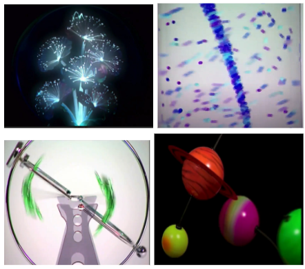
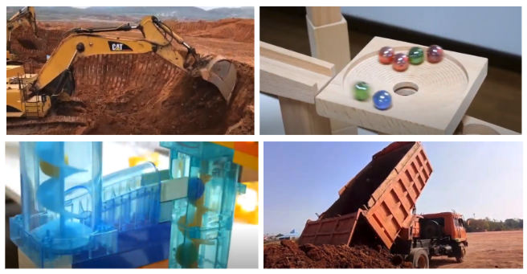
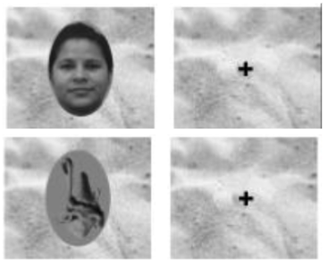

# EEG

## Video Resting State
### Overview
**Full Name**: Video Resting State  
**Acronym/Brief Name**: RS  
**Construct**: The Video Resting State (v.11.29.23) task provides information about neural oscillations measured in EEG power across the scalp. Developmental changes in oscillatory activity reflect underlying developing large scale neural networks associated with early self-regulatory, cognitive, and affective processes and developmental outcomes (Gabard-Durnam et al., 2019; E. J. Jones et al., 2020; Whedon et al., 2020). The metrics derived from the resting EEG signal include power across the frequency spectrum (Gabard-Durnam et al., 2019\) and relative power between different scalp locations (Davidson & Fox, 1982). See Fox et al. (2024) for more information about the RS.   
**Description**:    
In V03, a silent video plays with a variety of colorful and abstract toys and visuals on screen. The child watches the video for the duration of the task.

In V04/6, a silent video plays with a variety of marble run and construction visuals on screen. The child watches the video for the duration of the task.    

**Summary**: The Resting State Task (v.11.29.23) provides assessment of the development of large scale neural networks during infancy and early childhood.

### Publications and References
Davidson, R. J., & Fox, N. A. (1982). Asymmetrical Brain Activity Discriminates Between Positive and Negative Affective Stimuli in Human Infants. Science, 218(4578), 1235– 1237. [https://doi.org/10.1126/science.7146906](https://doi.org/10.1126/science.7146906)

Fox, N.A., Pérez-Edgar, K., Morales, S., Brito, N.H., Campbell, A.M., Cavanagh, J.F., Gabard-Durnam, L.J., Hudac, C.M., Key, A.P., Larson-Prior, L.J., Pedapati, E.V., Norton, E.S., Reetzke, R., Roberts, T.P., Rutter, T.M., Scott, L.S., Shuffrey, L.C., Antúnez, M., Boylan, M.R., … Yoder, L. (2024). The development and structure of the Healthy Brain and Child Development (HBCD) study EEG Protocol. Developmental Cognitive Neuroscience, 69, 101447. https://doi.org/10.1016/j.dcn.2024.101447 

Gabard-Durnam, L.J., Wilkinson, C., Kapur, K., Tager-Flusberg, H., Levin, A.R., & Nelson, C.A. (2019). Longitudinal EEG power in the first postnatal year differentiates autism outcomes. Nature Communications, 10(1), Article 1. [https://doi.org/10.1038/s41467-019-12202-9](https://doi.org/10.1038/s41467-019-12202-9) 

Jones, E.J. H., Goodwin, A., Orekhova, E., Charman, T., Dawson, G., Webb, S.J., & Johnson, M.H. (2020). Infant EEG theta modulation predicts childhood intelligence. Scientific Reports, 10(1), 11232. [https://doi.org/10.1038/s41598-020-67687-y](https://doi.org/10.1038/s41598-020-67687-y) 

Whedon, M., Perry, N.B., & Bell, M.A. (2020). Relations between frontal EEG maturation and inhibitory control in preschool in the prediction of children’s early academic skills. Brain and Cognition, 145, 105636. [https://doi.org/10.1016/j.bandc.2020.105636](https://doi.org/10.1016/j.bandc.2020.105636) 

### Implementation Details
**Method of Administration**: RA administered in person  
**REDCap Form Name**: NA  
**Pilot Data Dictionary**: NA  
**Spanish Translation**: NA  
**Child Specific/Unspecific Form**: Child Specific  
**Respondent**: NA

### Data Collection
**Visits Administered and corresponding age range of administration**:  
  * V03: 3-9 months  
  * V04: 9-15 months  
  * V06: 15-48 months  
**Estimated length of time for completion**: Approximately 3 minutes

### Quality Control (QC) Processes
**QC Procedures** 
  * Data are cleaned and preprocessed using the Maryland Analysis of Developmental EEG (MADE) pipeline (Debnath et al., 2019).   
  * Ongoing QC monitoring via LORIS dashboard  
  * Rate quality of EEG cap application for each recording  
  * Site specific check ins and troubleshooting  
  * See Fox et al. (2024) for more information on EEG data quality control procedures.   

**Common Issues Identified**  
  * Irregular application of EEG sensors 

### Potential Issues Flagged by Subject Matter Experts
* Change in video content between V03 \- V04/6

### Additional Information
**Relevant Documents**: HBCD E-Prime Task Manual, Official EEG Acquisition Manual  
**Links to Resources**:  
  * [E-Prime manual](https://docs.google.com/document/d/1PghQQpLbxjQavtVlHyIz7JVJxlyKcC4Do8z8j7srdaI/edit?usp=sharing)  
  * [EEG Acquisition Manual](https://docs.google.com/document/d/1tjrFJzntHOqJOrq-SRGy2Z0LOj56MFsZ2ZocgrUogSs/edit?usp=sharing)

### Summary
The Resting State Task (v.11.29.23) provides assessment of large-scale neural networks in infancy and early childhood. It includes thorough QC procedures to ensure data accuracy and integrity.

## EEG Faces Task
### Overview
**Full Name**: Faces task  
**Acronym/Brief Name**: Face  
**Construct**: The Faces task (v.11.29.23) assesses child and infant face processing abilities as well as the underlying neural activity supporting face and object processing. ERPs are computed as a function of repeated presentation of faces and objects. The ERPs index different stages of processing including attention, perception, categorization, individuation and memory. The ERP components elicited by the Faces task are the P1, N290, and P400 components. See Fox et al (2024) for additional information on the rationale for task/stimulus development and ERP findings from pilot data.   
**Description**: The task consists of 2 blocks: 50 trials of upright faces & 50 trials of inverted faces and 50 trials of upright faces & 50 trials of objects. If the child loses attention, an attention getter may be played to bring the child’s focus back to the task. 

**Face task images (Face vs. Object)**

**Face task schematic (Face vs. Object)**

**Summary**: The Face task (v.11.29.23) is used to assess neural activity supporting face and object processing within the first years of life.

### Publications and References
Barry-Anwar, Ryan, Tracy Riggins, and Lisa S. Scott, 'Electrophysiology in Developmental Populations Key Methods and Findings', in Kathrin Cohen Kadosh (ed.), *Oxford Handbook of Developmental Cognitive Neuroscience*, Oxford Library of Psychology (2024; online edn, Oxford Academic, 2 Sept. 2020), [https://doi.org/10.1093/oxfordhb/9780198827474.013.3](https://doi.org/10.1093/oxfordhb/9780198827474.013.3)

Fox, N.A., Pérez-Edgar, K., Morales, S., Brito, N.H., Campbell, A.M., Cavanagh, J.F., Gabard-Durnam, L.J., Hudac, C.M., Key, A.P., Larson-Prior, L.J., Pedapati, E.V., Norton, E.S., Reetzke, R., Roberts, T.P., Rutter, T.M., Scott, L.S., Shuffrey, L.C., Antúnez, M., Boylan, M.R., … Yoder, L. (2024). The development and structure of the Healthy Brain and Child Development (HBCD) study EEG Protocol. Developmental Cognitive Neuroscience, 69, 101447. https://doi.org/10.1016/j.dcn.2024.101447 

Markant, J., & Scott, L. S. (2018). Attention and Perceptual Learning Interact in the Development of the Other-Race Effect. *Current Directions in Psychological Science*, *27*(3), 163–169. [https://doi.org/10.1177/0963721418769884](https://doi.org/10.1177/0963721418769884) 

Scherf, K.S., & Scott, L.S. (2012). Connecting developmental trajectories: Biases in face processing from infancy to adulthood. *Developmental Psychobiology*, *54*(6), 643–663. [https://doi.org/10.1002/dev.21013](https://doi.org/10.1002/dev.21013)

### Implementation Details
**Method of Administration**: RA administered in person  
**REDCap Form Name**: NA  
**Pilot Data Dictionary**: NA  
**Spanish Translation**: NA  
**Child Specific/Unspecific Form**: Child Specific  
**Respondent**: NA

### Data Collection
**Visits Administered and corresponding age range of administration**:  
  * V03: 3-9 months  
  * V04: 9-15 months  
  * V06: 15-48 months  
**Estimated length of time for completion**: Approximately 5 minutes

### Quality Control (QC) Processes
**QC Procedures**:  
  * Data are cleaned and preprocessed using the Maryland Analysis of Developmental EEG (MADE) pipeline (Debnath et al., 2019\)  
  * Ongoing QC monitoring via LORIS dashboard  
  * Rate quality of EEG cap application for each recording  
  * Site specific check ins and troubleshooting  
  * See Fox et al. (2024) for more information on EEG data quality control procedures.   
**Common Issues Identified**:  
  * Partial task completion due to infant fussing out  
  * Irregular application of EEG sensors   
  * Missing stimulus flags

### Potential Issues Flagged by Subject Matter Experts
* No issues found

### Additional Information
**Relevant Documents**: HBCD E-Prime Task Manual, Official EEG Acquisition Manual  
**Links to Resources**:  
  * [E-Prime manual](https://docs.google.com/document/d/1PghQQpLbxjQavtVlHyIz7JVJxlyKcC4Do8z8j7srdaI/edit?usp=sharing)  
  * [EEG Acquisition Manual](https://docs.google.com/document/d/1tjrFJzntHOqJOrq-SRGy2Z0LOj56MFsZ2ZocgrUogSs/edit?usp=sharing)

### Summary
The Face task (v.11.29.23) is used to assess neural activity supporting face and object processing. It assesses child and infant face processing development including attention, perception, categorization, individuation and memory. The measure includes rigorous QC procedures to ensure data integrity and reliability.

## EEG Auditory Mismatch Negativity Task
### Overview
**Full Name**: Auditory Mismatch Negativity Task  
**Acronym/Brief Name**: MMN  
**Construct**: The Auditory mismatch negativity (MMN) Task (v.11.29.23) facilitates examining auditory evoked potentials and habituation/dishabituation to auditory stimuli. The MMN captures differences in neural responses to standard (“ba”) and deviant (“da”) stimuli.  From this task the MMN difference wave is computed, which is also known as the Mismatch Response (MMR). The amplitude/latency of this difference wave has been linked to language (Choudhury & Benasich, 2011), temperament/personality (Gurrera et al., 2001; Marshall et al., 2009), internalizing problems (Reeb-Sutherland et al., 2009), externalizing/attention problems (Gumenyuk et al., 2005), and disorders including autism (Lepistö et al., 2005; Schwartz et al., 2018\) and reading ability/dyslexia (Leppänen et al., 2010; Norton, Beach, et al., 2021). See Fox et al. (2024) for more information about the MMN task.   
**Description**: An auditory presentation of human syllables including “ba” and “da”. A video is played on iPad as a distractor with brightness all the way up, in airplane mode, and not plugged in. The task runs for 11:30 minutes in V03 and 8:30 minutes in V04/6. The task may be paused if breaks are needed.   
**Summary**: The MMN task (v.11.29.23) provides a comprehensive assessment of infant speech sound processing. The measure includes rigorous QC procedures to ensure data integrity and reliability.

### Publications and References
Choudhury, N., & Benasich, A. A. (2011). Maturation of auditory evoked potentials from 6 to 48 months: Prediction to 3 and 4 year language and cognitive abilities. Clinical Neurophysiology, 122(2), 320–338. [https://doi.org/10.1016/j.clinph.2010.05.035](https://doi.org/10.1016/j.clinph.2010.05.035)

Fox, N.A., Pérez-Edgar, K., Morales, S., Brito, N.H., Campbell, A.M., Cavanagh, J.F., Gabard-Durnam, L.J., Hudac, C.M., Key, A.P., Larson-Prior, L.J., Pedapati, E.V., Norton, E.S., Reetzke, R., Roberts, T.P., Rutter, T.M., Scott, L.S., Shuffrey, L.C., Antúnez, M., Boylan, M.R., … Yoder, L. (2024). The development and structure of the Healthy Brain and Child Development (HBCD) study EEG Protocol. Developmental Cognitive Neuroscience, 69, 101447. https://doi.org/10.1016/j.dcn.2024.101447 

Gumenyuk, V., Korzyukov, O., Escera, C., Hämäläinen, M., Huotilainen, M., Häyrinen, T., Oksanen, H., Näätänen, R., Von Wendt, L., & Alho, K. (2005). Electrophysiological evidence of enhanced distractibility in ADHD children. Neuroscience Letters, 374(3), 212–217. https://doi.org/10.1016/j.neulet.2004.10.081

Gurrera, R.J., O’Donnell, B.F., Nestor, P.G., Gainski, J., & McCarley, R.W. (2001). The P3 auditory event–related brain potential indexes major personality traits. Biological Psychiatry, 49(11), 922–929. https://doi.org/10.1016/S0006-3223(00)01067-2

Lachmann, T., Berti, S., Kujala, T., & Schröger, E. (2005). Diagnostic subgroups of developmental dyslexia have different deficits in neural processing of tones and phonemes. International Journal of Psychophysiology, 55(2), 105–120. [https://doi.org/10.1016/j.ijpsycho.2004.11.005](https://doi.org/10.1016/j.ijpsycho.2004.11.005) 

Lepistö, T., Kujala, T., Vanhala, R., Alku, P., Huotilainen, M., & Näätänen, R. (2005). The discrimination of and orienting to speech and non-speech sounds in children with autism. Brain Research, 1066(1–2), 147–157.

Leppänen, P.H., Hämäläinen, J.A., Salminen, H.K., Eklund, K.M., Guttorm, T.K., Lohvansuu, K., Puolakanaho, A., & Lyytinen, H. (2010). Newborn brain event-related potentials revealing atypical processing of sound frequency and the subsequent association with later literacy skills in children with familial dyslexia. Cortex, 46(10), 1362–1376.

Marshall, P.J., Reeb, B.C., & Fox, N.A. (2009). Electrophysiological responses to auditory novelty in temperamentally different 9-month-old infants. Developmental Science, 12(4), 568–582. [https://doi.org/10.1111/j.1467-7687.2008.00808.x](https://doi.org/10.1111/j.1467-7687.2008.00808.x)

Morr, M.L., Shafer, V.L., Kreuzer, J.A., & Kurtzberg, D. (2002). Maturation of mismatch negativity in typically developing infants and preschool children. Ear and Hearing, 23(2), 118–136. https://doi.org/10.1097/00003446-200204000-00005

Norton, E.S., Beach, S.D., Eddy, M.D., McWeeny, S., Ozernov-Palchik, O., Gaab, N., & Gabrieli, J.D. (2021). ERP mismatch negativity amplitude and asymmetry reflect 34 phonological and rapid automatized naming 	skills in English-speaking kindergartners. Frontiers in Human Neuroscience, 15, 624617.

Reeb-Sutherland, B.C., Vanderwert, R.E., Degnan, K.A., Marshall, P.J., Pérez-Edgar, K., Chronis-Tuscano, A., Pine, D.S., & Fox, N.A. (2009). Attention to novelty in behaviorally inhibited adolescents moderates risk 	for anxiety. Journal of Child Psychology and Psychiatry, 50(11), 1365–1372. [https://doi.org/10.1111/j.1469-](https://doi.org/10.1111/j.1469-)7610.2009.02170.x

Schwartz, S., Shinn-Cunningham, B., & Tager-Flusberg, H. (2018). Meta-analysis and systematic review of the literature characterizing auditory mismatch negativity in individuals with autism. Neuroscience & Biobehavioral Reviews, 87, 106–117.

### Implementation Details
**Method of Administration**: RA administered in person  
**REDCap Form Name**: NA  
**Pilot Data Dictionary**: NA  
**Spanish Translation**: NA  
**Child Specific/Unspecific Form**: Child Specific  
**Respondent**: NA

### Data Collection
**Visits Administered and corresponding age range of administration**:  
  * V03: 3-9 months  
  * V04: 9-15 months  
  * V06: 15-48 months  
**Estimated length of time for completion**: Approximately 11:30 minutes (V03) or 8:30 minutes (V04/6)

### Quality Control (QC) Processes
**QC Procedures** 
  * Data are cleaned and preprocessed using the Maryland Analysis of Developmental EEG (MADE) pipeline (Debnath et al., 2019\)  
  * Ongoing QC monitoring via LORIS dashboard  
  * Rate quality of EEG cap application for each recording  
  * Site specific check ins and troubleshooting  
  * See Fox et al. (2024) for more information on EEG data quality control procedures.   

**Common Issues Identified**  
  * Partial task completion due to infant fussing out  
  * Irregular application of EEG sensors   
  * Missing stimulus flags

### Potential Issues Flagged by Subject Matter Experts
* Interstimulus interval (ISI) changes between V03 \- V04/6. See Fox et al. (2024) and Morr et al. (2002) for more information about the ISI change. 

### Additional Information
**Relevant Documents**: HBCD E-Prime Task Manual, Official EEG Acquisition Manual  
**Links to Resources**:  
  * [E-Prime manual](https://docs.google.com/document/d/1PghQQpLbxjQavtVlHyIz7JVJxlyKcC4Do8z8j7srdaI/edit?usp=sharing)  
  * [EEG Acquisition Manual](https://docs.google.com/document/d/1tjrFJzntHOqJOrq-SRGy2Z0LOj56MFsZ2ZocgrUogSs/edit?usp=sharing)

### Summary
The Auditory Mismatch Negativity task (v.11.29.23) provides an assessment of the precursors of infant and child language development. It includes thorough QC procedures to ensure data accuracy and integrity.

## EEG Visual Evoked Potential Task
### Overview
**Full Name**: Visual Evoked Potential Task  
**Acronym/Brief Name**: VEP  
**Construct**: The Visual Evoked Potential Task (VEP) (v.11.29.23) measures cortical responses to flashing checkerboard visual stimuli. VEP amplitude and latency decreases with age during the first three years of life. The VEP has been associated with concurrent and later developmental outcomes as a function of prenatal substance exposures (Margolis et al., 2024), early visual enrichment or deprivation (Jensen et al., 2019), vision system maturation (Lippé et al., 2009), neurodevelopmental disorders (e.g., ASD and ADHD; Cremone- Caira et al., 2023; Nazhvani et al., 2013), and reading and learning disabilities (Shandiz et al., 2017). The morphology of the VEP likely reflects varying degrees of synaptic efficiency and as such, can be used as a readout of general cortical function. The task elicits a VEP response in the occipital area (Oz), consisting of the, N1 (first negative peak), P1 (first positive peak), and N2 (second negative peak) components. See Fox et al. (2024) for more information about the VEP task.  
**Description**: A flashing black and white checkerboard is shown for the duration of the task.  

**Summary**: The Visual Evoked Potential Task (v.11.29.23) measures development of visual cortex and response to stimuli, reflecting underlying cortical development. The measure includes rigorous QC procedures to ensure data integrity and reliability.

### Publications and References
Cremone-Caira, A., Braverman, Y., MacNaughton, G.A., Nikolaeva, J.I., & Faja, S. (2023). Reduced Visual Evoked Potential Amplitude in Autistic Children with Co-Occurring Features of Attention-Deficit/Hyperactivity Disorder. Journal of Autism and Developmental Disorders. [https://doi.org/10.1007/s10803-023-06005-7](https://doi.org/10.1007/s10803-023-06005-7)

Fox, N.A., Pérez-Edgar, K., Morales, S., Brito, N.H., Campbell, A.M., Cavanagh, J.F., Gabard-Durnam, L.J., Hudac, C.M., Key, A.P., Larson-Prior, L.J., Pedapati, E.V., Norton, E.S., Reetzke, R., Roberts, T.P., Rutter, T.M., Scott, L.S., Shuffrey, L.C., Antúnez, M., Boylan, M.R., … Yoder, L. (2024). The development and structure of the Healthy Brain and Child Development (HBCD) study EEG Protocol. Developmental Cognitive Neuroscience, 69, 101447. https://doi.org/10.1016/j.dcn.2024.101447 

Lippé, S., Kovacevic, N., & McIntosh, A.R. (2009). Differential Maturation of Brain Signal Complexity in the Human Auditory and Visual System. Frontiers in Human Neuroscience, 3, 48. https://doi.org/10.3389/neuro.09.048.2009

Jensen, S.K., Kumar, S., Xie, W., Tofail, F., Haque, R., Petri, W.A., & Nelson, C.A. (2019). Neural correlates of early adversity among Bangladeshi infants. Scientific Reports, 9(1), 1–10.

Margolis, E.T., Davel,L., Bourke, N.J., Bosco, C., Zieff, M.R., Monachino, A.D., Mazubane, T., Williams, S.R., Miles, M., & Jacobs, C.A. (2024). Longitudinal effects of prenatal alcohol exposure on visual neurodevelopment over infancy. Developmental Psychology. [https://psycnet.apa.org/record/2024-66755-001](https://psycnet.apa.org/record/2024-66755-001)

Nazhvani, A.D., Boostani, R., Afrasiabi, S., & Sadatnezhad, K. (2013). Classification of ADHD and BMD patients using visual evoked potential. Clinical Neurology and Neurosurgery, 115(11), 2329–2335.

Shandiz, J.H., Heyrani, M., Sobhani-Rad, D., Salehinejad, Z., Shojaei, S., Khoshsima, M.J., Azimi, A., Yekta, A.A., & Yazdi, S.H.H. (2017). Pattern Visual Evoked Potentials in Dyslexic Children. Journal of Ophthalmic & Vision Research, 12(4), 402–406. https://doi.org/10.4103/jovr.jovr\_106\_16

### Implementation Details
**Method of Administration**: RA administered in person  
**REDCap Form Name**: NA  
**Pilot Data Dictionary**: NA  
**Spanish Translation**: NA  
**Child Specific/Unspecific Form**: Child Specific  
**Respondent**: NA

### Data Collection
**Visits Administered and corresponding age range of administration**:  
  * V03: 3-9 months  
  * V04: 9-15 months  
  * V06: 15-48 months  
**Estimated length of time for completion**: Approximately 1 minute

### Quality Control (QC) Processes
**QC Procedures**:  
  * Data are cleaned and preprocessed using the Maryland Analysis of Developmental EEG (MADE) pipeline (Debnath et al., 2019\)  
  * Ongoing QC monitoring via LORIS dashboard  
  * Rate quality of EEG cap application for each recording  
  * Site specific check ins and troubleshooting  
  * See Fox et al. (2024) for more information on EEG data quality control procedures.   

**Common Issues Identified**:  
  * Irregular application of EEG sensors   
  * Missing stimulus flags

### Potential Issues Flagged by Subject Matter Experts
* No issues found

### Additional Information
**Relevant Documents**: HBCD E-Prime Task Manual, Official EEG Acquisition Manual  
**Links to Resources**:  
  * [E-Prime manual](https://docs.google.com/document/d/1PghQQpLbxjQavtVlHyIz7JVJxlyKcC4Do8z8j7srdaI/edit?usp=sharing)  
  * [EEG Acquisition Manual](https://docs.google.com/document/d/1tjrFJzntHOqJOrq-SRGy2Z0LOj56MFsZ2ZocgrUogSs/edit?usp=sharing)

### Summary
The Visual Evoked Potential Task (v.11.29.23) measures development of visual cortex and response to stimuli, reflecting underlying cortical development. It includes thorough QC procedures to ensure data accuracy and integrity.