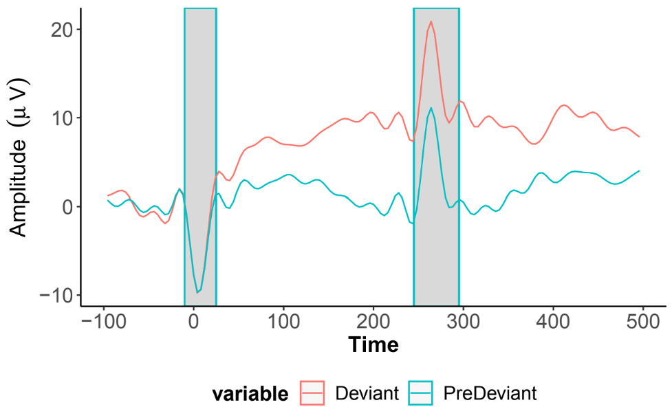

## EEG Task Details

  <i class="fas fa-exclamation-triangle"></i>
  
  Data Warnings
  <a class="anchor-link" href="#data-warning" title="Copy link">
  <i class="fa-solid fa-link"></i>
  </a>
  
  ▸

 
<b>HBCD EEG Utilities</b>

The EEG Core of the HBCD Data Coordinating Center (HDCC) has developed some helpful tools for extracting summary statistics and trial measures from HBCD EEG release data. We encourage all users to explore these resources at the <a href="https://hbcd-eeg-utilities.readthedocs.io/">HBCD EEG Utilities</a> website.

 
<b>Stimtracker Artifact</b>

The MMN, VEP, and FACE task data for one participant included in the data release was found to contain an electrical noise artifact originating from the stimtracker device used for stimulus timing. All other participants' data were checked and confirmed to be artifact-free.
 

This artifact is most prominent in electrode E55 between the REF and COM electrodes, but is also visible in surrounding channels. It is time-locked to both stimulus onset and offset: as highlighted in the following EEG trace (MMN auditory oddball task in E55), the artifact presents as a negative deflection at onset and a positive deflection at offset. Please visit <a href="artifacts" target="_blank">this page</a> to see how this artifact appears in time-frequency plots and ERP derivatives.

The EEG workgroup is currently developing a method of ICA correction to remove this artifact. In the meantime, <strong>it is recommended to exclude the MMN, VEP, and FACE tasks for this participant from analyses</strong>. The affected subject is flagged on the <a href="../../../data_access/lasso" target="_blank">Lasso platform</a>.

 

<b>Task Updates Between V03 and V04/V06 (MMN & RS)</b>

Researchers should be aware that the Auditory Mismatch Negativity (MMN) and Video Resting State (RS) tasks were updated between V03 and V04/V06. For MMN, the interstimulus interval (ISI) changed (see <a href="https://doi.org/10.1016/j.dcn.2024.101447">Fox et al. 2024</a> and <a href="https://doi.org/10.1097/00003446-200204000-00005">Morr et al. 2002</a> for details) and for RS, the video content was modified. Also note that RS is not a true resting state as there is a visual stimulus present.

## Resources
- [HBCD EEG Utilities](https://hbcd-eeg-utilities.readthedocs.io/)
- [HBCD E-Prime Task Manual](https://docs.google.com/document/d/1PghQQpLbxjQavtVlHyIz7JVJxlyKcC4Do8z8j7srdaI/edit?usp=sharing)
- [HBCD EEG Acquisition Protocol](https://zenodo.org/records/14795030)

## References

    
Adams, E. J., Scott, M. E., Amarante, M., Ramírez, C. A., Rowley, S. J., Noble, K. G., & Troller-Renfree, S. V. (2024). Fostering inclusion in EEG measures of pediatric brain activity. <i>Npj Science of Learning</i>, 9(1), 27. <a href="https://doi.org/10.1038/s41539-024-00240-y" target="_blank">https://doi.org/10.1038/s41539-024-00240-y</a>

    
Barry-Anwar, R., Riggins, T., & Scott, L. S. (2020). Electrophysiology in developmental populations: Key methods and findings. In K. Cohen Kadosh (Ed.), <i>The Oxford Handbook of Developmental Cognitive Neuroscience</i>. Oxford University Press. <a href="https://doi.org/10.1093/oxfordhb/9780198827474.013.3" target="_blank">https://doi.org/10.1093/oxfordhb/9780198827474.013.3</a>
  
    
Choudhury, N., & Benasich, A. A. (2011). Maturation of auditory evoked potentials from 6 to 48 months: Prediction to 3 and 4 year language and cognitive abilities. <i>Clinical Neurophysiology</i>, 122(2), 320–338. <a href="https://doi.org/10.1016/j.clinph.2010.05.035" target="_blank">https://doi.org/10.1016/j.clinph.2010.05.035</a>

    
Cremone-Caira, A., Braverman, Y., MacNaughton, G. A., Nikolaeva, J. I., & Faja, S. (2023). Reduced Visual Evoked Potential Amplitude in Autistic Children with Co-Occurring Features of Attention-Deficit/Hyperactivity Disorder. <em>Journal of Autism and Developmental Disorders</em>. <a href="https://doi.org/10.1007/s10803-023-06005-7" target="_blank">https://doi.org/10.1007/s10803-023-06005-7</a>

    
Davidson, R. J., & Fox, N. A. (1982). Asymmetrical Brain Activity Discriminates Between Positive and Negative Affective Stimuli in Human Infants. <em>Science</em>, 218(4578), 1235–1237. <a href="https://doi.org/10.1126/science.7146906" target="_blank">https://doi.org/10.1126/science.7146906</a>

    
Fox, N. A., Pérez-Edgar, K., Morales, S., Brito, N. H., Campbell, A. M., Cavanagh, J. F., Gabard-Durnam, L. J., Hudac, C. M., Key, A. P., Larson-Prior, L. J., Pedapati, E. V., Norton, E. S., Reetzke, R., Roberts, T. P., Rutter, T. M., Scott, L. S., Shuffrey, L. C., Antúnez, M., Boylan, M. R., … Yoder, L. (2024). The development and structure of the Healthy Brain and Child Development (HBCD) study EEG Protocol. <i>Developmental Cognitive Neuroscience</i>, 69, 101447. <a href="https://doi.org/10.1016/j.dcn.2024.101447" target="_blank">https://doi.org/10.1016/j.dcn.2024.101447</a>
 
    
Gabard-Durnam, L. J., Wilkinson, C., Kapur, K., Tager-Flusberg, H., Levin, A. R., & Nelson, C. A. (2019). Longitudinal EEG power in the first postnatal year differentiates autism outcomes. <em>Nature Communications</em>, 10(1), Article 1. <a href="https://doi.org/10.1038/s41467-019-12202-9" target="_blank">https://doi.org/10.1038/s41467-019-12202-9</a>

    
Gumenyuk, V., Korzyukov, O., Escera, C., Hämäläinen, M., Huotilainen, M., Häyrinen, T., Oksanen, H., Näätänen, R., Von Wendt, L., & Alho, K. (2005). Electrophysiological evidence of enhanced distractibility in ADHD children. <i>Neuroscience Letters</i>, 374(3), 212–217. <a href="https://doi.org/10.1016/j.neulet.2004.10.081" target="_blank">https://doi.org/10.1016/j.neulet.2004.10.081</a>
  
    
Gurrera, R. J., O’Donnell, B. F., Nestor, P. G., Gainski, J., & McCarley, R. W. (2001). The P3 auditory event–related brain potential indexes major personality traits. <i>Biological Psychiatry</i>, 49(11), 922–929. <a href="https://doi.org/10.1016/S0006-3223(00)01067-2" target="_blank">https://doi.org/10.1016/S0006-3223(00)01067-2</a>
 
    
Jensen, S. K. G., Kumar, S., Xie, W., Tofail, F., Haque, R., Petri, W. A., & Nelson, C. A. (2019). Neural correlates of early adversity among Bangladeshi infants. <em>Scientific Reports</em>, 9(1), 3507. <a href="https://doi.org/10.1038/s41598-019-39242-x" target="_blank">https://doi.org/10.1038/s41598-019-39242-x</a>

    
Jones, E. J. H., Goodwin, A., Orekhova, E., Charman, T., Dawson, G., Webb, S. J., & Johnson, M. H. (2020). Infant EEG theta modulation predicts childhood intelligence. <em>Scientific Reports</em>, 10(1), 11232. <a href="https://doi.org/10.1038/s41598-020-67687-y" target="_blank">https://doi.org/10.1038/s41598-020-67687-y</a>

    
Lachmann, T., Berti, S., Kujala, T., & Schröger, E. (2005). Diagnostic subgroups of developmental dyslexia have different deficits in neural processing of tones and phonemes. <i>International Journal of Psychophysiology</i>, 55(2), 105–120. <a href="https://doi.org/10.1016/j.ijpsycho.2004.11.005" target="_blank">https://doi.org/10.1016/j.ijpsycho.2004.11.005</a>
  
    
Lepistö, T., Kujala, T., Vanhala, R., Alku, P., Huotilainen, M., & Näätänen, R. (2005). The discrimination of and orienting to speech and non-speech sounds in children with autism. <i>Brain Research</i>, 1066(1–2), 147–157. <a href="https://doi.org/10.1016/j.brainres.2005.10.052" target="_blank">https://doi.org/10.1016/j.brainres.2005.10.052</a>
  
    
Leppänen, P. H. T., Hämäläinen, J. A., Salminen, H. K., Eklund, K. M., Guttorm, T. K., Lohvansuu, K., Puolakanaho, A., & Lyytinen, H. (2010). Newborn brain event-related potentials revealing atypical processing of sound frequency and the subsequent association with later literacy skills in children with familial dyslexia. <i>Cortex</i>, 46(10), 1362–1376. <a href="https://doi.org/10.1016/j.cortex.2010.06.003" target="_blank">https://doi.org/10.1016/j.cortex.2010.06.003</a>

    
Lippé, S., Kovacevic, N., & McIntosh, A. R. (2009). Differential Maturation of Brain Signal Complexity in the Human Auditory and Visual System. <em>Frontiers in Human Neuroscience</em>, 3, 48. <a href="https://doi.org/10.3389/neuro.09.048.2009" target="_blank">https://doi.org/10.3389/neuro.09.048.2009</a>

    
Margolis, E. T., Davel, L., Bourke, N. J., Bosco, C., Zieff, M. R., Monachino, A. D., Mazubane, T., Williams, S. R., Miles, M., & Jacobs, C. A. (2024). Longitudinal effects of prenatal alcohol exposure on visual neurodevelopment over infancy. <em>Developmental Psychology</em>. <a href="https://psycnet.apa.org/record/2024-66755-001" target="_blank">https://psycnet.apa.org/record/2024-66755-001</a>

    
Markant, J., & Scott, L. S. (2018). Attention and Perceptual Learning Interact in the Development of the Other-Race Effect. <i>Current Directions in Psychological Science</i>, <i>27</i>(3), 163–169. <a href="https://doi.org/10.1177/0963721418769884" target="_blank">https://doi.org/10.1177/0963721418769884</a>
  
    
Marshall, P. J., Reeb, B. C., & Fox, N. A. (2009). Electrophysiological responses to auditory novelty in temperamentally different 9-month-old infants. <i>Developmental Science</i>, 12(4), 568–582. <a href="https://doi.org/10.1111/j.1467-7687.2008.00808.x" target="_blank">https://doi.org/10.1111/j.1467-7687.2008.00808.x</a>

    
Mlandu, N., McCormick, S. A., Davel, L., Zieff, M. R., Bradford, L., Herr, D., Jacobs, C. A., Khumalo, A., Knipe, C., Madi, Z., Mazubane, T., Methola, B., Mhlakwaphalwa, T., Miles, M., Nabi, Z. G., Negota, R., Nkubungu, K., Pan, T., Samuels, R., … Gabard-Durnam, L. J. (2024). Evaluating a novel high-density EEG sensor net structure for improving inclusivity in infants with curly or tightly coiled hair. <i>Developmental Cognitive Neuroscience</i>, 67(101396), 101396. <a href="https://doi.org/10.1016/j.dcn.2024.101396" target="_blank">https://doi.org/10.1016/j.dcn.2024.101396</a>

    
Morr, M. L., Shafer, V. L., Kreuzer, J. A., & Kurtzberg, D. (2002). Maturation of mismatch negativity in typically developing infants and preschool children. <i>Ear and Hearing</i>, 23(2), 118–136. <a href="https://doi.org/10.1097/00003446-200204000-00005" target="_blank">https://doi.org/10.1097/00003446-200204000-00005</a>
  
    
Nazhvani, A. D., Boostani, R., Afrasiabi, S., & Sadatnezhad, K. (2013). Classification of ADHD and BMD patients using visual evoked potential. <em>Clinical Neurology and Neurosurgery</em>, 115(11), 2329–2335. <a href="https://doi.org/10.1016/j.clineuro.2013.08.009" target="_blank">https://doi.org/10.1016/j.clineuro.2013.08.009</a>

    
Norton, E. S., Beach, S. D., Eddy, M. D., McWeeny, S., Ozernov-Palchik, O., Gaab, N., & Gabrieli, J. D. E. (2021). ERP mismatch negativity amplitude and asymmetry reflect phonological and rapid automatized naming skills in English-speaking kindergartners. <i>Frontiers in Human Neuroscience</i>, 15, 624617. <a href="https://doi.org/10.3389/fnhum.2021.624617" target="_blank">https://doi.org/10.3389/fnhum.2021.624617</a>
  
    
Reeb-Sutherland, B. C., Vanderwert, R. E., Degnan, K. A., Marshall, P. J., Pérez-Edgar, K., Chronis-Tuscano, A., Pine, D. S., & Fox, N. A. (2009). Attention to novelty in behaviorally inhibited adolescents moderates risk for anxiety. <i>Journal of Child Psychology and Psychiatry</i>, 50(11), 1365–1372. <a href="https://doi.org/10.1111/j.1469-7610.2009.02170.x" target="_blank">https://doi.org/10.1111/j.1469-7610.2009.02170.x</a>
 
    
Shandiz, J. H., Heyrani, M., Sobhani-Rad, D., Salehinejad, Z., Shojaei, S., Khoshsima, M. J., Azimi, A., Yekta, A. A., & Yazdi, S. H. H. (2017). Pattern Visual Evoked Potentials in Dyslexic Children. <em>Journal of Ophthalmic & Vision Research</em>, 12(4), 402–406. <a href="https://doi.org/10.4103/jovr.jovr_106_16" target="_blank">https://doi.org/10.4103/jovr.jovr_106_16</a>
 
    
Scherf, K. S., & Scott, L. S. (2012). Connecting developmental trajectories: Biases in face processing from infancy to adulthood. <i>Developmental Psychobiology</i>, <i>54</i>(6), 643–663. <a href="https://doi.org/10.1002/dev.21013" target="_blank">https://doi.org/10.1002/dev.21013</a>
  
    
Schwartz, S., Shinn-Cunningham, B., & Tager-Flusberg, H. (2018). Meta-analysis and systematic review of the literature characterizing auditory mismatch negativity in individuals with autism. <i>Neuroscience and Biobehavioral Reviews</i>, 87, 106–117. <a href="https://doi.org/10.1016/j.neubiorev.2018.01.008" target="_blank">https://doi.org/10.1016/j.neubiorev.2018.01.008</a>
 
    
Whedon, M., Perry, N. B., & Bell, M. A. (2020). Relations between frontal EEG maturation and inhibitory control in preschool in the prediction of children’s early academic skills. <em>Brain and Cognition</em>, 145, 105636. <a href="https://doi.org/10.1016/j.bandc.2020.105636" target="_blank">https://doi.org/10.1016/j.bandc.2020.105636</a>

 
