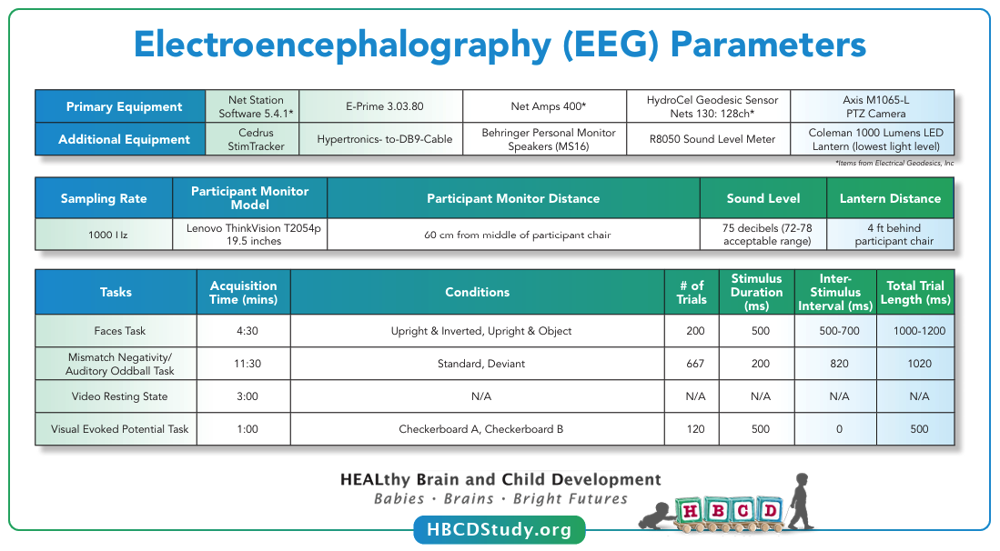

# Electroencephalography (EEG)
EEG tasks are acquired during visits V03, V04, and V06. For full details on the HBCD EEG protocol, please refer to [Fox et al. 2024](https://doi.org/10.1016/j.dcn.2024.101447) published in the Developmental Cognitive Neuroscience special issue on HBCD.

*Source: [HBCD Study Protocols - EEG](https://hbcdstudy.org/wp-content/uploads/2023/06/EEG-Parameters.pdf)*

    <i class="fas fa-exclamation-circle"></i>
    
    Responsible Use Warning
    <a class="anchor-link" href="#resp-use-warning" title="Copy link">
    <i class="fa-solid fa-link"></i>
    </a>
    
  ▸

The HBCD EEG data and EEG preprocessing outputs do not contain any personally identifiable information. It is important to consider that potentially stigmatizing conclusions could emerge from the inappropriate use of the EEG data together with available demographic information or questionnaires. Furthermore, all EEG tasks are all passive at the V03 age range and therefore conclusions should not be drawn about behavioral performance.
 

Methodologically, there are a number of best practices for responsible data use that will be included with each file. The first is selecting files that maintain a minimum trial threshold recommendation. For each task, there are three levels of quality control thresholds that can be used: (1) our QC thresholds used to provide feedback to sites on each upload, (2) a 30% trial retention threshold (which we use internally to indicate usability of an EEG recording), and (3) the reliability recommendations for each task.

<li><b>Threshold recommendations by task:</b></li>
<li>RS - 108 trials</li>
<li>FACE - 15 trials for each condition of interest</li>
<li>MMN - 30 trials for each condition of interest</li>
<li>VEP - 36 trials.</li>

An additional consideration for responsible use of the HBCD EEG dataset applies to disproportionate missing data. It is possible that some participant data may be systematically missing from this dataset by virtue of not meeting the QC thresholds. For instance, with infants that are inattentive and prone to fussing out during the EEG recording, more data may be removed from their datasets by our preprocessing scripts. A similar risk holds with participants  who have thick or dense hairstyling and hair texture, which may impact capping success, impedance, and data quality (<a href="https://doi.org/10.1038/s41539-024-00240-y">Adams et al., 2024</a>). The consortium has proactively worked to address this risk by using scheduling procedures that are flexible to participants hairstyling routines and by purchasing 3 long pedestal nets per site in sizes appropriate for the V03, V04, and V06 visits (<a href="https://doi.org/10.1038/s41539-024-00240-y">Adams et al., 2024</a>; <a href="https://doi.org/10.1016/j.dcn.2024.101396">Mlandu et al., 2024</a>). Preliminary analyses indicate that capping quality for visits where the long pedestal net was used have been consistent with capping quality seen for the dataset at large.

It is important to use these data in a manner which takes into account that physical and neurological differences between groups are not necessarily representative of intrinsic qualities of a given demographic  group. Discussions around data patterns should be sensitive to societal factors. In addition, it is important to note that variation within demographic populations is greater than variation across populations. Demographic markers are categorical proxies that cannot capture or explain the causal mechanisms that may account for evident differences.

## Quality Control    
After EEG acquisition, quality control checks are performed using [EEG2BIDS Wizard](https://github.com/aces/eeg2bids), a custom MATLAB application installed at all HBCD sites. These checks are immediately provided to the user to ensure the data's integrity and usability. The process includes:

- Verifying event markers in the EEG data to confirm all required events are accurately recorded.
- Ensuring the setup for stimulus presentation and EEG data acquisition adheres to the study protocol.
- Inspecting electrode impedances to ensure they are within acceptable limits.
- Detecting multiple task runs and incomplete recordings.
- Confirming the use of correct E-Prime task versions.

Both study sites and the EEG Core team use an EEG Quality Control dashboard developed by LORIS to access and monitor incoming EEG data and QC metrics, such as retained epochs and line noise levels. Outputs from the HBCD-Maryland Analysis of Developmental EEG ([HBCD-MADE](https://github.com/DCAN-Labs/HBCD-MADE)) pipeline, which handles preprocessing and data cleaning, are also integrated into the dashboard. These outputs include key metrics like outlier statistics for specific task epochs ([Debnath et al., 2020](https://doi.org/10.1111/psyp.13580)). Regular site-specific check-ins and troubleshooting are conducted to ensure consistent protocol adherence and data quality across sites. For a detailed description of QC procedures in the HBCD Study EEG protocol, refer to [Fox et al. (2024)](https://doi.org/10.1016/j.dcn.2024.101447).

During quality control, a frequently observed issue across all tasks was the irregular application of EEG sensors. Additionally, partial task completion due to infant fussing and missing stimulus flags were commonly noted for the faces and auditory mismatch negativity tasks.

### EEG Net Placement ("Capping Quality") Ratings
EEG capping quality ratings are used to determine inclusion in the data release pool and subsequent processing. Photos are taken for each acquisition from the front, back, top, left, and right angles of the participant's head and uploaded via the BIDS Wizard application to a secure computing environment. They are then reviewed by the EEG Core at the University of Maryland to rate the quality of EEG net placement, or "capping quality," for each acquisition. EEG data determined as unusable due to capping quality are not included in the initial public data release, as noted under [Exclusion Criteria > EEG](../../datacuration/exclusions.md#electroencephalography). 

“Average”, "Poor," and "Not usable" ratings correspond to net placement shifted 1-2 cm, 2-3 cm, and >3 cm from proper placement, respectively. To be rated as "Excellent," acquisitions must meet the following criteria:

1.	Net placement is symmetrical with midline electrodes centered on the scalp
2.	Ears are within the ear holes and not covered by sensors 
3.	Reference electrode is placed on the vertex of the scalp
4.	Electrode E17 is placed on the nasion

Please refer to the [HBCD EEG Acquisition Protocol](https://zenodo.org/records/14795030) for additional information about capping requirements.

## Resources
- [HBCD EEG Utilities](https://hbcd-eeg-utilities.readthedocs.io/)
- [HBCD E-Prime Task Manual](https://docs.google.com/document/d/1PghQQpLbxjQavtVlHyIz7JVJxlyKcC4Do8z8j7srdaI/edit?usp=sharing)
- [HBCD EEG Acquisition Protocol](https://zenodo.org/records/14795030)
