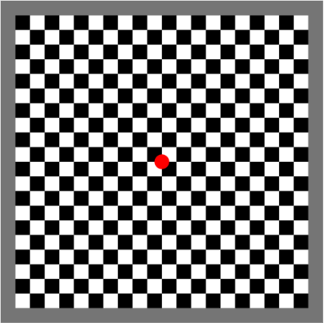

# Visual Evoked Potential Task

**Full Name**: Visual Evoked Potential Task            
**Acronym**: VEP                    
**Table Name**: **TO DO**     

The Visual Evoked Potential Task (v.11.29.23) measures development of visual cortex and response to stimuli, reflecting underlying cortical development. VEP amplitude and latency decreases with age during the first three years of life. The VEP has been associated with concurrent and later developmental outcomes as a function of prenatal substance exposures ([Margolis et al., 2024](https://psycnet.apa.org/record/2024-66755-001)), early visual enrichment or deprivation ([Jensen et al., 2019](https://doi.org/10.1038/s41598-019-39242-x)), vision system maturation ([Lippé et al., 2009](https://doi.org/10.3389/neuro.09.048.2009)), neurodevelopmental disorders (e.g., ASD and ADHD; [Cremone-Caira et al., 2023](https://doi.org/10.1007/s10803-023-06005-7); [Nazhvani et al., 2013](https://doi.org/10.1016/j.clineuro.2013.08.009)), and reading and learning disabilities ([Shandiz et al., 2017](https://doi.org/10.4103/jovr.jovr_106_16)). The morphology of the VEP likely reflects varying degrees of synaptic efficiency and as such, can be used as a readout of general cortical function. 

## Task Details

  

A flashing black and white 20x20 checkerboard with a red circle in the center is shown for the duration of the task (trial counts of 60 Checkerboard A and 60 Checkerboard B for a total of 120). The task elicits a VEP response in the occipital area (Oz), consisting of N1 (first negative peak), P1 (first positive peak), and N2 (second negative peak) components. See <a href="https://doi.org/10.1016/j.dcn.2024.101447">Fox et al. 2024</a> for more information about the VEP task the <a href="https://hbcdstudy.org/wp-content/uploads/2023/06/EEG-Parameters.pdf">HBCD Study Protocols - EEG</a> for additional details.

  

    

## Resources
- [HBCD EEG Utilities](https://hbcd-eeg-utilities.readthedocs.io/)
- [HBCD E-Prime Task Manual](https://docs.google.com/document/d/1PghQQpLbxjQavtVlHyIz7JVJxlyKcC4Do8z8j7srdaI/edit?usp=sharing)
- [HBCD EEG Acquisition Protocol](https://zenodo.org/records/14795030)

## References