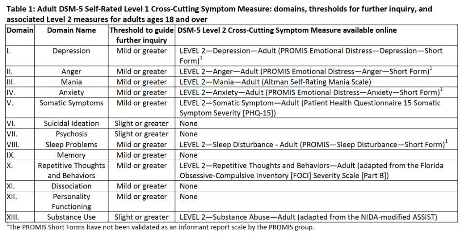

# Mental Health

**Full Name**: DSM-5 Self-Rated Level 1 and Level 2 (version 8a) Cross-Cutting Symptom Measure—Adult           
**Acronym**: APA 1/2     
**Table Name**: `pex_bm_apa`       
**Construct**: Mental health

  <i class="fas fa-exclamation-triangle"></i>
  Data Warning
  ▸

<strong>Consideration of Mental Health Symptoms Experienced During Pregnancy</strong>

Concurrence of psychiatric symptoms and substance use is well-recognized during pregnancy (Massey et al., 2011, 2012). Phenotypic risk in birthing parents may influence neurodevelopmental outcomes via prenatal and postnatal influences other than direct exposures alone (Estabrook et al., 2016, Massey et al., 2016, Massey et al., 2018). These influences may confound exposure-related neuroimaging and neurodevelopmental findings, and also represent malleable targets for prevention and early intervention. Thus, consideration of mental health symptoms experienced by birthing parents as covariates is strongly encouraged when possible to address these confounds.
 

## Administration & Quality Control

<table style="width: 100%; border-collapse: collapse; table-layout: fixed; font-size: 16px;">
<tbody>
<tr><td><b>Child Specific</b></td>
<td>No</td></tr>
<tr><td><b>Respondant</b></td>
<td style="word-wrap: break-word; white-space: normal;">Pregnant Person, Person Who Gave Birth, or Primary Caregiver</td></tr>
<tr><td><b>Administration</b></td>
<td style="word-wrap: break-word; white-space: normal;">Self-administered in-person or remote. Surveys were translated to Spanish for HBCD by <a href="https://burgtranslations.com/our-services/">BURG Translations</a>.</td></tr>
<tr><td><b>Visits</b></td>
<td>V01, V02, V03</td></tr>
<tr><td><b>Completion Time</b></td>
<td>5 min</td></tr>
<tr><td><b>Quality Control</b></td>
<td style="word-wrap: break-word; white-space: normal;">Response distributions reviewed for outliers.</td></tr>
</tbody>
</table>

## Instrument Details

The DSM-5 Self-Rated Level 1 and Level 2 Cross-Cutting Symptom Measure (APA 1/2) was adapted for HBCD by combining the following measures: the [DSM-5 Self-Rated Level 1 Cross-Cutting Symptom Measure—Adult](https://www.psychiatry.org/getmedia/e0b4b299-95b3-407b-b8c2-caa871ca218d/APA-DSM5TR-Level1MeasureAdult.pdf) and the [DSM-5 Level 2 Cross-Cutting Symptom Measures](https://www.psychiatry.org/psychiatrists/practice/dsm/educational-resources/assessment-measures):

**Level 1** includes 1-2 questions for each of eleven mental health domains, with scores calculated for depression, anger, mania, anxiety, somatic symptoms, suicidal ideation, psychosis, sleep disturbance, memory, repetitive behaviors, and dissociation. Note that Level 1 items for personality functioning and substance use were excluded. See Level 1 scoring procedures [here](https://www.psychiatry.org/getmedia/e0b4b299-95b3-407b-b8c2-caa871ca218d/APA-DSM5TR-Level1MeasureAdult.pdf). If symptoms are reported in Level 1, participants are subsequently administered the corresponding Level 2 symptom measure associated with each mental health domain, including anger, anxiety, depression, mania, somatic symptoms, repetitive thoughts, and sleep problems.

**Level 2** measures include all [Level 2 Cross-Cutting Symptom Measures](https://www.psychiatry.org/psychiatrists/practice/dsm/educational-resources/assessment-measures) with the exception of Substance Abuse. The Level 2 measures for Depression and Sleep Disturbance were replaced with the **PROMIS Short Forms v1.0** [Depression 8a questionnaire](https://www.phenxtoolkit.org/toolkit_content/supplemental_info/psychiatric/measures/07_Depressed_Mood.doc) and [Sleep Disturbance 8a](https://heal.nih.gov/files/CDEs/2024-07/promis-sleep-disturbance-8a-crf.pdf). Documentation for each measure and its scoring can be found [here](https://www.psychiatry.org/psychiatrists/practice/dsm/educational-resources/assessment-measures). PROMIS scoring procedures for Depression can be found [here](https://www.healthmeasures.net/images/PROMIS/manuals/Scoring_Manual_Only/PROMIS_Depression_Scoring_Manual_05Dec2023.pdf) and for Sleep Disturbance can be found [here](https://www.healthmeasures.net/images/PROMIS/manuals/Scoring_Manual_Only/PROMIS_Sleep_Scoring_Manual.pdf).

Finally, the HBCD measure also integrates the [Personality Inventory for DSM-5 Brief](https://www.psychiatry.org/File%20Library/Psychiatrists/Practice/DSM/APA_DSM5_The-Personality-Inventory-For-DSM-5-Brief-Form-Adult.pdf), which assesses five personality trait domains including negative affect, detachment, antagonism, disinhibition, and psychoticism. Scoring for the Personality Inventory can be found [here](https://www.psychiatry.org/File%20Library/Psychiatrists/Practice/DSM/APA_DSM5_The-Personality-Inventory-For-DSM-5-Brief-Form-Adult.pdf).

Additional modifications are described below. Future publications should be sure to acknowledge the removal of Level 1 and 2 substance use and the gating mechanisms for somatic symptoms and personality inventory:

  
    HBCD Modification Details
  
  ▸

 

<b>Excluded Questions and Gating</b>

Slight modifications were made due to the use of other measures and the study population. Specifically, the Level 1 questions for substance use and personality functioning were not included. Also, all participants answer the level 1 questions on depression and somatic symptoms but proceed to level 2 questions irrespective of answers; all participants proceed automatically to the level 2 measure for personality inventory.

<b>Clinical Alerts</b>

For HBCD, this measure was modified to alert study staff if responses to the Level 1 APA self-harm question ('Thoughts of actually hurting yourself?') or Level 2 APA depression questionnaire (items from 'I felt worthless' to 'I felt that nothing could cheer me up') exceed thresholds of 0 and 32, respectively.

<b>Response Option Changes</b>

For HBCD, the response option ‘Decline to answer’ was added to all questions. The response option ‘Don’t know’ was also included at the beginning of data collection, but was subsequently removed. Note that this does not impact scoring as questions answered with ‘Decline to answer’ or ‘Don’t know’ are skipped and marked as missing.
 

Note that in early data releases, total scores are not calculated for Level 2 measures. Users are encouraged to score individual scales themselves according to the scoring procedures linked above.

## References

Doss, R. A., &amp; Lowmaster, S. E. (2022). Validation of the DSM-5 Level 1 Cross-Cutting Symptom Measure in a Community  Sample. <em>Psychiatry Research</em>, <em>318</em>, 114935. <a href="https://doi.org/10.1016/j.psychres.2022.114935">https://doi.org/10.1016/j.psychres.2022.114935</a>

Estabrook, R., Massey, S. H., Clark, C. A. C., Burns, J. L., Mustanski, B. S., Cook, E. H., O’Brien, T. C., Makowski, B., Espy, K. A., & Wakschlag, L. S. (2016). Separating family-level and direct exposure effects of smoking during pregnancy on offspring externalizing symptoms: Bridging the behavior genetic and behavior teratologic divide. Behavior Genetics, 46(3), 389–402. <a href="https://doi.org/10.1007/s10519-015-9762-2">https://doi.org/10.1007/s10519-015-9762-2</a>

Massey, S. H., Mroczek, D. K., Burns, J. L., Clark, C. A. C., Espy, K. A., & Wakschlag, L. S. (2018). Positive parenting behaviors in women who spontaneously quit smoking during pregnancy: Clues to putative targets for preventive interventions. Neurotoxicology and Teratology, 67, 18–24.<a href="https://doi.org/10.1016/j.ntt.2018.02.003">https://doi.org/10.1016/j.ntt.2018.02.003</a>

Massey, S. H., Reiss, D., Neiderhiser, J. M., Leve, L. D., Shaw, D. S., & Ganiban, J. M. (2016). Maternal personality traits associated with patterns of prenatal smoking and exposure: Implications for etiologic and prevention research. Neurotoxicology and Teratology, 53, 48–54. <a href="https://doi.org/10.1016/j.ntt.2015.11.010">https://doi.org/10.1016/j.ntt.2015.11.010</a>

Roche, M. J., Pincus, A. L., &amp; Cole, P. E. (2019). Linking dimensions and dynamics in psychopathology research: An example using DSM-5 instruments. <em>Journal of Research in Personality</em>, <em>82</em>, 103852. <a href="https://doi.org/https://doi.org/10.1016/j.jrp.2019.103852">https://doi.org/https://doi.org/10.1016/j.jrp.2019.103852</a>

 