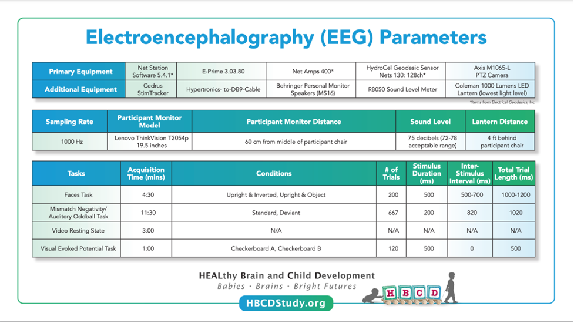

# Overview

## EEG Parameters




<p>
<div id="notification-banner" class="notification-banner" onclick="toggleCollapse(this)">
    <span class="text">Implementation & Data Collection Details</span>
  <span class="notification-arrow">▸</span>
</div>
<div class="notification-collapsible-content">
    <ul>
    <li><b>Method of Administration</b>: RA administered in person</li>
    <li><b>Child Specific/Unspecific Form</b>: Child Specific</li>
    <li><b>Visits</b>: V03, V04, V06</li>
    <li><b>Estimated length of time for completion</b>: Video RS 3 min; Face 5 min, MMN 11.5(V03) & 8.5 (V04/06) min; VEP 1 min</li>
    </ul>
</div>
</p>

## Quality Control & Known Issues    
After EEG acquisition, quality control checks are performed using [EEG2BIDS Wizard](https://github.com/aces/eeg2bids), a custom MATLAB application installed at all HBCD sites. These checks are immediately provided to the user to ensure the data's integrity and usability. The process includes:

- Verifying event markers in the EEG data to confirm all required events are accurately recorded.
- Ensuring the setup for stimulus presentation and EEG data acquisition adheres to the study protocol.
- Inspecting electrode impedances to ensure they are within acceptable limits.
- Detecting multiple task runs and incomplete recordings.
- Confirming the use of correct E-Prime task versions.

Both study sites and the EEG Core team use an EEG Quality Control dashboard developed by LORIS to access and monitor incoming EEG data and QC metrics, such as retained epochs and line noise levels. Outputs from the HBCD-Maryland Analysis of Developmental EEG ([HBCD-MADE](https://github.com/DCAN-Labs/HBCD-MADE)) pipeline, which handles preprocessing and data cleaning, are also integrated into the dashboard. These outputs include key metrics like outlier statistics for specific task epochs ([Debnath et al., 2020](https://doi.org/10.1111/psyp.13580)). Regular site-specific check-ins and troubleshooting are conducted to ensure consistent protocol adherence and data quality across sites. For a detailed description of QC procedures in the HBCD Study EEG protocol, refer to [Fox et al. (2024)](https://doi.org/10.1016/j.dcn.2024.101447).

### Potential Issues
During quality control, a frequently observed issue across all tasks was the irregular application of EEG sensors. Additionally, partial task completion due to infant fussing and missing stimulus flags were commonly noted for the faces and auditory mismatch negativity tasks.

Subject matter experts flagged potential issues related to task design changes between versions V03 and V04/6. These include updates to the video content in the video RS task and modifications to the interstimulus interval (ISI) in the auditory mismatch negativity task (see Fox et al., 2024; Morr et al., 2002, for details on the ISI changes). No potential issues were identified for the faces or visual evoked potential tasks.

### Data Curation & BIDS Conversion
To facilitate data handling and preprocessing, we employ [EEG2BIDS Wizard](https://github.com/aces/eeg2bids), a custom MATLAB application installed at all HBCD sites. After each EEG session, raw data are uploaded to the Wizard, which, among other things, converts this data to the BIDS standard data structure. The resulting BIDS data structure is:
```
assembly_bids/ 
|__ participants.tsv
|__ participants.json 
|__ sub-<label>/
|   |__ sub-<label>_sessions.tsv
|   |__ sub-<label>_sessions.json
|   |__ ses-<label>/
|       |__ eeg/
|       |

(Location of electrodes)
|       |   |__sub-<label>_ses-<label>_acq-ecg_space-CapTrak_electrodes.tsv
|       |   |__sub-<label>_ses-<label>_acq-ecg_space-CapTrak_coordsystem.json
|       |   |__sub-<label>_ses-<label>_acq-eeg_space-<CapTrak|CTF>_electrodes.tsv
|       |   |__sub-<label>_ses-<label>_acq-eeg_space-<CapTrak|CTF>_coordsystem.json

(Task acquisitions)
|       |   |__sub-<label>_ses-<label>_task-<FACE|MMN|RS|VEP>_acq-<eeg|ecg>_channels.tsv
|       |   |__sub-<label>_ses-<label>_task-<FACE|MMN|RS|VEP>_acq-<eeg|ecg>_eeg.json
|       |   |__sub-<label>_ses-<label>_task-<FACE|MMN|RS|VEP>_acq-<eeg|ecg>_eeg.set
|       |   |__sub-<label>_ses-<label>_task-<FACE|MMN|RS|VEP>_acq-<eeg|ecg>_events.tsv
|       |   |__sub-<label>_ses-<label>_task-<FACE|MMN|RS|VEP>_acq-<eeg|ecg>_events.json
|       |   |
|       |   |__ sourcedata/
|       |       |__ sub-<label>_ses-<label>_task-<FACE|MMN|RS|VEP>_acq-eeg_flags.json
|       |       |__ sub-<label>_ses-<label>_task-<FACE|MMN|RS|VEP>_acq-eeg_impedances.json
|       |       |__ sub-<label>_ses-<label>_task-<FACE|MMN|RS|VEP>_acq-eeg_eventlogs.txt
```

The specific **location of electrodes**, placed on either the head (`acq-eeg`) or chest (`acq-ecg`), is specified in the `*_electrodes.tsv` files following cartesian coordinates provided by the accompanying `*_coordsystem.json` file. For **task acquisitions**, the task is specified by `task-<label>`, with task options of `FACE`, `MMN`, `RS`, and `VEP` (see task details [here](../measures/eeg/overview.md#eeg-parameters)).

<ul>
The accompanying <code>sourcedata/</code> files include:
<li>Information about quality control flags and acquisition (<code>*_flags.json</code>- see QC details <a href="../../measures/eeg/overview#quality-control-known-issues">here</a>)</li>
<li>Impedance values used to ensure good electrode contact (<code>*_impedence.json</code>)</li>
<li>Task stimuli presentations (<code>*_eventlogs.txt</code>)</li>
</ul>

## Resources
- [HBCD E-Prime Task Manual](https://docs.google.com/document/d/1PghQQpLbxjQavtVlHyIz7JVJxlyKcC4Do8z8j7srdaI/edit?usp=sharing)
- [Official EEG Acquisition Manual](https://docs.google.com/document/d/1tjrFJzntHOqJOrq-SRGy2Z0LOj56MFsZ2ZocgrUogSs/edit?usp=sharing)


