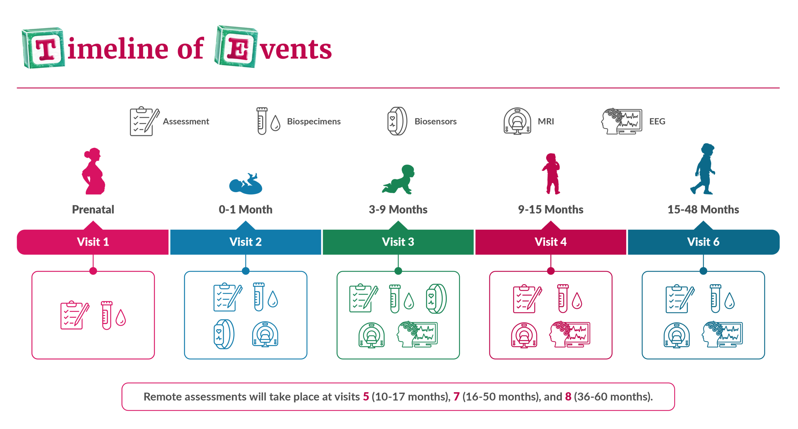
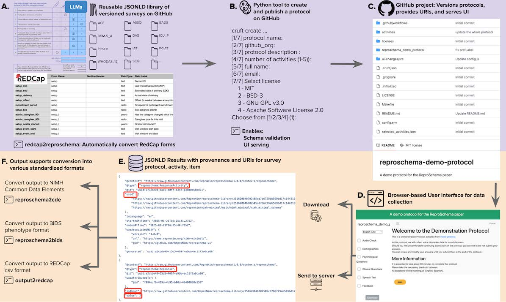
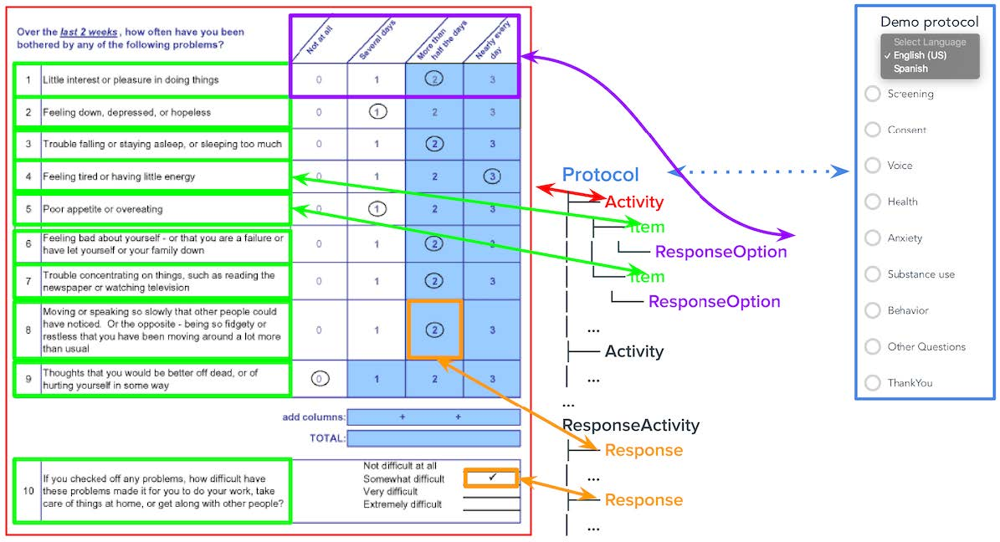

# Data Measures & Quality Control

## Data Measure Release Notes
The current release includes data from Visits 1, 2, and 3 (V01, V02, and V03). In this section we provide a brief overview of each data measure provided in the data release, including, where applicable, details of implementation and data collection, scoring procedures, quality control procedures, known issues, and references.

  <i class="fa-regular fa-lightbulb"></i>
  Visit numbers are labeled as Visit X or V0X in the release notes (e.g., V01 = Visit 1)

Below is a summary of measures included in Release 1.0. Note that the HBCD Data Release Docs only cover the measures currently available, with additional documentation to follow in future updates as additional measure data are released. 

The data provided within the `phenotype/` folder includes demographic, toxicology, behavior, and tabulated data associated with magnetic resonance imaging (MRI), spectroscopy (MRS), electroencephalography (EEG), and motion/accelerometry (i.e. [wearable sensor](sensors.md) recordings for leg motion) - see [Phenotype BIDS Data](../datacuration/phenotypes.md) under the [HBCD BIDS Data](../datacuration/overview.md) section of the Release Notes for details. 

The release also includes raw (`rawdata/`) and processed "derivative" (`derivatives/`) data for MRI, MRS, EEG, and motion/accelerometry, formatted to adhere to the Brain Imaging Data Structure (BIDS) standard. See [Raw BIDS Data](../datacuration/rawbids.md) and [Derivatives](../datacuration/derivatives.md) under the [HBCD BIDS Data](../datacuration/overview.md) section of the Release Notes for details.

For details on upcoming additions in Release 1.1, see [Pending & Upcoming Updates](../changelog/pending.md). Full study protocols are available on the [HBCD Study site](https://hbcdstudy.org/study-protocols/).

<button id="toggle-all-btn">Expand All Sections ↕️</button>

  Behavior & Caregiver-Child Interaction
  ▸

<table style="width: 100%; border-collapse: collapse; table-layout: fixed; font-size: 14px;">
  <thead>
  </tr>
  <tr>
    <tr>
      <th style="width: 40%; border: 1px solid #ddd; padding: 6px; text-align: center; font-size: 12px;">Name of Instrument</th>
      <th style="width: 15%; border: 1px solid #ddd; padding: 6px; text-align: center; font-size: 12px;">Acronym</th>
      <th style="width: 30%; border: 1px solid #ddd; padding: 6px; text-align: center; font-size: 12px;">Construct</th>
      <th style="width: 15%; border: 1px solid #ddd; padding: 6px; text-align: center; font-size: 12px;">Table Name</th>
    </tr>
  </thead>
  <tbody>
  <tr>
    <td style="border: 1px solid #ddd; padding: 8px; word-wrap: break-word; white-space: normal;"><a href="../measures/behCGinteraction/#ecpromis-child-caregiver-interaction">Early Childhood Patient-Reported Outcome Measurement Information System Child/Caregiver Relationship Scale</a></td>
    <td style="border: 1px solid #ddd; padding: 8px; word-wrap: break-word; white-space: normal;">ecPROMIS</td>
    <td style="border: 1px solid #ddd; padding: 8px; word-wrap: break-word; white-space: normal;">Relationships</td>
    <td style="border: 1px solid #ddd; padding: 8px; word-wrap: break-word; white-space: normal;">mh_cg_pms__cc__inf</td>
  </tr>
  <tr>
    <td style="border: 1px solid #ddd; padding: 8px; word-wrap: break-word; white-space: normal;"><a href="../measures/behCGinteraction/#ibq-r-very-short-form-behavioral-inhibition">Infant Behavior Questionnaire &ndash; Revised Very Short Form + Behavior Inhibition</a></td>
    <td style="border: 1px solid #ddd; padding: 8px; word-wrap: break-word; white-space: normal;">IBQ-R (VSF)+BI</td>
    <td style="border: 1px solid #ddd; padding: 8px; word-wrap: break-word; white-space: normal;">Temperamental Surgency/Extraversion, Negative Affectivity, Effortful Control, and Behavioral Inhibition</td>
    <td style="border: 1px solid #ddd; padding: 8px; word-wrap: break-word; white-space: normal;">mh_cg_ibqr</td>
  </tr>
  <tr>
    <td style="border: 1px solid #ddd; padding: 8px; word-wrap: break-word; white-space: normal;"><a href="../measures/behCGinteraction/#maps-tl">Multidimensional Assessment Profiles - Temper Loss scale</a></td>
    <td style="border: 1px solid #ddd; padding: 8px; word-wrap: break-word; white-space: normal;">MAPS-TL</td>
    <td style="border: 1px solid #ddd; padding: 8px; word-wrap: break-word; white-space: normal;">Irritability</td>
    <td style="border: 1px solid #ddd; padding: 8px; word-wrap: break-word; white-space: normal;">mh_cg_mapdb__inf</td>
  </tr>
  </tbody>
  </table>

  Biospecimen & Omics
  ▸

  <table style="width: 100%; border-collapse: collapse; table-layout: fixed; font-size: 14px;">
  <thead>
  <tr>
    <th style="width: 40%; border: 1px solid #ddd; padding: 6px; text-align: center; font-size: 12px;">Name of Instrument</th>
    <th style="width: 15%; border: 1px solid #ddd; padding: 6px; text-align: center; font-size: 12px;">Acronym</th>
    <th style="width: 30%; border: 1px solid #ddd; padding: 6px; text-align: center; font-size: 12px;">Construct</th>
    <th style="width: 15%; border: 1px solid #ddd; padding: 6px; text-align: center; font-size: 12px;">Table Name</th>
  </tr>
  </thead>
  <tbody>
    <tr>
    <td style="border: 1px solid #ddd; padding: 8px; text-align: left;"><a href="../measures/biospec/#nails">Nails Toxicology Screen</a></td>
    <td style="border: 1px solid #ddd; padding: 8px; text-align: left;">Nails</td>
    <td style="border: 1px solid #ddd; padding: 8px; text-align: left;">Toxicology Screen</td>
    <td style="border: 1px solid #ddd; padding: 8px; text-align: left;">bio_biosample_nails</td>
  </tr>
  <tr>
      <td style="border: 1px solid #ddd; padding: 8px; text-align: left;"><a href="../measures/biospec/#urine">Urine Toxicology Screen</a></td>
      <td style="border: 1px solid #ddd; padding: 8px; text-align: left;">Urine</td>
      <td style="border: 1px solid #ddd; padding: 8px; text-align: left;">Toxicology Screen</td>
      <td style="border: 1px solid #ddd; padding: 8px; text-align: left;">bio_biosample_urine</td>
  </tr>
  </tbody>
  </table>

  Demographics
  ▸

<table style="width: 100%; border-collapse: collapse; table-layout: fixed; font-size: 14px;">
  <thead>
  </tr>
  <tr>
    <tr>
      <th style="width: 10%; border: 1px solid #ddd; padding: 6px; text-align: center; font-size: 12px;">Name of Instrument</th>
      <th style="width: 10%; border: 1px solid #ddd; padding: 6px; text-align: center; font-size: 12px;">Acronym</th>
      <th style="width: 30%; border: 1px solid #ddd; padding: 6px; text-align: center; font-size: 12px;">Construct</th>
      <th style="width: 15%; border: 1px solid #ddd; padding: 6px; text-align: center; font-size: 12px;">Table Name</th>
    </tr>
  </thead>
  <tbody>
  <tr>
      <td style="border: 1px solid #ddd; padding: 8px; text-align: left;"><a href="../measures/demographics">HBCD Demographics V01</a></td>
      <td style="border: 1px solid #ddd; padding: 8px; text-align: left;">Demographics</td>
      <td style="border: 1px solid #ddd; padding: 8px; word-wrap: break-word; white-space: normal;">Basic social characteristics related to the birthing parent, the other biological parent, and their household</td>
      <td style="border: 1px solid #ddd; padding: 8px; text-align: left;">sed_basic_demographics</td>
  </tr>
  </tbody>
  </table>

  Neurocognition & Language
  ▸

<table style="width: 100%; border-collapse: collapse; table-layout: fixed; font-size: 14px;">
  <thead>
  </tr>
  <tr>
    <tr>
      <th style="width: 40%; border: 1px solid #ddd; padding: 6px; text-align: center; font-size: 12px;">Name of Instrument</th>
      <th style="width: 15%; border: 1px solid #ddd; padding: 6px; text-align: center; font-size: 12px;">Acronym</th>
      <th style="width: 30%; border: 1px solid #ddd; padding: 6px; text-align: center; font-size: 12px;">Construct</th>
      <th style="width: 15%; border: 1px solid #ddd; padding: 6px; text-align: center; font-size: 12px;">Table Name</th>
    </tr>
  </thead>
  <tbody>
  <tr>
      <td style="border: 1px solid #ddd; padding: 8px; word-wrap: break-word; white-space: normal;"><a href="../measures/neurocog/#mlds">Multilingual Language Development Screener</a></td>
      <td style="border: 1px solid #ddd; padding: 8px; word-wrap: break-word; white-space: normal;">MLDS</td>
      <td style="border: 1px solid #ddd; padding: 8px; word-wrap: break-word; white-space: normal;">Multilingual exposure</td>
      <td style="border: 1px solid #ddd; padding: 8px; word-wrap: break-word; white-space: normal;">ncl_ch_mlds</td>
  </tr>
  <tr>
      <td style="border: 1px solid #ddd; padding: 8px; word-wrap: break-word; white-space: normal;"><a href="../measures/neurocog/#spm-2">Sensory Processing Measure – Infant/Toddler</a></td>
      <td style="border: 1px solid #ddd; padding: 8px; word-wrap: break-word; white-space: normal;">SPM-2</td>
      <td style="border: 1px solid #ddd; padding: 8px; word-wrap: break-word; white-space: normal;">Sensory processing</td>
      <td style="border: 1px solid #ddd; padding: 8px; word-wrap: break-word; white-space: normal;">ncl_cg_spm2__inf</td>
  </tr>
  </tbody>
  </table>

  Novel Technologies & Wearable Sensors
  ▸

  <table style="width: 100%; border-collapse: collapse; table-layout: fixed; font-size: 14px;">
    <thead>
    </tr>
    <tr>
      <tr>
        <th style="width: 40%; border: 1px solid #ddd; padding: 6px; text-align: center; font-size: 12px;">Name of Instrument</th>
        <th style="width: 15%; border: 1px solid #ddd; padding: 6px; text-align: center; font-size: 12px;">Acronym</th>
        <th style="width: 30%; border: 1px solid #ddd; padding: 6px; text-align: center; font-size: 12px;">Construct</th>
        <th style="width: 15%; border: 1px solid #ddd; padding: 6px; text-align: center; font-size: 12px;">Table Name</th>
      </tr>
    </thead>
    <tbody>
  <tr>
    <td style="border: 1px solid #ddd; padding: 8px; word-wrap: break-word; white-space: normal;"><a href="../measures/sensors/#wearable-sensors">Wearable Sensors</a></td>
    <td style="border: 1px solid #ddd; padding: 8px; word-wrap: break-word; white-space: normal;">Channel setup</td>
    <td style="border: 1px solid #ddd; padding: 8px; word-wrap: break-word; white-space: normal;">N/A</td>
    <td style="border: 1px solid #ddd; padding: 8px; word-wrap: break-word; white-space: normal;">sens_ch_setup</td>
  </tr>
    <tr>
      <td style="border: 1px solid #ddd; padding: 8px; word-wrap: break-word; white-space: normal;"><a href="../measures/sensors/#infant-sensor-questionnaire">Infant Sensor Questionnaire</a></td>
      <td style="border: 1px solid #ddd; padding: 8px; word-wrap: break-word; white-space: normal;">N/A</td>
      <td style="border: 1px solid #ddd; padding: 8px; word-wrap: break-word; white-space: normal;">Motor behavior, physical activity, sleep</td>
      <td style="border: 1px solid #ddd; padding: 8px; word-wrap: break-word; white-space: normal;">nt_ch_sens__qtn_1</td>
    </tr>
    <tr>
      <td style="border: 1px solid #ddd; padding: 8px; word-wrap: break-word; white-space: normal;"><a href="../measures/sensors/#infant-sensor-questionnaire">Infant Sensor Questionnaire</a></td>
      <td style="border: 1px solid #ddd; padding: 8px; word-wrap: break-word; white-space: normal;">N/A</td>
      <td style="border: 1px solid #ddd; padding: 8px; word-wrap: break-word; white-space: normal;">Motor behavior, physical activity, sleep</td>
      <td style="border: 1px solid #ddd; padding: 8px; word-wrap: break-word; white-space: normal;">nt_ch_sens__qtn_2</td>
    </tr>
    <tr>
      <td style="border: 1px solid #ddd; padding: 8px; word-wrap: break-word; white-space: normal;"><a href="../measures/sensors/#infant-sensor-questionnaire">Infant Sensor Questionnaire</a></td>
      <td style="border: 1px solid #ddd; padding: 8px; word-wrap: break-word; white-space: normal;">N/A</td>
      <td style="border: 1px solid #ddd; padding: 8px; word-wrap: break-word; white-space: normal;">Motor behavior, physical activity, sleep</td>
      <td style="border: 1px solid #ddd; padding: 8px; word-wrap: break-word; white-space: normal;">nt_ch_sens__qtn_3</td>
    </tr>  
    </tbody>
    </table>

  Physical Health
  ▸

<table style="width: 100%; border-collapse: collapse; table-layout: fixed; font-size: 14px;">
  <thead>
  </tr>
  <tr>
    <tr>
      <th style="width: 30%; border: 1px solid #ddd; padding: 6px; text-align: center; font-size: 12px;">Name of Instrument</th>
      <th style="width: 15%; border: 1px solid #ddd; padding: 6px; text-align: center; font-size: 12px;">Acronym</th>
      <th style="width: 30%; border: 1px solid #ddd; padding: 6px; text-align: center; font-size: 12px;">Construct</th>
      <th style="width: 15%; border: 1px solid #ddd; padding: 6px; text-align: center; font-size: 12px;">Table Name</th>
    </tr>
  </thead>
  <tbody>
  <tr>
    <td style="border: 1px solid #ddd; padding: 8px; word-wrap: break-word; white-space: normal;"><a href="../measures/physicalhealth/#breastfeeding">Breast Feeding History</a></td>
    <td style="border: 1px solid #ddd; padding: 8px; word-wrap: break-word; white-space: normal;">PHENX BF</td>
    <td style="border: 1px solid #ddd; padding: 8px; word-wrap: break-word; white-space: normal;">Nutrition</td>
    <td style="border: 1px solid #ddd; padding: 8px; word-wrap: break-word; white-space: normal;">ph_cg_phx__bfh</td>
  </tr>
  <tr>
    <td style="border: 1px solid #ddd; padding: 8px; word-wrap: break-word; white-space: normal;"><a href="../measures/physicalhealth/#food-insecurity">2-item Food Insecurity</a></td>
    <td style="border: 1px solid #ddd; padding: 8px; word-wrap: break-word; white-space: normal;">USDA short form</td>
    <td style="border: 1px solid #ddd; padding: 8px; word-wrap: break-word; white-space: normal;">Food insecurity</td>
    <td style="border: 1px solid #ddd; padding: 8px; word-wrap: break-word; white-space: normal;">sed_cg_foodins</td>
  </tr>
  <tr>
    <td style="border: 1px solid #ddd; padding: 8px; word-wrap: break-word; white-space: normal;"><a href="../measures/physicalhealth/#growth">Height/Weight/Head Circumference</a></td>
    <td style="border: 1px solid #ddd; padding: 8px; word-wrap: break-word; white-space: normal;">Growth</td>
    <td style="border: 1px solid #ddd; padding: 8px; word-wrap: break-word; white-space: normal;">Growth</td>
    <td style="border: 1px solid #ddd; padding: 8px; word-wrap: break-word; white-space: normal;">ph_ch_anthro</td>
  </tr>  
  </tbody>
  </table>

  Pregnancy & Exposure, Including Substance Use
  ▸

  <a href="pregexp/preghealth" style="color: #00008B; text-decoration: none;">&nbsp; Pregnancy & Infant Health</a>

<table style="width: 100%; border-collapse: collapse; table-layout: fixed; font-size: 14px;">
  <thead>
  </tr>
  <tr>
    <tr>
      <th style="width: 30%; border: 1px solid #ddd; padding: 6px; text-align: center; font-size: 12px;">Name of Instrument</th>
      <th style="width: 10%; border: 1px solid #ddd; padding: 6px; text-align: center; font-size: 12px;">Acronym</th>
      <th style="width: 30%; border: 1px solid #ddd; padding: 6px; text-align: center; font-size: 12px;">Construct</th>
      <th style="width: 15%; border: 1px solid #ddd; padding: 6px; text-align: center; font-size: 12px;">Table Name</th>
    </tr>
  </thead>
  <tbody>
   <tr>
      <td style="border: 1px solid #ddd; padding: 8px; word-wrap: break-word; white-space: normal;"><a href="../measures/pregexp/preghealth#instrument-details">Pregnancy Health</a></td>
      <td style="border: 1px solid #ddd; padding: 8px; word-wrap: break-word; white-space: normal;">Healthhx</td>
      <td style="border: 1px solid #ddd; padding: 8px; word-wrap: break-word; white-space: normal;">Pre-pregnancy and pregnancy health</td>
      <td style="border: 1px solid #ddd; padding: 8px; word-wrap: break-word; white-space: normal;">pex_bm_health_preg__healthhx</td>
    </tr>          
    <tr>
    <td style="border: 1px solid #ddd; padding: 8px; word-wrap: break-word; white-space: normal;"><a href="../measures/pregexp/preghealth#instrument-details">Pregnancy Health-Exposures and Vaccines</a></td>
    <td style="border: 1px solid #ddd; padding: 8px; word-wrap: break-word; white-space: normal;">Vacc</td>
    <td style="border: 1px solid #ddd; padding: 8px; word-wrap: break-word; white-space: normal;">Vaccines in pregnancy</td>
    <td style="border: 1px solid #ddd; padding: 8px; word-wrap: break-word; white-space: normal;">pex_bm_health_preg__exp__vacc</td>
  </tr>    
  <tr>
    <td style="border: 1px solid #ddd; padding: 8px; word-wrap: break-word; white-space: normal;"><a href="../measures/pregexp/preghealth#instrument-details">Pregnancy Health-Chronic Conditions</a></td>
    <td style="border: 1px solid #ddd; padding: 8px; word-wrap: break-word; white-space: normal;">Exp I chroncond</td>
    <td style="border: 1px solid #ddd; padding: 8px; word-wrap: break-word; white-space: normal;">Chronic conditions and sexually transmitted infections in pregnancy</td>
    <td style="border: 1px solid #ddd; padding: 8px; word-wrap: break-word; white-space: normal;">pex_bm_health_preg__chroncond</td>
  </tr>  
  <tr>
    <td style="border: 1px solid #ddd; padding: 8px; word-wrap: break-word; white-space: normal;"><a href="../measures/pregexp/preghealth#instrument-details">Pregnancy Health-Illness</a></td>
    <td style="border: 1px solid #ddd; padding: 8px; word-wrap: break-word; white-space: normal;">Exp I illness</td>
    <td style="border: 1px solid #ddd; padding: 8px; word-wrap: break-word; white-space: normal;">Illness in pregnancy</td>
    <td style="border: 1px solid #ddd; padding: 8px; word-wrap: break-word; white-space: normal;">pex_bm_health_preg__illness</td>
  </tr>     
  <tr>
    <td style="border: 1px solid #ddd; padding: 8px; word-wrap: break-word; white-space: normal;"><a href="../measures/pregexp/preghealth#instrument-details">Pregnancy Health-ER/Hospitalizations</a></td>
    <td style="border: 1px solid #ddd; padding: 8px; word-wrap: break-word; white-space: normal;">Exp I ERhosp</td>
    <td style="border: 1px solid #ddd; padding: 8px; word-wrap: break-word; white-space: normal;">ER visit or hospitalization in pregnancy</td>
    <td style="border: 1px solid #ddd; padding: 8px; word-wrap: break-word; white-space: normal;">pex_bm_health_preg__erhosp</td>
  </tr>  
  <tr>
    <td style="border: 1px solid #ddd; padding: 8px; word-wrap: break-word; white-space: normal;"><a href="../measures/pregexp/preghealth#instrument-details">Pregnancy Health-Medications</a></td>
    <td style="border: 1px solid #ddd; padding: 8px; word-wrap: break-word; white-space: normal;">Exp I Meds</td>
    <td style="border: 1px solid #ddd; padding: 8px; word-wrap: break-word; white-space: normal;">Prescription and over the counter medications in pregnancy</td>
    <td style="border: 1px solid #ddd; padding: 8px; word-wrap: break-word; white-space: normal;">pex_bm_health_preg__meds</td>
  </tr>  
  <tr>
    <td style="border: 1px solid #ddd; padding: 8px; word-wrap: break-word; white-space: normal;"><a href="../measures/pregexp/preghealth#instrument-details">Pregnancy Health-V2 (End of Pregnancy)</a></td>
    <td style="border: 1px solid #ddd; padding: 8px; word-wrap: break-word; white-space: normal;">Healthv2 Preg</td>
    <td style="border: 1px solid #ddd; padding: 8px; word-wrap: break-word; white-space: normal;">Updates information between enrollment and delivery</td>
    <td style="border: 1px solid #ddd; padding: 8px; word-wrap: break-word; white-space: normal;">pex_bm_healthv2_preg</td>
  </tr>     
  <tr>
    <td style="border: 1px solid #ddd; padding: 8px; word-wrap: break-word; white-space: normal;"><a href="../measures/pregexp/preghealth#instrument-details">Infant health- V2</a></td>
    <td style="border: 1px solid #ddd; padding: 8px; word-wrap: break-word; white-space: normal;">Healthv2 Inf</td>
    <td style="border: 1px solid #ddd; padding: 8px; word-wrap: break-word; white-space: normal;">Delivery and birth outcomes</td>
    <td style="border: 1px solid #ddd; padding: 8px; word-wrap: break-word; white-space: normal;">pex_bm_healthv2_inf</td>
  </tr>    
</tbody>
</table>

  <a href="pregexp/substanceuse" style="color: #00008B; text-decoration: none;">&nbsp; Substance Use</a>

<table style="width: 100%; border-collapse: collapse; table-layout: fixed; font-size: 14px;">
  <thead>
  </tr>
  <tr>
    <tr>
      <th style="width: 30%; border: 1px solid #ddd; padding: 6px; text-align: center; font-size: 12px;">Name of Instrument</th>
      <th style="width: 10%; border: 1px solid #ddd; padding: 6px; text-align: center; font-size: 12px;">Acronym</th>
      <th style="width: 30%; border: 1px solid #ddd; padding: 6px; text-align: center; font-size: 12px;">Construct</th>
      <th style="width: 15%; border: 1px solid #ddd; padding: 6px; text-align: center; font-size: 12px;">Table Name</th>
    </tr>
  </thead>
  <tbody>
  <tr>
        <td style="border: 1px solid #ddd; padding: 8px; word-wrap: break-word; white-space: normal;"><a href="../measures/pregexp/substanceuse/#assist-v1v2v3">Alcohol, Smoking and Substance Involvement Screening Test V1.0</a></td>
        <td>Assist V1</td>
        <td style="border: 1px solid #ddd; padding: 8px; word-wrap: break-word; white-space: normal;">Substance use and problematic use before and during pregnancy</td>
        <td style="border: 1px solid #ddd; padding: 8px; word-wrap: break-word; white-space: normal;">pex_bm_assistv1</td>
    </tr>    
    <tr>
        <td style="border: 1px solid #ddd; padding: 8px; word-wrap: break-word; white-space: normal;"><a href="../measures/pregexp/substanceuse/#assist-v1v2v3">Alcohol, Smoking and Substance Involvement Screening Test V2.0</a></td>
        <td style="border: 1px solid #ddd; padding: 8px; word-wrap: break-word; white-space: normal;">Assist V2</td>
        <td style="border: 1px solid #ddd; padding: 8px; word-wrap: break-word; white-space: normal;">Substance use during end of pregnancy ( between V1 and delivery) and postnatal (weeks 0-4, between delivery and V2)</td>
        <td style="border: 1px solid #ddd; padding: 8px; word-wrap: break-word; white-space: normal;">pex_bm_assistv2</td>
    </tr>    
    <tr>
        <td style="border: 1px solid #ddd; padding: 8px; word-wrap: break-word; white-space: normal;"><a href="../measures/pregexp/substanceuse/#assist-v1v2v3">Alcohol, Smoking and Substance Involvement Screening Test V3.0</a></td>
        <td style="border: 1px solid #ddd; padding: 8px; word-wrap: break-word; white-space: normal;">Assist V3</td>
        <td style="border: 1px solid #ddd; padding: 8px; word-wrap: break-word; white-space: normal;">Substance use after pregnancy</td>
        <td style="border: 1px solid #ddd; padding: 8px; word-wrap: break-word; white-space: normal;">pex_bm_assistv3</td>
    </tr>   
    <tr>
        <td style="border: 1px solid #ddd; padding: 8px; word-wrap: break-word; white-space: normal;"><a href="../measures/pregexp/substanceuse/#tlfb">Timeline Follow Back</a></td>
        <td style="border: 1px solid #ddd; padding: 8px; word-wrap: break-word; white-space: normal;">TLFB</td>
        <td style="border: 1px solid #ddd; padding: 8px; word-wrap: break-word; white-space: normal;">Substance use before and during pregnancy</td>
        <td style="border: 1px solid #ddd; padding: 8px; word-wrap: break-word; white-space: normal;">pex_ch_tlfb</td>
    </tr>   
  </tbody>
  </table>

  <a href="pregexp/mentalhealth" style="color: #00008B; text-decoration: none;">&nbsp; Mental Health</a>

<table style="width: 100%; border-collapse: collapse; table-layout: fixed; font-size: 14px;">
  <thead>
  </tr>
  <tr>
    <tr>
      <th style="width: 30%; border: 1px solid #ddd; padding: 6px; text-align: center; font-size: 12px;">Name of Instrument</th>
      <th style="width: 10%; border: 1px solid #ddd; padding: 6px; text-align: center; font-size: 12px;">Acronym</th>
      <th style="width: 30%; border: 1px solid #ddd; padding: 6px; text-align: center; font-size: 12px;">Construct</th>
      <th style="width: 15%; border: 1px solid #ddd; padding: 6px; text-align: center; font-size: 12px;">Table Name</th>
    </tr>
  </thead>
  <tbody>
  <tr>
    <td style="border: 1px solid #ddd; padding: 8px; word-wrap: break-word; white-space: normal;"><a href="../measures/pregexp/mentalhealth/#personal-family-psychiatric-history">Personal and family psychiatric history</a></td>
    <td style="border: 1px solid #ddd; padding: 8px; word-wrap: break-word; white-space: normal;">FAM MH</td>
    <td style="border: 1px solid #ddd; padding: 8px; word-wrap: break-word; white-space: normal;">Personal and family mental health</td>
    <td style="border: 1px solid #ddd; padding: 8px; word-wrap: break-word; white-space: normal;">pex_bm_psych</td>
  </tr>            
  <tr>
    <td style="border: 1px solid #ddd; padding: 8px; word-wrap: break-word; white-space: normal;"><a href="../measures/pregexp/mentalhealth/#apa-12">DSM-5 Self-Rated Level 1 and Level 2 (version 8a) Cross-Cutting Symptom Measure—Adult</a></td>
    <td style="border: 1px solid #ddd; padding: 8px; word-wrap: break-word; white-space: normal;">APA 1/2</td>
    <td style="border: 1px solid #ddd; padding: 8px; word-wrap: break-word; white-space: normal;">Mental Health</td>
    <td style="border: 1px solid #ddd; padding: 8px; word-wrap: break-word; white-space: normal;">pex_bm_apa</td>
  </tr>  
  <tr>
    <td style="border: 1px solid #ddd; padding: 8px; word-wrap: break-word; white-space: normal;"><a href="../measures/pregexp/mentalhealth/#dsm5-ptsdacute-stress-short-scale">National Stressful Events Survey- PTSD Short Scale/Acute Stress Disorder</a></td>
    <td style="border: 1px solid #ddd; padding: 8px; word-wrap: break-word; white-space: normal;">NSESSS—PTSD/Acute Stress Disorder</td>
    <td style="border: 1px solid #ddd; padding: 8px; word-wrap: break-word; white-space: normal;">PTSD/acute stress disorder symptom severity</td>
    <td style="border: 1px solid #ddd; padding: 8px; word-wrap: break-word; white-space: normal;">pex_bm_str__ptsd</td>
  </tr>      
  <tr>
    <td style="border: 1px solid #ddd; padding: 8px; word-wrap: break-word; white-space: normal;"><a href="../measures/pregexp/mentalhealth/#epds">Edinburgh Postnatal Depression Scale</a></td>
    <td style="border: 1px solid #ddd; padding: 8px; word-wrap: break-word; white-space: normal;">EPDS</td>
    <td style="border: 1px solid #ddd; padding: 8px; word-wrap: break-word; white-space: normal;">Postnatal depression</td>
    <td style="border: 1px solid #ddd; padding: 8px; word-wrap: break-word; white-space: normal;">pex_bm_epds</td>
  </tr>      
</tbody>
</table>

  Social & Environmental Determinants
  ▸

<table style="width: 100%; border-collapse: collapse; table-layout: fixed; font-size: 14px;">
  <thead>
  </tr>
  <tr>
    <tr>
      <th style="width: 10%; border: 1px solid #ddd; padding: 6px; text-align: center; font-size: 12px;">Name of Instrument</th>
      <th style="width: 10%; border: 1px solid #ddd; padding: 6px; text-align: center; font-size: 12px;">Acronym</th>
      <th style="width: 30%; border: 1px solid #ddd; padding: 6px; text-align: center; font-size: 12px;">Construct</th>
      <th style="width: 15%; border: 1px solid #ddd; padding: 6px; text-align: center; font-size: 12px;">Table Name</th>
    </tr>
  </thead>
  <tbody>
</tr>
        <td style="border: 1px solid #ddd; padding: 8px; word-wrap: break-word; white-space: normal;"><a href="../measures/socenvdet/#babys-first-years">Baby’s First Years – Benefits/Services/Economic Stress</a></td>
        <td style="border: 1px solid #ddd; padding: 8px; word-wrap: break-word; white-space: normal;">BFY</td>
        <td style="border: 1px solid #ddd; padding: 8px; word-wrap: break-word; white-space: normal;">Benefits/Services/Economic Stress</td>
        <td style="border: 1px solid #ddd; padding: 8px; word-wrap: break-word; white-space: normal;">sed_bm_bfy</td>
    </tr>
    <tr>
        <td style="border: 1px solid #ddd; padding: 8px; word-wrap: break-word; white-space: normal;"><a href="../measures/socenvdet/#discrimination">PhenX+ Toolkit Discrimination</a></td>
        <td style="border: 1px solid #ddd; padding: 8px; word-wrap: break-word; white-space: normal;">PhenX+ Discrimination</td>
        <td style="border: 1px solid #ddd; padding: 8px; word-wrap: break-word; white-space: normal;">Discrimination</td>
        <td style="border: 1px solid #ddd; padding: 8px; word-wrap: break-word; white-space: normal;">sed_bm_phx__discr</td>
    </tr>   
    <tr>
        <td style="border: 1px solid #ddd; padding: 8px; word-wrap: break-word; white-space: normal;"><a href="../measures/socenvdet/#ehits">Extended – Hurt, Insult, Threaten, Scream</a></td>
        <td style="border: 1px solid #ddd; padding: 8px; word-wrap: break-word; white-space: normal;">eHITS</td>
        <td style="border: 1px solid #ddd; padding: 8px; word-wrap: break-word; white-space: normal;">Intimate Partner Violence</td>
        <td style="border: 1px solid #ddd; padding: 8px; word-wrap: break-word; white-space: normal;">sed_bm_ehits</td>
    </tr>        
    <tr>
        <td style="border: 1px solid #ddd; padding: 8px; word-wrap: break-word; white-space: normal;"><a href="../measures/socenvdet/#neighborhood-safety">PhenX+ Toolkit Neighborhood Safety</a></td>
        <td style="border: 1px solid #ddd; padding: 8px; word-wrap: break-word; white-space: normal;">Neighborhood Safety</td>
        <td style="border: 1px solid #ddd; padding: 8px; word-wrap: break-word; white-space: normal;">Social Determinants of Health</td>
        <td style="border: 1px solid #ddd; padding: 8px; word-wrap: break-word; white-space: normal;">sed_bm_nbhsaf</td>
    </tr>          
    <tr>
        <td style="border: 1px solid #ddd; padding: 8px; word-wrap: break-word; white-space: normal;"><a href="../measures/socenvdet/#paces">Protective and Compensatory Experience</a></td>
        <td style="border: 1px solid #ddd; padding: 8px; word-wrap: break-word; white-space: normal;">PACES</td>
        <td style="border: 1px solid #ddd; padding: 8px; word-wrap: break-word; white-space: normal;">Protective Factors</td>
        <td style="border: 1px solid #ddd; padding: 8px; word-wrap: break-word; white-space: normal;">sed_bm_paces</td>
    </tr>   
    <tr>
        <td style="border: 1px solid #ddd; padding: 8px; word-wrap: break-word; white-space: normal;"><a href="../measures/socenvdet/#perceived-stresssocial-support">Patient-Reported Outcome Measurement Information System</a></td>
        <td style="border: 1px solid #ddd; padding: 8px; word-wrap: break-word; white-space: normal;">PROMIS</td>
        <td style="border: 1px solid #ddd; padding: 8px; word-wrap: break-word; white-space: normal;">Perceived Stress/Social Support</td>
        <td style="border: 1px solid #ddd; padding: 8px; word-wrap: break-word; white-space: normal;">sed_bm_strsup</td>
    </tr>   
</tbody>
</table>

  EEG
  ▸

<table style="width: 100%; border-collapse: collapse; table-layout: fixed; font-size: 14px;">
  <thead>
  </tr>
  <tr>
    <tr>
      <th style="width: 30%; border: 1px solid #ddd; padding: 6px; text-align: center; font-size: 12px;">Name of Instrument</th>
      <th style="width: 10%; border: 1px solid #ddd; padding: 6px; text-align: center; font-size: 12px;">Acronym</th>
      <th style="width: 15%; border: 1px solid #ddd; padding: 6px; text-align: center; font-size: 12px;">Table Name(s)</th>
    </tr>
  </thead>
  <tbody>
    <tr>
    <td style="border: 1px solid #ddd; padding: 8px; word-wrap: break-word; white-space: normal;"><a href="../measures/eeg/#faces-task">Faces Task</a></td>
    <td style="border: 1px solid #ddd; padding: 8px; word-wrap: break-word; white-space: normal;">Face</td>
    <td colspan="2" rowspan="1" style="word-wrap: break-word; white-space: normal;">eeg_made_task-FACE_acq-eeg_MADE_preprocessing_report eeg_qc_task-FACE</td>
  </tr>
  <tr>
    <td style="border: 1px solid #ddd; padding: 8px; word-wrap: break-word; white-space: normal;"><a href="../measures/eeg/#auditory-mismatch-negativity-task-mmn">Auditory Mismatch Negativity Task</a></td>
    <td style="border: 1px solid #ddd; padding: 8px; word-wrap: break-word; white-space: normal;">MMN</td>
    <td colspan="2" rowspan="1" style="word-wrap: break-word; white-space: normal;">eeg_made_task-MMN_acq-eeg_MADE_preprocessing_report eeg_qc_task-MMN</td>
  </tr>
  <tr>
    <td style="border: 1px solid #ddd; padding: 8px; word-wrap: break-word; white-space: normal;"><a href="../measures/eeg/#video-resting-state-rs">Video Resting State Task</a></td>
    <td style="border: 1px solid #ddd; padding: 8px; word-wrap: break-word; white-space: normal;">RS</td>
    <td colspan="2" rowspan="1" style="word-wrap: break-word; white-space: normal;">eeg_made_task-RS_acq-eeg_MADE_preprocessing_report eeg_qc_task-RS</td>
  </tr>
  <tr>
    <td style="border: 1px solid #ddd; padding: 8px; word-wrap: break-word; white-space: normal;"><a href="../measures/eeg/#visual-evoked-potential-task-vep">Visual Evoked Potential Task</a></td>
    <td style="border: 1px solid #ddd; padding: 8px; word-wrap: break-word; white-space: normal;">VEP</td>
    <td colspan="2" rowspan="1" style="word-wrap: break-word; white-space: normal;">eeg_made_task-RS_acq-eeg_VEP_preprocessing_report eeg_qc_task-VEP eeg_made_task-VEP_ERP-summaryStats</td>
  </tr>
  <tr>
</tbody>
</table>

  MRI & MRS
  ▸

<table style="width: 100%; border-collapse: collapse; table-layout: fixed; font-size: 14px;">
<tfoot><tr>
<td colspan="3" style="word-wrap: break-word; white-space: normal;">
    <li><b class="blue-text">&lt;SEG&gt;</b> label: 4S1056Parcels, 4S156Parcels, 4S256Parcels, 4S356Parcels, 4S456Parcels, 4S556Parcels, 4S656Parcels, 4S756Parcels, 4S856Parcels, 4S956Parcels, HCP, Glasser, Gordon, MIDB, MyersLabonte, Tian</li>
     
    <li><b class="blue-text">&lt;PROC&gt;</b> labels: HERCULES_diff1, HERCULES_diff2, HERCULES_sum, unedited_A</li>
</td></tr>
</tfoot>
  <thead>
  </tr>
  <tr>
    <tr>
      <th style="width: 30%; border: 1px solid #ddd; padding: 6px; text-align: center; font-size: 12px;">Name of Instrument</th>
      <th style="width: 10%; border: 1px solid #ddd; padding: 6px; text-align: center; font-size: 12px;">Acronym</th>
      <th style="width: 15%; border: 1px solid #ddd; padding: 6px; text-align: center; font-size: 12px;">Table Name(s)</th>
    </tr>
  </thead>
  <tbody>
  <tr>
    <td style="border: 1px solid #ddd; padding: 8px; word-wrap: break-word; white-space: normal;"><a href="../measures/mri/smri">Structural MRI</a></td>
    <td style="border: 1px solid #ddd; padding: 8px; word-wrap: break-word; white-space: normal;">sMRI</td>
    <td colspan="2" rowspan="1" style="word-wrap: break-word; white-space: normal;">
    img_brainswipes_xcpd-T1w img_brainswipes_xcpd-T2w img_mriqc_T1w img_mriqc_T2w 
    img_bibsnet_space-T1w_desc-aseg_volumes 
    img_bibsnet_space-T2w_desc-aseg_volumes 
    </td>
  </tr>
  <tr>
    <td style="border: 1px solid #ddd; padding: 8px; word-wrap: break-word; white-space: normal;"><a href="../measures/mri/fmri">Functional MRI</a></td>
    <td style="border: 1px solid #ddd; padding: 8px; word-wrap: break-word; white-space: normal;">fMRI</td>
    <td colspan="2" rowspan="1" style="word-wrap: break-word; white-space: normal;">img_brainswipes_xcpd-bold img_mriqc_bold 
    <li>img_xcpd_space-fsLR_seg-&lt;SEG&gt;_stat-alff_bold  </li>
    <li>img_xcpd_space-fsLR_seg-&lt;SEG&gt;_stat-coverage_bold  </li>
    <li>img_xcpd_space-fsLR_seg-&lt;SEG&gt;_stat-mean_desc-curv_morph  </li>
    <li>img_xcpd_space-fsLR_seg-&lt;SEG&gt;_stat-mean_desc-sulc_morph  </li>
    <li>img_xcpd_space-fsLR_seg-&lt;SEG&gt;_stat-mean_desc-thickness_morph  </li>
    <li>img_xcpd_space-fsLR_seg-&lt;SEG&gt;_stat-reho_bold  </li></td>
  </tr>
  <tr>
    <td style="border: 1px solid #ddd; padding: 8px; word-wrap: break-word; white-space: normal;"><a href="../measures/mri/dmri">Diffusion MRI</a></td>
    <td style="border: 1px solid #ddd; padding: 8px; word-wrap: break-word; white-space: normal;">dMRI</td>
    <td>img_brainswipes_qsiprep-dwi</td>
  </tr>
    <tr>
    <td style="border: 1px solid #ddd; padding: 8px; word-wrap: break-word; white-space: normal;"><a href="../measures/mri/qmri">Quantitative MRI</a></td>
    <td style="border: 1px solid #ddd; padding: 8px; word-wrap: break-word; white-space: normal;">qMRI</td>
    <td>N/A</td>
  </tr>
  <tr>
    <td style="border: 1px solid #ddd; padding: 8px; word-wrap: break-word; white-space: normal;"><a href="../measures/mri/mrs">Magnetic Resonance Spectroscopy</a></td>
    <td style="border: 1px solid #ddd; padding: 8px; word-wrap: break-word; white-space: normal;">MRS</td>
    <td colspan="2" rowspan="1" style="word-wrap: break-word; white-space: normal;">
      <li>img_osprey_&lt;PROC&gt;_AlphaCorrWaterScaledGroupNormed_Voxel_1_Basis_1  </li>
      <li>img_osprey_&lt;PROC&gt;_AlphaCorrWaterScaled_Voxel_1_Basis_1</li>
      <li>img_osprey_&lt;PROC&gt;_CSFWaterScaled_Voxel_1_Basis_1</li>
      <li>img_osprey_&lt;PROC&gt;_TissCorrWaterScaled_Voxel_1_Basis_1</li>
      <li>img_osprey_&lt;PROC&gt;_rawWaterScaled_Voxel_1_Basis_1</li>
      <li>img_osprey_&lt;PROC&gt;_amplMets_Voxel_1_Basis_1  </li>
      <li>img_osprey_&lt;PROC&gt;_tCr_Voxel_1_Basis_1  </li>
      <li>img_osprey_HERCULES_qm_processed_spectra</li>
      <li>img_osprey_unedited_qm_processed_spectra</li></td>
  </tr>
</tbody>
</table>

## ReproSchema
### 1. What is ReproSchema?
Ensuring consistency in research data collection is critical, especially in large-scale and multi-site studies like the HEALthy Brain and Child Development (HBCD) study. However, tracking changes in questionnaires, maintaining structured formats, and ensuring version control across different time points can be challenging.

ReproSchema is a framework designed to address these challenges by providing a structured, standardized, and version-controlled system for managing research questionnaires. It functions as both a schema and a platform to enhance the reliability and reproducibility of survey-based data collection.

As a schema, ReproSchema defines a structured format for organizing questionnaires, ensuring that questions, response options, and metadata remain consistent across studies and timepoints.  
As a platform, it provides a set of tools to store, version, and track questionnaires, allowing researchers to:

- Access specific versions of questionnaires at any time  
- Compare changes across different study phases  
- Document and review all modifications to ensure data consistency

ReproSchema is not a standalone survey tool like Qualtrics or REDCap. Instead, it is a modular framework that integrates with existing data collection systems to standardize questionnaires and track their evolution over time. In the HBCD study, for example, researchers use REDCap to administer surveys, but ReproSchema provides a structured backbone that ensures:

- Every questionnaire follows a consistent format across study sites and time points.  
- Changes to questions—such as modifications in wording, response options, or scoring—are version-controlled and fully documented.  
- Researchers can easily retrieve past versions of a questionnaire to compare responses across different data releases.

By integrating ReproSchema into the HBCD study, researchers can reduce inconsistencies in questionnaire administration, improve data traceability, and ensure reproducibility in longitudinal research.  

<figure>
  
  <figcaption style="font-size: 0.9em;"><b>Figure 1. ReproSchema workflow overview.</b> This figure presents the ReproSchema workflow, which standardizes survey data collection to enhance research reproducibility and interoperability across studies. The workflow consists of six key components: <b>(A)</b> ReproSchema supports multiple input formats, including questionnaires in PDF or DOC format (which can be converted to ReproSchema format using large language models (LLMs), such as Claude 3.7 Sonnet, as demonstrated in the supplementary material), existing assessments from the ReproSchema library, and REDCap CSV exports (which can be automatically converted using redcap2reproschema). <b>(B)</b> The reproschema-protocol-cookiecutter tool provides a structured, stepwise process for researchers to create and publish a protocol on GitHub, ensuring organized metadata and version control. This tool enables schema validation and user interface (UI) serving. <b>(C)</b> ReproSchema protocols are stored in GitHub repositories (or other Git-compatible services), where version-controlled URIs ensure persistent access to protocols, activities, and assessment items, supporting reproducibility and provenance tracking. <b>(D)</b> The ReproSchema-UI provides a browser-based interface for interactive survey deployment, allowing researchers and participants to collect structured data while maintaining schema integrity. <b>(E)</b> Survey responses are stored in JSON-LD format, with embedded URIs linking each protocol, activity, and item to their respective sources in the ReproSchema library. This structure ensures data provenance, traceability, and semantic interoperability. <b>(F)</b> The reproschema-py tools facilitate output conversion into various standardized formats, including the National Institute of Mental Health (NIMH) Common Data Elements (reproschema2cde), the Brain Imaging Data Structure (BIDS) phenotype format (reproschema2bids), and REDCap CSV format (output2redcap), ensuring compatibility with existing research workflows.</figcaption>
</figure>

For more information about reproschema, please visit [https://www.repronim.org/reproschema/](https://www.repronim.org/reproschema/) or read [Chen et al., 2024](https://preprints.jmir.org/preprint/63343). 

### 2. Core Components of ReproSchema
ReproSchema is designed to standardize and manage research questionnaires by functioning as both a structured schema and a software platform. These two components work together to ensure that questionnaires remain consistent, versioned, and reproducible over time.

#### 2.1 ReproSchema as a Schema
As a schema, ReproSchema provides a structured format for defining and organizing questionnaires. This ensures that:

- Questionnaires are consistently formatted across different studies and time points.  
- Each question, response option, and skip pattern is clearly defined and linked to metadata.  
- Version history is preserved so researchers can track changes over time.

In the HBCD study, this structured approach ensures that all surveys follow a common framework, regardless of where or when they are administered.

#### 2.1 ReproSchema as a Platform
Beyond structuring questionnaires, ReproSchema provides tools that help researchers store, track, and access different versions of their surveys. These tools allow researchers to:

- Store and version questionnaires to prevent discrepancies in multi-site studies.  
- Track and document changes, such as wording adjustments, adding or removing questions, or updating response options.  
- Compare different versions of a questionnaire to understand how changes impact data collection.  
- Access specific versions of a questionnaire used at any given time, ensuring longitudinal research consistency.

For example, in the HBCD study, if a question about sleep duration was updated between Release 1.0 and Release 2.0, researchers can use ReproSchema to compare both versions and determine how the change may impact data analysis.

### 3. ReproSchema’s Role in the HBCD Study
In the HBCD Study, researchers collect data using REDCap, a web application for managing surveys and databases. To share and analyze this data, they convert it into the LORIS data dictionary format, which is used for data releases. ReproSchema provides a standardized framework for both REDCap and LORIS, ensuring that questionnaires maintain a consistent structure during this conversion. This consistency is crucial for preserving data integrity across different platforms and study phases.​

### 4 Quick Start Guide for Researchers 
By using ReproSchema, the HBCD study ensures that data collected in REDCap can be accurately transformed into the LORIS format. This harmonization supports seamless data integration and analysis, enhancing the reliability and reproducibility of research findings.  
​In the HEALthy Brain and Child Development (HBCD) Study, researchers can access and compare questionnaires using the following steps:​

#### 4.1 Accessing Questionnaires

- Data Portal: Visit the NIH Brain Development Cohorts (NBDC) Data Sharing Platform, which hosts HBCD data releases.​  
- Data Use Certification (DUC): Complete the required DUC process to gain access to the data.​  
- Data Navigation: [need details from the website]

#### 4.2 Comparing Questionnaire Versions
- Version Documentation: Each questionnaire includes a JSON file detailing its metadata, including version history.​  
- Change Logs: Review the change logs in the metadata to identify any modifications between versions.​  
- Longitudinal Consistency: Understanding these changes is crucial for maintaining consistency in longitudinal analyses.​

### 5. Overview of Version Management
In the HEALthy Brain and Child Development (HBCD) Study, ReproSchema plays a crucial role in managing changes to questionnaires across data releases, ensuring data consistency and reliability. Here's an overview of how ReproSchema handles various modifications:  

#### 5.1 Fixing Typographical Errors
When a typographical error is identified in a questionnaire, ReproSchema allows for its correction while maintaining a record of the change. This ensures that all future data collections use the corrected version, and researchers can trace back to understand the impact of the error on previously collected data.  

#### 5.2 Adjusting Answer Choices
If answer choices need modification—such as adding new options or refining existing ones—ReproSchema facilitates these updates. Each change is documented, allowing researchers to account for these adjustments during data analysis and ensuring that variations in response options are considered when interpreting results.  

#### 5.3 Modifying Question Order
Changes in the sequence of questions can influence how respondents perceive and answer them. ReproSchema tracks any reordering of questions, enabling researchers to assess potential effects on responses due to such modifications.  

#### 5.4 Adding or Removing Questions
Introducing new questions or removing existing ones can significantly impact data comparability over time. ReproSchema meticulously documents these additions or deletions, ensuring that longitudinal analyses account for these structural changes in the questionnaires.

#### Importance of Tracking and Documenting Changes
In longitudinal studies like HBCD, where data is collected over extended periods, tracking every change in data collection instruments is vital. ReproSchema's systematic documentation allows researchers to:

- Maintain Data Consistency: By having a clear record of all modifications, researchers can ensure that data remains comparable across different time points.  
- Enhance Data Reliability: Understanding the history of changes helps in assessing the reliability of the data, as it provides context for any variations observed in the responses.  
- Facilitate Transparent Reporting: Comprehensive documentation supports transparent reporting of methodologies, which is essential for reproducibility and credibility in scientific research.

### 6. Practical Example: Evolution of a Sleep Quality Question Across Data Releases

**Initial Version (Release 1.0):**  
Question: "How many hours do you sleep on a typical night?"  
Response Options: Participants entered the number of hours as a free-text response.

**Revised Version (Release 2.0):**  
Question: "On average, how many hours of sleep do you get per night?"  
Response Options: A dropdown menu with the following choices:  
Less than 5 hours  
5-6 hours  
7-8 hours  
More than 8 hours

**Further Revision (Release 3.0):**  
Question: "On average, how many hours of sleep do you get in a 24-hour period, including naps?"  
Response Options: Same as Release 2.0.

**Implications for Data Analysis:**

- Data Consistency: The shift from a free-text response to predefined categories (Release 1.0 to 2.0) standardizes data collection, reducing variability and simplifying analysis. However, it may also limit the granularity of the data.  
- Comparability: The change in question-wording to include naps (Release 2.0 to 3.0) affects the comparability of data across releases. Analysts must account for this when interpreting trends over time.  
- Data Harmonization: ReproSchema's version management ensures that each change is documented. This allows researchers to adjust their analyses accordingly, maintaining the integrity of longitudinal studies.

### 7. How ReproSchema Organizes Questionnaires
ReproSchema structures research questionnaires into three levels, making it easy to track, update, and maintain consistency in data collection over time.  

<figure>
  
  <figcaption style="font-size: 0.9em;"><b>Figure 2. Mapping a research protocol to ReproSchema.</b> This figure illustrates how an assessment is structured and represented in ReproSchema, as well as how it appears in the user interface. The entire assessment (outlined in red) is an Activity. Each individual question (green) is an Item, and the available answer choices (purple) are ResponseOptions. When a participant selects an answer (orange), that selection is recorded as a Response. One protocol can have multiple activities. The right panel demonstrates how different Activities within a protocol are organized in the UI, allowing users to navigate between different activities.</figcaption>
</figure>

#### 7.1 Protocol Level: The Big Picture
At the highest level, a protocol represents the entire study’s questionnaire framework. It includes all assessments and surveys used in the research. Each protocol is tied to a specific data release, ensuring everything is version-controlled and well-documented. This structure helps researchers keep surveys consistent across different phases of a study.

#### 7.2 Activity Level: The Questionnaires
Within each protocol, the activity level includes individual questionnaires or assessments, such as the PHQ-9 (depression scale) or GAD-7 (anxiety scale). ReproSchema tracks changes at this level, including when assessments are added, removed, or modified. This tracking ensures that researchers can compare data across time while maintaining accuracy.

#### 7.3 Item Level: The Questions
The smallest unit in ReproSchema is an item, which refers to individual questions within a questionnaire. Each question is carefully tracked, including:

- Question Text: The exact wording of the question.  
- Response Options: The answer choices given to participants.  
- Skip Patterns: If certain answers lead to different follow-up questions.

Tracking these elements allows researchers to see when and how questions change, which is critical in studies that collect data over multiple years.

### 8. Accessing and Using Questionnaires
Researchers can easily find and use questionnaires from the HBCD study by following these steps:

- To be added

### Tracking Change 
Need help? Open an issue on [GitHub](https://github.com/ReproNim/hbcd-loris2reproschema)

## References

	
Chen Y, Jarecka D, Abraham SA, Gau R, Ng E, Low DM, Bevers I, Johnson A, Keshavan A, Klein A, Clucas J, Rosli Z, Hodge SM, Linkersdörfer J, Bartsch H, Das S, Fair D, Kennedy D, Ghosh SS. ReproSchema: Enhancing Research Reproducibility through Standardized Survey Data Collection. JMIR Preprints. 21/06/2024:63343. DOI: 10.2196/preprints.63343. URL: <a href="https://preprints.jmir.org/preprint/63343">https://preprints.jmir.org/preprint/63343 </a>
 

 

