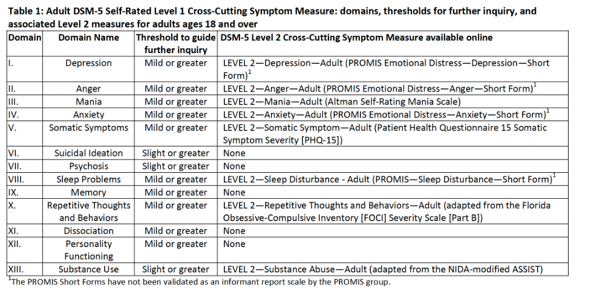

# Mental Health
## Instruments
The current data release for Pregnancy & Exposure, Including Substance Use, includes the following instruments related to mental health:

<table style="width: 100%; border-collapse: collapse; table-layout: fixed;">
  <thead>
    <tr>
      <th style="border: 1px solid #ddd; padding: 8px; text-align: left;">Name of Instrument</th>
      <th style="border: 1px solid #ddd; padding: 8px; text-align: left;">Acronym</th>
      <th style="border: 1px solid #ddd; padding: 8px; text-align: left;">Construct</th>
      <th style="border: 1px solid #ddd; padding: 8px; text-align: left;">Table Name</th>
    </tr>
  </thead>
<tbody>
    <tr>
        <td style="border: 1px solid #ddd; padding: 8px; word-wrap: break-word; white-space: normal;"><a href="#personal-family-psychiatric-history">Personal and family psychiatric history</a></td>
        <td style="border: 1px solid #ddd; padding: 8px; word-wrap: break-word; white-space: normal;">FAM MH</td>
        <td style="border: 1px solid #ddd; padding: 8px; word-wrap: break-word; white-space: normal;">Personal and family mental health</td>
        <td style="border: 1px solid #ddd; padding: 8px; word-wrap: break-word; white-space: normal;">pex_bm_psych</td>
    </tr>            
    <tr>
        <td style="border: 1px solid #ddd; padding: 8px; word-wrap: break-word; white-space: normal;"><a href="#apa-12">DSM-5 Self-Rated Level 1 and Level 2 (version 8a) Cross-Cutting Symptom Measure—Adult</a></td>
        <td style="border: 1px solid #ddd; padding: 8px; word-wrap: break-word; white-space: normal;">APA 1/2</td>
        <td style="border: 1px solid #ddd; padding: 8px; word-wrap: break-word; white-space: normal;">Mental Health</td>
        <td style="border: 1px solid #ddd; padding: 8px; word-wrap: break-word; white-space: normal;">pex_bm_apa</td>
    </tr>  
    <tr>
        <td style="border: 1px solid #ddd; padding: 8px; word-wrap: break-word; white-space: normal;"><a href="#dsm5-ptsdacute-stress-short-scale">National Stressful Events Survey- PTSD Short Scale/Acute Stress Disorder</a></td>
        <td style="border: 1px solid #ddd; padding: 8px; word-wrap: break-word; white-space: normal;">NSESSS—PTSD/Acute Stress Disorder</td>
        <td style="border: 1px solid #ddd; padding: 8px; word-wrap: break-word; white-space: normal;">PTSD/acute stress disorder symptom severity</td>
        <td style="border: 1px solid #ddd; padding: 8px; word-wrap: break-word; white-space: normal;">pex_bm_str__ptsd</td>
    </tr>      
    <tr>
        <td style="border: 1px solid #ddd; padding: 8px; word-wrap: break-word; white-space: normal;"><a href="#epds">Edinburgh Postnatal Depression Scale</a></td>
        <td style="border: 1px solid #ddd; padding: 8px; word-wrap: break-word; white-space: normal;">EPDS</td>
        <td style="border: 1px solid #ddd; padding: 8px; word-wrap: break-word; white-space: normal;">Postnatal depression</td>
        <td style="border: 1px solid #ddd; padding: 8px; word-wrap: break-word; white-space: normal;">pex_bm_epds</td>
    </tr>      
</tbody>
</table>

## Implementation & Data Collection
Surveys were translated to Spanish for HBCD by [BURG Translations](https://burgtranslations.com/our-services/). All are child-unspecific and were self-administered either in-person or remote with the exception of FAM MH, which was only self-administered in-person. Additional information is as follows:

<table style="width: 100%; border-collapse: collapse; table-layout: fixed;">
  <thead>
    <tr>
      <th style="border: 1px solid #ddd; padding: 8px; text-align: left;">Instrument</th>
      <th style="border: 1px solid #ddd; padding: 8px; text-align: left;">Respondent</th>
      <th style="border: 1px solid #ddd; padding: 8px; text-align: left;">Visits</th>
      <th style="border: 1px solid #ddd; padding: 8px; text-align: left;">Completion Time</th>      
    </tr>
  </thead>
<tbody>
    <tr>
        <td>FAM MH</td>
        <td>Pregnant Person</td>
        <td>V01</td>
        <td>5 min</td>
    </tr>       
    <tr>
        <td>APA 1/2</td>
        <td style="border: 1px solid #ddd; padding: 8px; word-wrap: break-word; white-space: normal;">Pregnant Person, Person Who Gave Birth, or Primary Caregiver</td>
        <td>V01, V02, V03</td>
        <td>5 min</td>
    </tr>    
    <tr>
        <td style="border: 1px solid #ddd; padding: 8px; word-wrap: break-word; white-space: normal;">NSESSS—PTSD/Acute Stress Disorder</td>
        <td style="border: 1px solid #ddd; padding: 8px; word-wrap: break-word; white-space: normal;">Pregnant Person, Person Who Gave Birth, or Primary Caregiver</td>
        <td>V01, V02, V03</td>
        <td>3 min</td>
    </tr>       
    <tr>
        <td>EPDS</td>
        <td>Pregnant Person or Person Who Gave Birth</td>
        <td>V01, V02, V03</td>
        <td>3 min</td>
    </tr>    
</tbody>
</table>

## Quality Control
For all mental health instruments, response distributions were reviewed for outliers and no common issues were identified. No potential issues were flagged by subject matter experts.

## Instrument Details
### Personal & Family Psychiatric History 
The HBCD FAM MH assesses self-reported diagnoses and mental health conditions of the biological mother, biological father, and biological maternal and paternal grandmother and grandfather. It was created from combining and modifying items from the [Family History Assessment Module (FHAM)](https://arc.psych.wisc.edu/self-report/family-history-assessment-module-fham/) and the [All of Us Personal and Family Health History](https://www.researchallofus.org/wp-content/themes/research-hub-wordpress-theme/media/2023/PaFHH_Survey_English.pdf). The HBCD FAM MH includes (1) FHAM items on alcohol use [alc], drug use [drug], depression [dep], mania [man], and Schizophrenia [sch]; and (2) All of Us mental health outcomes for only biological mother [bm] and biological father [bf]: Alcohol Use Disorder [001], Anxiety disorder or panic disorder [002], Autism Spectrum Disorder [003], Bipolar disorder [004], Depressive disorder [005], Drug or Substance Use Disorder [006], Schizophrenia [007], and Attention Deficit/Hyperactivity Disorder (ADHD) [008], excluding questions about age of diagnosis, treatment, and medications. Future publications should note that this measure is a combination of these and that this is not a scored scale, but simply descriptive for family psychiatric history.

  
    HBCD Modification Details
  
  ▸

<b>FHAM</b>

FAM MH excludes the following FHAM items: (1) items for Antisocial Personality Disorder [ASP] and Undifferentiated Psychiatric Disorder [UPD] and (2) items asking about any treatment for mental or emotional problems, hospitalization, and suicide. In addition, the original response options including 'parents', 'grandparents', 'siblings', 'aunts', 'uncles', and 'cousins' were modified to include only biological mom [001], biological dad [002], biological maternal grandmother [003], biological maternal grandfather [004], biological paternal grandmother [005], and biological paternal grandfather [006].

<b>All of Us</b>

Original response options including 'mom', 'dad', 'sibling', 'daughter', 'son', and 'grandparent' were modified to include only biological mother [bm] and biological father [bf]. Follow-up questions about age of diagnosis, treatment, and medications were excluded.

### APA 1/2

  <i class="fas fa-exclamation-triangle"></i>
  Data Warning
  ▸

<strong>Consideration of Mental Health Symptoms Experienced During Pregnancy</strong>

Concurrence of psychiatric symptoms and substance use is well-recognized during pregnancy (Massey et al., 2011, 2012). Phenotypic risk in birthing parents may influence neurodevelopmental outcomes via prenatal and postnatal influences other than direct exposures alone (Estabrook et al., 2016, Massey et al., 2016, Massey et al., 2018). These influences may confound exposure-related neuroimaging and neurodevelopmental findings, and also represent malleable targets for prevention and early intervention. Thus, consideration of mental health symptoms experienced by birthing parents as covariates is strongly encouraged when possible to address these confounds.
 

This highly sensitive screening tool adapted for HBCD is designed for community samples and combines two measures: the [DSM-5 Self-Rated Level 1 Cross-Cutting Symptom Measure—Adult](https://www.psychiatry.org/getmedia/e0b4b299-95b3-407b-b8c2-caa871ca218d/APA-DSM5TR-Level1MeasureAdult.pdf) and the DSM-5 Level 2 Cross-Cutting Symptom Measures (below):

**Level 1** includes 1-2 questions for each of thirteen mental health conditions. If symptoms are reported in Level 1, participants answer questions about additional symptoms associated with each mental health condition, including anger, anxiety, depression, mania, repetitive thoughts, and sleep problems (see scoring procedures [here](https://www.psychiatry.org/getmedia/e0b4b299-95b3-407b-b8c2-caa871ca218d/APA-DSM5TR-Level1MeasureAdult.pdf)). 

**Level 2** measures include all [Level 2 Cross-Cutting Symptom Measures](https://www.psychiatry.org/psychiatrists/practice/dsm/educational-resources/assessment-measures) with the exception of Depression and Sleep Disturbance, for which the **PROMIS Short Forms v1.0** [Depression 8a questionnaire](https://www.google.com/url?sa=t&amp;source=web&amp;rct=j&amp;opi=89978449&amp;url=https://www.phenxtoolkit.org/toolkit_content/supplemental_info/psychiatric/measures/07_Depressed_Mood.doc&amp;ved=2ahUKEwjyl8-7t_-IAxW7H0QIHcyBJTEQFnoECC8QAQ&amp;usg=AOvVaw1dPWhSyXkbVCQ3BgmjwAtC) and [Sleep Disturbance 8a](https://heal.nih.gov/files/CDEs/2024-07/promis-sleep-disturbance-8a-crf.pdf) were used instead (see Sleep Disturbance scoring procedures [here](https://www.healthmeasures.net/images/PROMIS/manuals/Scoring_Manual_Only/PROMIS_Sleep_Scoring_Manual.pdf)).

Finally, the HBCD measure also integrates the [Personality Inventory for DSM-5 Brief](https://www.psychiatry.org/File%20Library/Psychiatrists/Practice/DSM/APA_DSM5_The-Personality-Inventory-For-DSM-5-Brief-Form-Adult.pdf), which assesses 5 personality trait domains including negative affect, detachment, antagonism, disinhibition, and psychoticism, with each trait domain consisting of 5 items.

Additional modifications are described below. Future publications should be sure to acknowledge the removal of Level 1-2 substance use (section XIII) and the gating mechanisms for sections V (somatic symptoms) and XII (personality functioning):

  
    HBCD Modification Details
  
  ▸

 

<b>Excluded Questions and Gating</b>

Slight modifications were made due to the use of other measures and the study population. Specifically, the Level 1 questions for substance use were not included. Also, participants proceed automatically to level 2 measures for personality inventory and somatic symptoms. In addition, all participants answer the level 1 questions on depression, but proceed to level 2 questions irrespective of answers.

<b>Clinical Alerts</b>

For HBCD, this measure was modified to alert study staff if responses to the APA suicide question ('Thoughts of actually hurting yourself?') or APA depression question (ranging from 'I felt worthless' to 'I felt that nothing could cheer me up') exceed thresholds of 0 and 32, respectively.

<b>Response Option Changes</b>

'Refuse to answer' option was added to all questions (note that this does not affect scoring as skipped questions are ignored).
 

### DSM5 PTSD/Acute Stress Short Scale

  <i class="fas fa-exclamation-triangle"></i>
  Data Warning
  ▸

<strong>Consideration of Mental Health Symptoms Experienced During Pregnancy</strong>

Concurrence of psychiatric symptoms and substance use is well-recognized during pregnancy (Massey et al., 2011, 2012). Phenotypic risk in birthing parents may influence neurodevelopmental outcomes via prenatal and postnatal influences other than direct exposures alone (Estabrook et al., 2016, Massey et al., 2016, Massey et al., 2018). These influences may confound exposure-related neuroimaging and neurodevelopmental findings, and also represent malleable targets for prevention and early intervention. Thus, consideration of mental health symptoms experienced by birthing parents as covariates is strongly encouraged when possibl to address these confounds.
 

The HBCD Severity of Posttraumatic/Acute Stress Symptoms measure was developed to assess the severity of PTSD and acute stress symptoms following a traumatic event (for individuals aged 18 and older). It combines items from two surveys from the National Stressful Events Surveys: items 1-9 from the PTSD Short Scale ([NSESSS-PTSD](https://www.psychiatry.org/File%20Library/Psychiatrists/Practice/DSM/APA_DSM5_Severity-of-Posttraumatic-Stress-Symptoms-Adult.pdf)) and item 3 from the Acute Stress Disorder Short Scale ([NSESSS-Acute Stress Disorder](https://www.psychiatry.org/File%20Library/Psychiatrists/Practice/DSM/APA_DSM5_Severity-of-Acute-Stress-Symptoms-Adult.pdf)) into a single 10-item assessment for the HBCD study.  Responses are scored 0, 1, 2, 3, or 4 and responses to items are summed for a total score. For HBCD, the response option ‘Decline to answer’ was added to all questions. The response option ‘Don’t know’ was also included at the beginning of data collection, but was subsequently removed. Future publications should note that this measure combines NSESSS-PTSD and NSESSS-Acute Stress Disorder.

Scores on these scales assess trauma-related stress symptoms and do not differentiate between PTSD and Acute Stress Disorder. Researchers should review individual items on each scale to determine the most relevant scale to their research. Individual total scores are provided for NSESSS-PTSD and NSESSS-Acute Stress Disorder, and are computed as the sum of scores from questions 1-9 for PTSD and questions 1-3 & 7-10 for Acute Stress. Note: If 3 or more items are left unanswered, the total score on the scale is not calculated. If 1 or 2 items are left unanswered, a prorated score is calculated by summing the scores of items that were answered to get a partial raw score, multiplying the partial raw score by the total number of items (i.e., 9 on NSESSS-PTSD and 7 on NSESSS-Acute Stress Disorder), and dividing the value by the number of items that were actually answered, rounded to the nearest whole number.

**Questionnaire prompt/instructions:**    
*People sometimes have problems after extremely stressful events or experiences. How much have you been bothered during the PAST SEVEN (7) DAYS by each of the following problems that occurred or became worse after an extremely stressful event/experience?*

### EPDS
The Edinburgh Postnatal Depression Scale (<a href="https://downloads.aap.org/AAP/PDF/Postnatal%20Depression%20Scale.pdf">EPDS</a>), a sensitive, 10-item screening tool for prenatal and postpartum depression symptoms, was selected to capture symptoms of maternal depression due to its ease of administration and widely accepted use. For HBCD, the response option 'refuse to answer' was added to all questions. Note that this does not impact scoring as questions answered with ‘refuse to answer’ are skipped. In addition, scores for EPDS suicide (score>1) or depression (overall score>11) triggered clinical alerts for study staff.

## References

<u>Personal & Family Psychiatric History</u>

Rice, J. P., Reich, T., Bucholz, K., Neuman, R. J., Fishman, R., Rochberg, N., Hesselbrock, V. M., Numberger, J. I., Shuckit, M. A., & Begleiter, H. (1995). Comparison of Direct Interview and Family History Diagnoses of Alcohol Dependence.  <em>Alcoholism: Clinical and Experimental Research</em>, <em>19</em>, 1018-1023. <a href="https://doi.org/10.1111/j.1530-0277.1995.tb00983.x">https://doi.org/10.1111/j.1530-0277.1995.tb00983.x</a>

<u>APA 1/2 Mental Health</u>

<ul>

Doss, R. A., &amp; Lowmaster, S. E. (2022). Validation of the DSM-5 Level 1 Cross-Cutting Symptom Measure in a Community  Sample. <em>Psychiatry Research</em>, <em>318</em>, 114935. <a href="https://doi.org/10.1016/j.psychres.2022.114935">https://doi.org/10.1016/j.psychres.2022.114935</a>

Estabrook, R., Massey, S. H., Clark, C. A. C., Burns, J. L., Mustanski, B. S., Cook, E. H., O’Brien, T. C., Makowski, B., Espy, K. A., & Wakschlag, L. S. (2016). Separating family-level and direct exposure effects of smoking during pregnancy on offspring externalizing symptoms: Bridging the behavior genetic and behavior teratologic divide. Behavior Genetics, 46(3), 389–402. <a href="https://doi.org/10.1007/s10519-015-9762-2">https://doi.org/10.1007/s10519-015-9762-2</a>

Massey, S. H., Mroczek, D. K., Burns, J. L., Clark, C. A. C., Espy, K. A., & Wakschlag, L. S. (2018). Positive parenting behaviors in women who spontaneously quit smoking during pregnancy: Clues to putative targets for preventive interventions. Neurotoxicology and Teratology, 67, 18–24.<a href="https://doi.org/10.1016/j.ntt.2018.02.003">https://doi.org/10.1016/j.ntt.2018.02.003</a>

Massey, S. H., Reiss, D., Neiderhiser, J. M., Leve, L. D., Shaw, D. S., & Ganiban, J. M. (2016). Maternal personality traits associated with patterns of prenatal smoking and exposure: Implications for etiologic and prevention research. Neurotoxicology and Teratology, 53, 48–54. <a href="https://doi.org/10.1016/j.ntt.2015.11.010">https://doi.org/10.1016/j.ntt.2015.11.010</a>

Roche, M. J., Pincus, A. L., &amp; Cole, P. E. (2019). Linking dimensions and dynamics in psychopathology research: An example using DSM-5 instruments. <em>Journal of Research in Personality</em>, <em>82</em>, 103852. <a href="https://doi.org/https://doi.org/10.1016/j.jrp.2019.103852">https://doi.org/https://doi.org/10.1016/j.jrp.2019.103852</a>

<u>EPDS</u>

Cox, J. L., Holden, J. M., &amp; Sagovsky, R. (1987). Detection of postnatal depression . Development of the 10-item Edinburgh Postnatal Depression Scale. <em>British Journal of Psychiatry</em>, <em>150</em>, 782–786. <a href="https://doi.org/10.1192/bjp.150.6.782">https://doi.org/10.1192/bjp.150.6.782</a>

 
